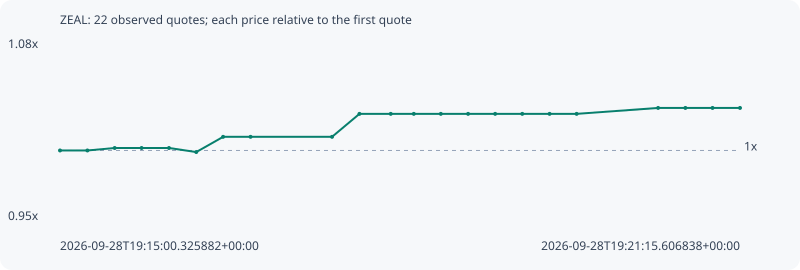

# ZEAL

**robinhood** / `0x9fa1c5e90a11294f83a9f135b81ad1b537a5ffdc`

[All tokens](README.md) · [Market window](../README.md)

## Native assessments

This contract is in the quote cohort; it has no native model assessment in this window.

## Series d4ecf7fc14d7d202c4b6

Pool: `not supplied`

[Complete series](../series/robinhood/d4ecf7fc14d7d202c4b6.json)

Every dot is a captured quote. Lines connect observations; the curve ends at the last available quote.

| Peak | Final | Return | Maximum drawdown |
| ---: | ---: | ---: | ---: |
| 1.0313x | 1.0313x | +3.13% | 0.30% |

### Complete quote timeline

| Time (UTC) | Price (USD) | Multiple | Evidence |
| --- | ---: | ---: | --- |
| 2026-09-28T19:15:00.325882+00:00 | 0.00166456 | 1.0000x | `capture:663c0420-2b9e-4a94-998b-531fa9202dee:rank:98` |
| 2026-09-28T19:15:15.449577+00:00 | 0.00166456 | 1.0000x | `capture:14452070-ab94-45a0-af6d-e6c54082daec:rank:98` |
| 2026-09-28T19:15:30.501058+00:00 | 0.0016676 | 1.0018x | `capture:4e680297-1e75-418b-b818-8b2903e8b923:rank:88` |
| 2026-09-28T19:15:45.353664+00:00 | 0.0016676 | 1.0018x | `capture:b9051b67-24e1-4469-9f82-bc08bd56807d:rank:98` |
| 2026-09-28T19:16:00.473367+00:00 | 0.0016676 | 1.0018x | `capture:cd404827-1073-4901-b09c-82ef1488855b:rank:99` |
| 2026-09-28T19:16:15.518445+00:00 | 0.00166261 | 0.9988x | `capture:c193221c-c80a-4a3b-ad88-59f12dcb1689:rank:77` |
| 2026-09-28T19:16:30.344303+00:00 | 0.00168127 | 1.0100x | `capture:18d587e7-b24d-4b8d-82f1-0ac2903a3303:rank:71` |
| 2026-09-28T19:16:45.486467+00:00 | 0.00168127 | 1.0100x | `capture:4ca26bf7-9d1e-455b-a63e-1b5df831b997:rank:88` |
| 2026-09-28T19:17:30.451540+00:00 | 0.00168127 | 1.0100x | `capture:e161007c-0751-46e4-acc9-c8e28cd7190a:rank:98` |
| 2026-09-28T19:17:45.582227+00:00 | 0.00170941 | 1.0269x | `capture:a3f98285-516a-4bd4-b2c4-63596c968a6b:rank:80` |
| 2026-09-28T19:18:02.849542+00:00 | 0.00170941 | 1.0269x | `capture:53a348cd-74d6-4031-ba2b-02d70c63e42b:rank:83` |
| 2026-09-28T19:18:15.585380+00:00 | 0.00170941 | 1.0269x | `capture:ea19027f-d2c1-43cc-973f-0d8eb46ed64e:rank:86` |
| 2026-09-28T19:18:30.489414+00:00 | 0.00170941 | 1.0269x | `capture:c5cd70df-4ca4-4388-b3c5-f977fa86f8a2:rank:90` |
| 2026-09-28T19:18:45.550203+00:00 | 0.00170941 | 1.0269x | `capture:728d4974-5fe3-40a8-8e99-2139c59da3e3:rank:90` |
| 2026-09-28T19:19:00.487408+00:00 | 0.00170941 | 1.0269x | `capture:297e4fae-3bb5-49eb-b490-a4f34898851c:rank:90` |
| 2026-09-28T19:19:15.451095+00:00 | 0.00170941 | 1.0269x | `capture:0bcc0576-3637-4b2c-b0e4-f9e05871b187:rank:87` |
| 2026-09-28T19:19:30.512866+00:00 | 0.00170941 | 1.0269x | `capture:bb499bdc-159a-4072-a450-312045f32cef:rank:92` |
| 2026-09-28T19:19:45.438706+00:00 | 0.00170941 | 1.0269x | `capture:59b12f7b-2112-42c7-834a-a2eb9bcaee3d:rank:90` |
| 2026-09-28T19:20:30.417446+00:00 | 0.00171667 | 1.0313x | `capture:f2fe9ac4-89a0-4ad3-8f15-5a70d7e1d5f7:rank:77` |
| 2026-09-28T19:20:45.464282+00:00 | 0.00171667 | 1.0313x | `capture:26559b75-812f-4386-982b-eba5073faf44:rank:89` |
| 2026-09-28T19:21:00.449260+00:00 | 0.00171667 | 1.0313x | `capture:186445b2-8971-4639-85b9-26b2e8fb9d2c:rank:86` |
| 2026-09-28T19:21:15.606838+00:00 | 0.00171667 | 1.0313x | `capture:c2a8ab31-038e-42f4-8e33-852fee1b9a24:rank:88` |

### Exit-policy timeline

Calculated from captured quotes under the window policy. Native assessments are linked separately above.

| Time (UTC) | Action | Price (USD) | Evidence |
| --- | --- | ---: | --- |
| 2026-09-28T19:15:00.325882+00:00 | BUY | 0.00166456 | `capture:663c0420-2b9e-4a94-998b-531fa9202dee:rank:98` |
| 2026-09-28T19:15:15.449577+00:00 | HOLD | 0.00166456 | `capture:14452070-ab94-45a0-af6d-e6c54082daec:rank:98` |
| 2026-09-28T19:15:30.501058+00:00 | HOLD | 0.0016676 | `capture:4e680297-1e75-418b-b818-8b2903e8b923:rank:88` |
| 2026-09-28T19:15:45.353664+00:00 | HOLD | 0.0016676 | `capture:b9051b67-24e1-4469-9f82-bc08bd56807d:rank:98` |
| 2026-09-28T19:16:00.473367+00:00 | HOLD | 0.0016676 | `capture:cd404827-1073-4901-b09c-82ef1488855b:rank:99` |
| 2026-09-28T19:16:15.518445+00:00 | HOLD | 0.00166261 | `capture:c193221c-c80a-4a3b-ad88-59f12dcb1689:rank:77` |
| 2026-09-28T19:16:30.344303+00:00 | HOLD | 0.00168127 | `capture:18d587e7-b24d-4b8d-82f1-0ac2903a3303:rank:71` |
| 2026-09-28T19:16:45.486467+00:00 | HOLD | 0.00168127 | `capture:4ca26bf7-9d1e-455b-a63e-1b5df831b997:rank:88` |
| 2026-09-28T19:17:30.451540+00:00 | HOLD | 0.00168127 | `capture:e161007c-0751-46e4-acc9-c8e28cd7190a:rank:98` |
| 2026-09-28T19:17:45.582227+00:00 | HOLD | 0.00170941 | `capture:a3f98285-516a-4bd4-b2c4-63596c968a6b:rank:80` |
| 2026-09-28T19:18:02.849542+00:00 | HOLD | 0.00170941 | `capture:53a348cd-74d6-4031-ba2b-02d70c63e42b:rank:83` |
| 2026-09-28T19:18:15.585380+00:00 | HOLD | 0.00170941 | `capture:ea19027f-d2c1-43cc-973f-0d8eb46ed64e:rank:86` |
| 2026-09-28T19:18:30.489414+00:00 | HOLD | 0.00170941 | `capture:c5cd70df-4ca4-4388-b3c5-f977fa86f8a2:rank:90` |
| 2026-09-28T19:18:45.550203+00:00 | HOLD | 0.00170941 | `capture:728d4974-5fe3-40a8-8e99-2139c59da3e3:rank:90` |
| 2026-09-28T19:19:00.487408+00:00 | HOLD | 0.00170941 | `capture:297e4fae-3bb5-49eb-b490-a4f34898851c:rank:90` |
| 2026-09-28T19:19:15.451095+00:00 | HOLD | 0.00170941 | `capture:0bcc0576-3637-4b2c-b0e4-f9e05871b187:rank:87` |
| 2026-09-28T19:19:30.512866+00:00 | HOLD | 0.00170941 | `capture:bb499bdc-159a-4072-a450-312045f32cef:rank:92` |
| 2026-09-28T19:19:45.438706+00:00 | HOLD | 0.00170941 | `capture:59b12f7b-2112-42c7-834a-a2eb9bcaee3d:rank:90` |
| 2026-09-28T19:20:30.417446+00:00 | HOLD | 0.00171667 | `capture:f2fe9ac4-89a0-4ad3-8f15-5a70d7e1d5f7:rank:77` |
| 2026-09-28T19:20:45.464282+00:00 | HOLD | 0.00171667 | `capture:26559b75-812f-4386-982b-eba5073faf44:rank:89` |
| 2026-09-28T19:21:00.449260+00:00 | HOLD | 0.00171667 | `capture:186445b2-8971-4639-85b9-26b2e8fb9d2c:rank:86` |
| 2026-09-28T19:21:15.606838+00:00 | HOLD | 0.00171667 | `capture:c2a8ab31-038e-42f4-8e33-852fee1b9a24:rank:88` |
