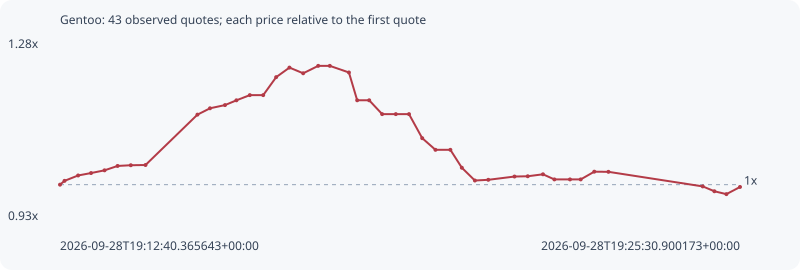

# Gentoo

**solana** / `DS6ePhDssKU2aW4Wyw424CRC7fYDHygmNu4cyMCc5vq4`

[All tokens](README.md) · [Market window](../README.md)

## Native assessments

This contract is in the quote cohort; it has no native model assessment in this window.

## Series 1a6b1bb528b800134bfd

Pool: `not supplied`

[Complete series](../series/solana/1a6b1bb528b800134bfd.json)

Every dot is a captured quote. Lines connect observations; the curve ends at the last available quote.

| Peak | Final | Return | Maximum drawdown |
| ---: | ---: | ---: | ---: |
| 1.2297x | 0.9955x | -0.45% | 20.17% |

### Complete quote timeline

| Time (UTC) | Price (USD) | Multiple | Evidence |
| --- | ---: | ---: | --- |
| 2026-09-28T19:12:40.365643+00:00 | 8.56149e-05 | 1.0000x | `capture:3af1faa1-2074-484e-893e-ed2c676e1576:rank:86` |
| 2026-09-28T19:12:45.490977+00:00 | 8.62451e-05 | 1.0074x | `capture:ac0279d6-7dd1-44b6-bf3e-910bf7b8eddf:rank:84` |
| 2026-09-28T19:13:00.884337+00:00 | 8.71363e-05 | 1.0178x | `capture:5867894f-39b4-4bcd-bd87-86394c63aab4:rank:92` |
| 2026-09-28T19:13:15.565374+00:00 | 8.75374e-05 | 1.0225x | `capture:ca31b3d4-ad60-4333-98b3-6d940a196f86:rank:93` |
| 2026-09-28T19:13:30.833894+00:00 | 8.79878e-05 | 1.0277x | `capture:2beb38a4-bfac-4502-bbc3-8c8c0f943007:rank:96` |
| 2026-09-28T19:13:45.640151+00:00 | 8.87139e-05 | 1.0362x | `capture:4d31b656-3ffe-4768-bef6-377adf019420:rank:99` |
| 2026-09-28T19:14:00.595194+00:00 | 8.88317e-05 | 1.0376x | `capture:2c78112b-48e7-4f74-8c2e-1cb8642a79dc:rank:96` |
| 2026-09-28T19:14:17.246316+00:00 | 8.88681e-05 | 1.0380x | `capture:7a923cde-d765-4388-a15c-4f47fde0a3b5:rank:95` |
| 2026-09-28T19:15:16.098308+00:00 | 9.72084e-05 | 1.1354x | `capture:ab2becb9-3f94-4a57-b9e8-472ad0998012:rank:94` |
| 2026-09-28T19:15:30.340579+00:00 | 9.82592e-05 | 1.1477x | `capture:564db5fc-5586-41d3-88fb-a9a955708f1d:rank:91` |
| 2026-09-28T19:15:47.323285+00:00 | 9.87898e-05 | 1.1539x | `capture:65003429-a569-4442-8d4f-b2c93db69061:rank:91` |
| 2026-09-28T19:16:00.259696+00:00 | 9.95787e-05 | 1.1631x | `capture:4236f8d5-90c4-4c9b-a73e-d6443ae3bf32:rank:91` |
| 2026-09-28T19:16:15.455827+00:00 | 0.000100438 | 1.1731x | `capture:acc657c6-9a43-46bf-986e-7b907c831cba:rank:97` |
| 2026-09-28T19:16:30.624202+00:00 | 0.000100438 | 1.1731x | `capture:0d391072-ec81-4bb7-9be0-0d6bbb801c70:rank:97` |
| 2026-09-28T19:16:45.311485+00:00 | 0.000103414 | 1.2079x | `capture:72cccbac-c3fe-4991-8f62-08c53849b146:rank:98` |
| 2026-09-28T19:17:00.368914+00:00 | 0.000104996 | 1.2264x | `capture:1232cf18-7088-40a1-9f55-ad9ae22b44f5:rank:99` |
| 2026-09-28T19:17:15.914647+00:00 | 0.000104055 | 1.2154x | `capture:9792e199-c0c2-4272-ac95-24501e4a3f79:rank:97` |
| 2026-09-28T19:17:32.965607+00:00 | 0.000105284 | 1.2297x | `capture:0f04cfe5-88a0-4a83-ae8d-85c5cb3cdc89:rank:89` |
| 2026-09-28T19:17:46.087880+00:00 | 0.000105284 | 1.2297x | `capture:ee91a1c6-bc99-4c7a-9cdc-bd6cb5478a9b:rank:90` |
| 2026-09-28T19:18:07.749963+00:00 | 0.000104189 | 1.2169x | `capture:b0fb1b47-4973-472f-9619-8480bc7d294e:rank:95` |
| 2026-09-28T19:18:17.126008+00:00 | 9.95827e-05 | 1.1631x | `capture:5ed98f51-d1e1-422a-81df-4186a8b0a0a2:rank:89` |
| 2026-09-28T19:18:30.722167+00:00 | 9.95827e-05 | 1.1631x | `capture:9f88d118-9108-4dff-bbfc-246eaed5ce38:rank:92` |
| 2026-09-28T19:18:45.386687+00:00 | 9.7294e-05 | 1.1364x | `capture:f533100a-ce62-4457-9107-42e7601ea5d7:rank:92` |
| 2026-09-28T19:19:00.883835+00:00 | 9.7294e-05 | 1.1364x | `capture:a2495d99-5671-4c7e-b87c-48f48d90f2f2:rank:90` |
| 2026-09-28T19:19:15.826416+00:00 | 9.7294e-05 | 1.1364x | `capture:ba1dc6a3-b8b7-461a-8110-8490f03539a5:rank:94` |
| 2026-09-28T19:19:30.814098+00:00 | 9.33093e-05 | 1.0899x | `capture:b25d90dc-c8db-4388-8a2b-d06541e5320f:rank:92` |
| 2026-09-28T19:19:45.817199+00:00 | 9.13834e-05 | 1.0674x | `capture:722d1b7b-ef4f-4ac5-883c-0557bae2b60b:rank:87` |
| 2026-09-28T19:20:02.715590+00:00 | 9.13834e-05 | 1.0674x | `capture:60ff17d8-3b18-4f61-9bc7-006afd324cf2:rank:88` |
| 2026-09-28T19:20:15.699547+00:00 | 8.84181e-05 | 1.0327x | `capture:10a94828-637f-4580-a9f7-2fbd34d8589a:rank:87` |
| 2026-09-28T19:20:30.480194+00:00 | 8.63011e-05 | 1.0080x | `capture:54722132-db1d-4a2b-8c1c-2b0e71d01430:rank:94` |
| 2026-09-28T19:20:45.683165+00:00 | 8.64188e-05 | 1.0094x | `capture:17963a37-fd65-46b6-8e1c-350082721f8c:rank:99` |
| 2026-09-28T19:21:15.372716+00:00 | 8.69598e-05 | 1.0157x | `capture:a923b968-a768-495e-ae33-6de2042c551f:rank:96` |
| 2026-09-28T19:21:30.402460+00:00 | 8.70073e-05 | 1.0163x | `capture:d926629b-2050-4e50-a602-1638c6205870:rank:90` |
| 2026-09-28T19:21:47.649380+00:00 | 8.73321e-05 | 1.0201x | `capture:0799ec6d-0e89-46b5-ae88-5695bf6c5fc3:rank:89` |
| 2026-09-28T19:22:00.569928+00:00 | 8.64826e-05 | 1.0101x | `capture:263cda40-4b31-4b2d-b168-fa4310edb46d:rank:87` |
| 2026-09-28T19:22:18.240717+00:00 | 8.64826e-05 | 1.0101x | `capture:546b2c55-1845-4da7-bc9c-4439cd0ccdba:rank:88` |
| 2026-09-28T19:22:30.371968+00:00 | 8.64826e-05 | 1.0101x | `capture:507d17cb-af67-4a81-a2b2-d5ddfbc40021:rank:92` |
| 2026-09-28T19:22:45.783808+00:00 | 8.77649e-05 | 1.0251x | `capture:9558d322-c429-480b-885f-82f4481c8506:rank:99` |
| 2026-09-28T19:23:01.833252+00:00 | 8.77402e-05 | 1.0248x | `capture:c5462412-2da1-4432-8949-8fcd1492c57f:rank:97` |
| 2026-09-28T19:24:48.687179+00:00 | 8.53258e-05 | 0.9966x | `capture:feb72cbd-a170-4ba3-8a11-eb1df1686719:rank:95` |
| 2026-09-28T19:25:01.877958+00:00 | 8.45214e-05 | 0.9872x | `capture:fd6d01ae-d246-439e-ac58-27ae75880eb9:rank:94` |
| 2026-09-28T19:25:15.488701+00:00 | 8.40456e-05 | 0.9817x | `capture:b8fee87c-9981-475c-930b-99c255910a9f:rank:92` |
| 2026-09-28T19:25:30.900173+00:00 | 8.52337e-05 | 0.9955x | `capture:7f757769-25c3-429a-81d0-c6b2ee45ee15:rank:98` |

### Exit-policy timeline

Calculated from captured quotes under the window policy. Native assessments are linked separately above.

| Time (UTC) | Action | Price (USD) | Evidence |
| --- | --- | ---: | --- |
| 2026-09-28T19:12:40.365643+00:00 | BUY | 8.56149e-05 | `capture:3af1faa1-2074-484e-893e-ed2c676e1576:rank:86` |
| 2026-09-28T19:12:45.490977+00:00 | HOLD | 8.62451e-05 | `capture:ac0279d6-7dd1-44b6-bf3e-910bf7b8eddf:rank:84` |
| 2026-09-28T19:13:00.884337+00:00 | HOLD | 8.71363e-05 | `capture:5867894f-39b4-4bcd-bd87-86394c63aab4:rank:92` |
| 2026-09-28T19:13:15.565374+00:00 | HOLD | 8.75374e-05 | `capture:ca31b3d4-ad60-4333-98b3-6d940a196f86:rank:93` |
| 2026-09-28T19:13:30.833894+00:00 | HOLD | 8.79878e-05 | `capture:2beb38a4-bfac-4502-bbc3-8c8c0f943007:rank:96` |
| 2026-09-28T19:13:45.640151+00:00 | HOLD | 8.87139e-05 | `capture:4d31b656-3ffe-4768-bef6-377adf019420:rank:99` |
| 2026-09-28T19:14:00.595194+00:00 | HOLD | 8.88317e-05 | `capture:2c78112b-48e7-4f74-8c2e-1cb8642a79dc:rank:96` |
| 2026-09-28T19:14:17.246316+00:00 | HOLD | 8.88681e-05 | `capture:7a923cde-d765-4388-a15c-4f47fde0a3b5:rank:95` |
| 2026-09-28T19:15:16.098308+00:00 | HOLD | 9.72084e-05 | `capture:ab2becb9-3f94-4a57-b9e8-472ad0998012:rank:94` |
| 2026-09-28T19:15:30.340579+00:00 | HOLD | 9.82592e-05 | `capture:564db5fc-5586-41d3-88fb-a9a955708f1d:rank:91` |
| 2026-09-28T19:15:47.323285+00:00 | HOLD | 9.87898e-05 | `capture:65003429-a569-4442-8d4f-b2c93db69061:rank:91` |
| 2026-09-28T19:16:00.259696+00:00 | HOLD | 9.95787e-05 | `capture:4236f8d5-90c4-4c9b-a73e-d6443ae3bf32:rank:91` |
| 2026-09-28T19:16:15.455827+00:00 | HOLD | 0.000100438 | `capture:acc657c6-9a43-46bf-986e-7b907c831cba:rank:97` |
| 2026-09-28T19:16:30.624202+00:00 | HOLD | 0.000100438 | `capture:0d391072-ec81-4bb7-9be0-0d6bbb801c70:rank:97` |
| 2026-09-28T19:16:45.311485+00:00 | HOLD | 0.000103414 | `capture:72cccbac-c3fe-4991-8f62-08c53849b146:rank:98` |
| 2026-09-28T19:17:00.368914+00:00 | HOLD | 0.000104996 | `capture:1232cf18-7088-40a1-9f55-ad9ae22b44f5:rank:99` |
| 2026-09-28T19:17:15.914647+00:00 | HOLD | 0.000104055 | `capture:9792e199-c0c2-4272-ac95-24501e4a3f79:rank:97` |
| 2026-09-28T19:17:32.965607+00:00 | HOLD | 0.000105284 | `capture:0f04cfe5-88a0-4a83-ae8d-85c5cb3cdc89:rank:89` |
| 2026-09-28T19:17:46.087880+00:00 | HOLD | 0.000105284 | `capture:ee91a1c6-bc99-4c7a-9cdc-bd6cb5478a9b:rank:90` |
| 2026-09-28T19:18:07.749963+00:00 | HOLD | 0.000104189 | `capture:b0fb1b47-4973-472f-9619-8480bc7d294e:rank:95` |
| 2026-09-28T19:18:17.126008+00:00 | HOLD | 9.95827e-05 | `capture:5ed98f51-d1e1-422a-81df-4186a8b0a0a2:rank:89` |
| 2026-09-28T19:18:30.722167+00:00 | HOLD | 9.95827e-05 | `capture:9f88d118-9108-4dff-bbfc-246eaed5ce38:rank:92` |
| 2026-09-28T19:18:45.386687+00:00 | HOLD | 9.7294e-05 | `capture:f533100a-ce62-4457-9107-42e7601ea5d7:rank:92` |
| 2026-09-28T19:19:00.883835+00:00 | HOLD | 9.7294e-05 | `capture:a2495d99-5671-4c7e-b87c-48f48d90f2f2:rank:90` |
| 2026-09-28T19:19:15.826416+00:00 | HOLD | 9.7294e-05 | `capture:ba1dc6a3-b8b7-461a-8110-8490f03539a5:rank:94` |
| 2026-09-28T19:19:30.814098+00:00 | HOLD | 9.33093e-05 | `capture:b25d90dc-c8db-4388-8a2b-d06541e5320f:rank:92` |
| 2026-09-28T19:19:45.817199+00:00 | HOLD | 9.13834e-05 | `capture:722d1b7b-ef4f-4ac5-883c-0557bae2b60b:rank:87` |
| 2026-09-28T19:20:02.715590+00:00 | HOLD | 9.13834e-05 | `capture:60ff17d8-3b18-4f61-9bc7-006afd324cf2:rank:88` |
| 2026-09-28T19:20:15.699547+00:00 | HOLD | 8.84181e-05 | `capture:10a94828-637f-4580-a9f7-2fbd34d8589a:rank:87` |
| 2026-09-28T19:20:30.480194+00:00 | HOLD | 8.63011e-05 | `capture:54722132-db1d-4a2b-8c1c-2b0e71d01430:rank:94` |
| 2026-09-28T19:20:45.683165+00:00 | HOLD | 8.64188e-05 | `capture:17963a37-fd65-46b6-8e1c-350082721f8c:rank:99` |
| 2026-09-28T19:21:15.372716+00:00 | HOLD | 8.69598e-05 | `capture:a923b968-a768-495e-ae33-6de2042c551f:rank:96` |
| 2026-09-28T19:21:30.402460+00:00 | HOLD | 8.70073e-05 | `capture:d926629b-2050-4e50-a602-1638c6205870:rank:90` |
| 2026-09-28T19:21:47.649380+00:00 | HOLD | 8.73321e-05 | `capture:0799ec6d-0e89-46b5-ae88-5695bf6c5fc3:rank:89` |
| 2026-09-28T19:22:00.569928+00:00 | HOLD | 8.64826e-05 | `capture:263cda40-4b31-4b2d-b168-fa4310edb46d:rank:87` |
| 2026-09-28T19:22:18.240717+00:00 | HOLD | 8.64826e-05 | `capture:546b2c55-1845-4da7-bc9c-4439cd0ccdba:rank:88` |
| 2026-09-28T19:22:30.371968+00:00 | HOLD | 8.64826e-05 | `capture:507d17cb-af67-4a81-a2b2-d5ddfbc40021:rank:92` |
| 2026-09-28T19:22:45.783808+00:00 | HOLD | 8.77649e-05 | `capture:9558d322-c429-480b-885f-82f4481c8506:rank:99` |
| 2026-09-28T19:23:01.833252+00:00 | HOLD | 8.77402e-05 | `capture:c5462412-2da1-4432-8949-8fcd1492c57f:rank:97` |
| 2026-09-28T19:24:48.687179+00:00 | HOLD | 8.53258e-05 | `capture:feb72cbd-a170-4ba3-8a11-eb1df1686719:rank:95` |
| 2026-09-28T19:25:01.877958+00:00 | HOLD | 8.45214e-05 | `capture:fd6d01ae-d246-439e-ac58-27ae75880eb9:rank:94` |
| 2026-09-28T19:25:15.488701+00:00 | HOLD | 8.40456e-05 | `capture:b8fee87c-9981-475c-930b-99c255910a9f:rank:92` |
| 2026-09-28T19:25:30.900173+00:00 | HOLD | 8.52337e-05 | `capture:7f757769-25c3-429a-81d0-c6b2ee45ee15:rank:98` |
