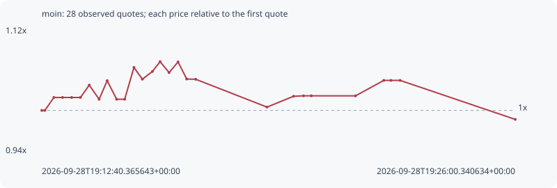

# moin

**solana** / `8DXqVUopcdviLvujTcpwEqkKzB43Arp6E1axzsEE5Btq`

[All tokens](README.md) · [Market window](../README.md)

## Native assessments

This contract is in the quote cohort; it has no native model assessment in this window.

## Series 0a7eabb1177c1a926d61

Pool: `not supplied`

[Complete series](../series/solana/0a7eabb1177c1a926d61.json)

Every dot is a captured quote. Lines connect observations; the curve ends at the last available quote.

| Peak | Final | Return | Maximum drawdown |
| ---: | ---: | ---: | ---: |
| 1.0721x | 0.9868x | -1.32% | 7.96% |

### Complete quote timeline

| Time (UTC) | Price (USD) | Multiple | Evidence |
| --- | ---: | ---: | --- |
| 2026-09-28T19:12:40.365643+00:00 | 0.000252933 | 1.0000x | `capture:3af1faa1-2074-484e-893e-ed2c676e1576:rank:82` |
| 2026-09-28T19:12:45.490977+00:00 | 0.000252933 | 1.0000x | `capture:ac0279d6-7dd1-44b6-bf3e-910bf7b8eddf:rank:81` |
| 2026-09-28T19:13:00.884337+00:00 | 0.000257785 | 1.0192x | `capture:5867894f-39b4-4bcd-bd87-86394c63aab4:rank:80` |
| 2026-09-28T19:13:15.565374+00:00 | 0.000257785 | 1.0192x | `capture:ca31b3d4-ad60-4333-98b3-6d940a196f86:rank:82` |
| 2026-09-28T19:13:30.833894+00:00 | 0.000257785 | 1.0192x | `capture:2beb38a4-bfac-4502-bbc3-8c8c0f943007:rank:85` |
| 2026-09-28T19:13:45.640151+00:00 | 0.000257785 | 1.0192x | `capture:4d31b656-3ffe-4768-bef6-377adf019420:rank:85` |
| 2026-09-28T19:14:00.595194+00:00 | 0.000262411 | 1.0375x | `capture:2c78112b-48e7-4f74-8c2e-1cb8642a79dc:rank:88` |
| 2026-09-28T19:14:17.246316+00:00 | 0.000257119 | 1.0165x | `capture:7a923cde-d765-4388-a15c-4f47fde0a3b5:rank:87` |
| 2026-09-28T19:14:30.874732+00:00 | 0.000264059 | 1.0440x | `capture:fa585070-b1ae-4f9d-afbd-aa986f487793:rank:89` |
| 2026-09-28T19:14:46.892387+00:00 | 0.000257119 | 1.0165x | `capture:7d9e3e65-8bda-4696-b6d1-7a86825bd98c:rank:87` |
| 2026-09-28T19:15:00.432009+00:00 | 0.000257119 | 1.0165x | `capture:797f9a41-958a-44ba-ac57-3b9cacf5d06b:rank:91` |
| 2026-09-28T19:15:16.098308+00:00 | 0.000269004 | 1.0635x | `capture:ab2becb9-3f94-4a57-b9e8-472ad0998012:rank:86` |
| 2026-09-28T19:15:30.340579+00:00 | 0.000264621 | 1.0462x | `capture:564db5fc-5586-41d3-88fb-a9a955708f1d:rank:83` |
| 2026-09-28T19:15:47.323285+00:00 | 0.000267511 | 1.0576x | `capture:65003429-a569-4442-8d4f-b2c93db69061:rank:83` |
| 2026-09-28T19:16:00.259696+00:00 | 0.000271177 | 1.0721x | `capture:4236f8d5-90c4-4c9b-a73e-d6443ae3bf32:rank:89` |
| 2026-09-28T19:16:15.455827+00:00 | 0.000267103 | 1.0560x | `capture:acc657c6-9a43-46bf-986e-7b907c831cba:rank:87` |
| 2026-09-28T19:16:30.624202+00:00 | 0.000271071 | 1.0717x | `capture:0d391072-ec81-4bb7-9be0-0d6bbb801c70:rank:92` |
| 2026-09-28T19:16:45.311485+00:00 | 0.000264666 | 1.0464x | `capture:72cccbac-c3fe-4991-8f62-08c53849b146:rank:91` |
| 2026-09-28T19:17:00.368914+00:00 | 0.000264599 | 1.0461x | `capture:1232cf18-7088-40a1-9f55-ad9ae22b44f5:rank:93` |
| 2026-09-28T19:19:00.883835+00:00 | 0.00025418 | 1.0049x | `capture:a2495d99-5671-4c7e-b87c-48f48d90f2f2:rank:97` |
| 2026-09-28T19:19:45.817199+00:00 | 0.000258235 | 1.0210x | `capture:722d1b7b-ef4f-4ac5-883c-0557bae2b60b:rank:97` |
| 2026-09-28T19:20:02.715590+00:00 | 0.000258396 | 1.0216x | `capture:60ff17d8-3b18-4f61-9bc7-006afd324cf2:rank:94` |
| 2026-09-28T19:20:15.699547+00:00 | 0.000258396 | 1.0216x | `capture:10a94828-637f-4580-a9f7-2fbd34d8589a:rank:99` |
| 2026-09-28T19:21:30.402460+00:00 | 0.000258377 | 1.0215x | `capture:d926629b-2050-4e50-a602-1638c6205870:rank:92` |
| 2026-09-28T19:22:18.240717+00:00 | 0.000264171 | 1.0444x | `capture:546b2c55-1845-4da7-bc9c-4439cd0ccdba:rank:89` |
| 2026-09-28T19:22:30.371968+00:00 | 0.000264171 | 1.0444x | `capture:507d17cb-af67-4a81-a2b2-d5ddfbc40021:rank:94` |
| 2026-09-28T19:22:45.783808+00:00 | 0.000264171 | 1.0444x | `capture:9558d322-c429-480b-885f-82f4481c8506:rank:98` |
| 2026-09-28T19:26:00.340634+00:00 | 0.000249586 | 0.9868x | `capture:5b3728c5-aff9-43f3-bbb5-25b251825caa:rank:96` |

### Exit-policy timeline

Calculated from captured quotes under the window policy. Native assessments are linked separately above.

| Time (UTC) | Action | Price (USD) | Evidence |
| --- | --- | ---: | --- |
| 2026-09-28T19:12:40.365643+00:00 | BUY | 0.000252933 | `capture:3af1faa1-2074-484e-893e-ed2c676e1576:rank:82` |
| 2026-09-28T19:12:45.490977+00:00 | HOLD | 0.000252933 | `capture:ac0279d6-7dd1-44b6-bf3e-910bf7b8eddf:rank:81` |
| 2026-09-28T19:13:00.884337+00:00 | HOLD | 0.000257785 | `capture:5867894f-39b4-4bcd-bd87-86394c63aab4:rank:80` |
| 2026-09-28T19:13:15.565374+00:00 | HOLD | 0.000257785 | `capture:ca31b3d4-ad60-4333-98b3-6d940a196f86:rank:82` |
| 2026-09-28T19:13:30.833894+00:00 | HOLD | 0.000257785 | `capture:2beb38a4-bfac-4502-bbc3-8c8c0f943007:rank:85` |
| 2026-09-28T19:13:45.640151+00:00 | HOLD | 0.000257785 | `capture:4d31b656-3ffe-4768-bef6-377adf019420:rank:85` |
| 2026-09-28T19:14:00.595194+00:00 | HOLD | 0.000262411 | `capture:2c78112b-48e7-4f74-8c2e-1cb8642a79dc:rank:88` |
| 2026-09-28T19:14:17.246316+00:00 | HOLD | 0.000257119 | `capture:7a923cde-d765-4388-a15c-4f47fde0a3b5:rank:87` |
| 2026-09-28T19:14:30.874732+00:00 | HOLD | 0.000264059 | `capture:fa585070-b1ae-4f9d-afbd-aa986f487793:rank:89` |
| 2026-09-28T19:14:46.892387+00:00 | HOLD | 0.000257119 | `capture:7d9e3e65-8bda-4696-b6d1-7a86825bd98c:rank:87` |
| 2026-09-28T19:15:00.432009+00:00 | HOLD | 0.000257119 | `capture:797f9a41-958a-44ba-ac57-3b9cacf5d06b:rank:91` |
| 2026-09-28T19:15:16.098308+00:00 | HOLD | 0.000269004 | `capture:ab2becb9-3f94-4a57-b9e8-472ad0998012:rank:86` |
| 2026-09-28T19:15:30.340579+00:00 | HOLD | 0.000264621 | `capture:564db5fc-5586-41d3-88fb-a9a955708f1d:rank:83` |
| 2026-09-28T19:15:47.323285+00:00 | HOLD | 0.000267511 | `capture:65003429-a569-4442-8d4f-b2c93db69061:rank:83` |
| 2026-09-28T19:16:00.259696+00:00 | HOLD | 0.000271177 | `capture:4236f8d5-90c4-4c9b-a73e-d6443ae3bf32:rank:89` |
| 2026-09-28T19:16:15.455827+00:00 | HOLD | 0.000267103 | `capture:acc657c6-9a43-46bf-986e-7b907c831cba:rank:87` |
| 2026-09-28T19:16:30.624202+00:00 | HOLD | 0.000271071 | `capture:0d391072-ec81-4bb7-9be0-0d6bbb801c70:rank:92` |
| 2026-09-28T19:16:45.311485+00:00 | HOLD | 0.000264666 | `capture:72cccbac-c3fe-4991-8f62-08c53849b146:rank:91` |
| 2026-09-28T19:17:00.368914+00:00 | HOLD | 0.000264599 | `capture:1232cf18-7088-40a1-9f55-ad9ae22b44f5:rank:93` |
| 2026-09-28T19:19:00.883835+00:00 | HOLD | 0.00025418 | `capture:a2495d99-5671-4c7e-b87c-48f48d90f2f2:rank:97` |
| 2026-09-28T19:19:45.817199+00:00 | HOLD | 0.000258235 | `capture:722d1b7b-ef4f-4ac5-883c-0557bae2b60b:rank:97` |
| 2026-09-28T19:20:02.715590+00:00 | HOLD | 0.000258396 | `capture:60ff17d8-3b18-4f61-9bc7-006afd324cf2:rank:94` |
| 2026-09-28T19:20:15.699547+00:00 | HOLD | 0.000258396 | `capture:10a94828-637f-4580-a9f7-2fbd34d8589a:rank:99` |
| 2026-09-28T19:21:30.402460+00:00 | HOLD | 0.000258377 | `capture:d926629b-2050-4e50-a602-1638c6205870:rank:92` |
| 2026-09-28T19:22:18.240717+00:00 | HOLD | 0.000264171 | `capture:546b2c55-1845-4da7-bc9c-4439cd0ccdba:rank:89` |
| 2026-09-28T19:22:30.371968+00:00 | HOLD | 0.000264171 | `capture:507d17cb-af67-4a81-a2b2-d5ddfbc40021:rank:94` |
| 2026-09-28T19:22:45.783808+00:00 | HOLD | 0.000264171 | `capture:9558d322-c429-480b-885f-82f4481c8506:rank:98` |
| 2026-09-28T19:26:00.340634+00:00 | HOLD | 0.000249586 | `capture:5b3728c5-aff9-43f3-bbb5-25b251825caa:rank:96` |
