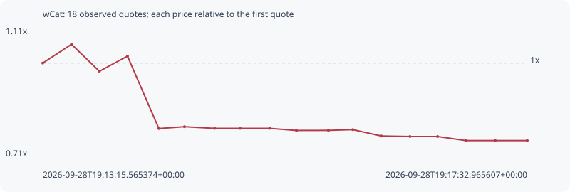

# wCat

**solana** / `4RtA5ANnHdVDod28gczHWDpBhqcm6RF1qcEniAsHpump`

[All tokens](README.md) · [Market window](../README.md)

## Native assessments

This contract is in the quote cohort; it has no native model assessment in this window.

## Series 64109a3fe104516db759

Pool: `not supplied`

[Complete series](../series/solana/64109a3fe104516db759.json)

Every dot is a captured quote. Lines connect observations; the curve ends at the last available quote.

| Peak | Final | Return | Maximum drawdown |
| ---: | ---: | ---: | ---: |
| 1.0591x | 0.7559x | -24.41% | 28.63% |

### Complete quote timeline

| Time (UTC) | Price (USD) | Multiple | Evidence |
| --- | ---: | ---: | --- |
| 2026-09-28T19:13:15.565374+00:00 | 5.34209e-06 | 1.0000x | `capture:ca31b3d4-ad60-4333-98b3-6d940a196f86:rank:83` |
| 2026-09-28T19:13:30.833894+00:00 | 5.65776e-06 | 1.0591x | `capture:2beb38a4-bfac-4502-bbc3-8c8c0f943007:rank:83` |
| 2026-09-28T19:13:45.640151+00:00 | 5.20423e-06 | 0.9742x | `capture:4d31b656-3ffe-4768-bef6-377adf019420:rank:72` |
| 2026-09-28T19:14:00.595194+00:00 | 5.45881e-06 | 1.0218x | `capture:2c78112b-48e7-4f74-8c2e-1cb8642a79dc:rank:65` |
| 2026-09-28T19:14:17.246316+00:00 | 4.24032e-06 | 0.7938x | `capture:7a923cde-d765-4388-a15c-4f47fde0a3b5:rank:61` |
| 2026-09-28T19:14:30.874732+00:00 | 4.27099e-06 | 0.7995x | `capture:fa585070-b1ae-4f9d-afbd-aa986f487793:rank:60` |
| 2026-09-28T19:14:46.892387+00:00 | 4.24298e-06 | 0.7943x | `capture:7d9e3e65-8bda-4696-b6d1-7a86825bd98c:rank:56` |
| 2026-09-28T19:15:00.432009+00:00 | 4.2434e-06 | 0.7943x | `capture:797f9a41-958a-44ba-ac57-3b9cacf5d06b:rank:56` |
| 2026-09-28T19:15:16.098308+00:00 | 4.2434e-06 | 0.7943x | `capture:ab2becb9-3f94-4a57-b9e8-472ad0998012:rank:56` |
| 2026-09-28T19:15:30.340579+00:00 | 4.20814e-06 | 0.7877x | `capture:564db5fc-5586-41d3-88fb-a9a955708f1d:rank:55` |
| 2026-09-28T19:15:47.323285+00:00 | 4.20953e-06 | 0.7880x | `capture:65003429-a569-4442-8d4f-b2c93db69061:rank:51` |
| 2026-09-28T19:16:00.259696+00:00 | 4.22207e-06 | 0.7903x | `capture:4236f8d5-90c4-4c9b-a73e-d6443ae3bf32:rank:52` |
| 2026-09-28T19:16:15.455827+00:00 | 4.11447e-06 | 0.7702x | `capture:acc657c6-9a43-46bf-986e-7b907c831cba:rank:53` |
| 2026-09-28T19:16:30.624202+00:00 | 4.10611e-06 | 0.7686x | `capture:0d391072-ec81-4bb7-9be0-0d6bbb801c70:rank:55` |
| 2026-09-28T19:16:45.311485+00:00 | 4.10611e-06 | 0.7686x | `capture:72cccbac-c3fe-4991-8f62-08c53849b146:rank:53` |
| 2026-09-28T19:17:00.368914+00:00 | 4.03784e-06 | 0.7559x | `capture:1232cf18-7088-40a1-9f55-ad9ae22b44f5:rank:55` |
| 2026-09-28T19:17:15.914647+00:00 | 4.03784e-06 | 0.7559x | `capture:9792e199-c0c2-4272-ac95-24501e4a3f79:rank:55` |
| 2026-09-28T19:17:32.965607+00:00 | 4.03784e-06 | 0.7559x | `capture:0f04cfe5-88a0-4a83-ae8d-85c5cb3cdc89:rank:55` |

### Exit-policy timeline

Calculated from captured quotes under the window policy. Native assessments are linked separately above.

| Time (UTC) | Action | Price (USD) | Evidence |
| --- | --- | ---: | --- |
| 2026-09-28T19:13:15.565374+00:00 | BUY | 5.34209e-06 | `capture:ca31b3d4-ad60-4333-98b3-6d940a196f86:rank:83` |
| 2026-09-28T19:13:30.833894+00:00 | HOLD | 5.65776e-06 | `capture:2beb38a4-bfac-4502-bbc3-8c8c0f943007:rank:83` |
| 2026-09-28T19:13:45.640151+00:00 | HOLD | 5.20423e-06 | `capture:4d31b656-3ffe-4768-bef6-377adf019420:rank:72` |
| 2026-09-28T19:14:00.595194+00:00 | HOLD | 5.45881e-06 | `capture:2c78112b-48e7-4f74-8c2e-1cb8642a79dc:rank:65` |
| 2026-09-28T19:14:17.246316+00:00 | SL | 4.24032e-06 | `capture:7a923cde-d765-4388-a15c-4f47fde0a3b5:rank:61` |
