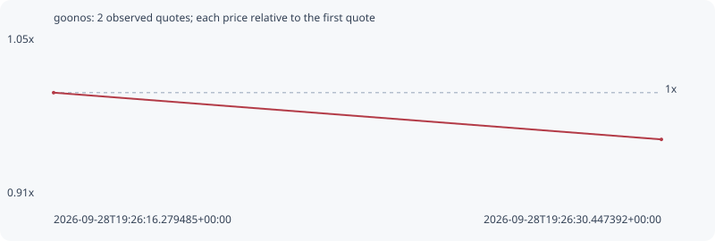

# goonos

**robinhood** / `0x47eb31e37d7b88e2f31ebb86c7fa8cd1a02b26a4`

[All tokens](README.md) · [Market window](../README.md)

## Native assessments

This contract is in the quote cohort; it has no native model assessment in this window.

## Series d45d0c212efee35d7fc9

Pool: `not supplied`

[Complete series](../series/robinhood/d45d0c212efee35d7fc9.json)

Every dot is a captured quote. Lines connect observations; the curve ends at the last available quote.

| Peak | Final | Return | Maximum drawdown |
| ---: | ---: | ---: | ---: |
| 1.0000x | 0.9590x | -4.10% | 4.10% |

### Complete quote timeline

| Time (UTC) | Price (USD) | Multiple | Evidence |
| --- | ---: | ---: | --- |
| 2026-09-28T19:26:16.279485+00:00 | 1.01021e-05 | 1.0000x | `capture:085b2ea9-3985-4608-a1cd-1eddc6b16122:rank:10` |
| 2026-09-28T19:26:30.447392+00:00 | 9.68783e-06 | 0.9590x | `capture:36fd4b46-5420-443d-b1ed-b86b98706671:rank:10` |

### Exit-policy timeline

Calculated from captured quotes under the window policy. Native assessments are linked separately above.

| Time (UTC) | Action | Price (USD) | Evidence |
| --- | --- | ---: | --- |
| 2026-09-28T19:26:16.279485+00:00 | BUY | 1.01021e-05 | `capture:085b2ea9-3985-4608-a1cd-1eddc6b16122:rank:10` |
| 2026-09-28T19:26:30.447392+00:00 | HOLD | 9.68783e-06 | `capture:36fd4b46-5420-443d-b1ed-b86b98706671:rank:10` |
