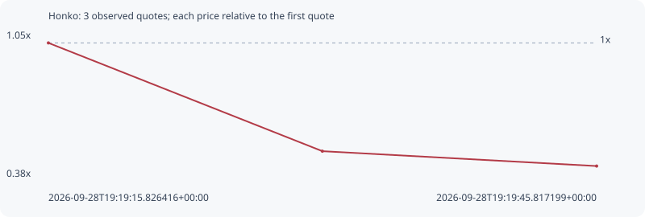

# Honko

**solana** / `33RXti5iriPdzHEXET7SfuGmPaauzLrUR8eHhMZy5A59`

[All tokens](README.md) · [Market window](../README.md)

## Native assessments

This contract is in the quote cohort; it has no native model assessment in this window.

## Series 3d7a2791f3fce30080e2

Pool: `not supplied`

[Complete series](../series/solana/3d7a2791f3fce30080e2.json)

Every dot is a captured quote. Lines connect observations; the curve ends at the last available quote.

| Peak | Final | Return | Maximum drawdown |
| ---: | ---: | ---: | ---: |
| 1.0000x | 0.4285x | -57.15% | 57.15% |

### Complete quote timeline

| Time (UTC) | Price (USD) | Multiple | Evidence |
| --- | ---: | ---: | --- |
| 2026-09-28T19:19:15.826416+00:00 | 9.81894e-06 | 1.0000x | `capture:ba1dc6a3-b8b7-461a-8110-8490f03539a5:rank:57` |
| 2026-09-28T19:19:30.814098+00:00 | 4.88497e-06 | 0.4975x | `capture:b25d90dc-c8db-4388-8a2b-d06541e5320f:rank:36` |
| 2026-09-28T19:19:45.817199+00:00 | 4.2077e-06 | 0.4285x | `capture:722d1b7b-ef4f-4ac5-883c-0557bae2b60b:rank:35` |

### Exit-policy timeline

Calculated from captured quotes under the window policy. Native assessments are linked separately above.

| Time (UTC) | Action | Price (USD) | Evidence |
| --- | --- | ---: | --- |
| 2026-09-28T19:19:15.826416+00:00 | BUY | 9.81894e-06 | `capture:ba1dc6a3-b8b7-461a-8110-8490f03539a5:rank:57` |
| 2026-09-28T19:19:30.814098+00:00 | SL | 4.88497e-06 | `capture:b25d90dc-c8db-4388-8a2b-d06541e5320f:rank:36` |
