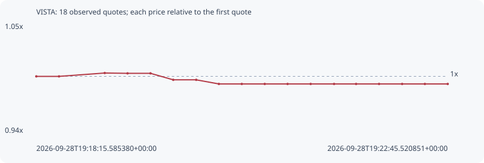

# VISTA

**robinhood** / `0x59cbe15eb2c034fcf6800a998225ce06b68a0229`

[All tokens](README.md) · [Market window](../README.md)

## Native assessments

This contract is in the quote cohort; it has no native model assessment in this window.

## Series 4c8772dba088a8ca6e72

Pool: `not supplied`

[Complete series](../series/robinhood/4c8772dba088a8ca6e72.json)

Every dot is a captured quote. Lines connect observations; the curve ends at the last available quote.

| Peak | Final | Return | Maximum drawdown |
| ---: | ---: | ---: | ---: |
| 1.0034x | 0.9923x | -0.77% | 1.11% |

### Complete quote timeline

| Time (UTC) | Price (USD) | Multiple | Evidence |
| --- | ---: | ---: | --- |
| 2026-09-28T19:18:15.585380+00:00 | 0.000338574 | 1.0000x | `capture:ea19027f-d2c1-43cc-973f-0d8eb46ed64e:rank:95` |
| 2026-09-28T19:18:30.489414+00:00 | 0.000338574 | 1.0000x | `capture:c5cd70df-4ca4-4388-b3c5-f977fa86f8a2:rank:99` |
| 2026-09-28T19:19:00.487408+00:00 | 0.000339733 | 1.0034x | `capture:297e4fae-3bb5-49eb-b490-a4f34898851c:rank:88` |
| 2026-09-28T19:19:15.451095+00:00 | 0.000339623 | 1.0031x | `capture:0bcc0576-3637-4b2c-b0e4-f9e05871b187:rank:81` |
| 2026-09-28T19:19:30.512866+00:00 | 0.000339623 | 1.0031x | `capture:bb499bdc-159a-4072-a450-312045f32cef:rank:80` |
| 2026-09-28T19:19:45.438706+00:00 | 0.000337376 | 0.9965x | `capture:59b12f7b-2112-42c7-834a-a2eb9bcaee3d:rank:74` |
| 2026-09-28T19:20:00.494705+00:00 | 0.000337376 | 0.9965x | `capture:5b06d6b3-9eca-4487-82fb-6b28820c37d9:rank:74` |
| 2026-09-28T19:20:15.393373+00:00 | 0.000335951 | 0.9923x | `capture:17802da9-7cee-48c3-9f5b-5829781be3f6:rank:69` |
| 2026-09-28T19:20:30.417446+00:00 | 0.000335951 | 0.9923x | `capture:f2fe9ac4-89a0-4ad3-8f15-5a70d7e1d5f7:rank:69` |
| 2026-09-28T19:20:45.464282+00:00 | 0.000335951 | 0.9923x | `capture:26559b75-812f-4386-982b-eba5073faf44:rank:68` |
| 2026-09-28T19:21:00.449260+00:00 | 0.000335951 | 0.9923x | `capture:186445b2-8971-4639-85b9-26b2e8fb9d2c:rank:66` |
| 2026-09-28T19:21:15.606838+00:00 | 0.000335951 | 0.9923x | `capture:c2a8ab31-038e-42f4-8e33-852fee1b9a24:rank:66` |
| 2026-09-28T19:21:30.959683+00:00 | 0.000335951 | 0.9923x | `capture:300e0f35-12d4-46a9-a17e-17adbe8e1059:rank:65` |
| 2026-09-28T19:21:45.420062+00:00 | 0.000335951 | 0.9923x | `capture:ec22b61b-732a-44d2-be85-c577051928eb:rank:66` |
| 2026-09-28T19:22:00.489634+00:00 | 0.000335951 | 0.9923x | `capture:d6c64542-18c5-48a0-a6c9-f0e2a9c54b41:rank:64` |
| 2026-09-28T19:22:15.632268+00:00 | 0.000335951 | 0.9923x | `capture:13e6d33e-e854-4b87-b3da-49aedec6950e:rank:68` |
| 2026-09-28T19:22:30.535979+00:00 | 0.000335951 | 0.9923x | `capture:091fb4d2-10fc-4d5f-9c22-af9f55e90e4a:rank:69` |
| 2026-09-28T19:22:45.520851+00:00 | 0.000335951 | 0.9923x | `capture:128617a9-4055-4a8d-8b04-c8876bad9c70:rank:70` |

### Exit-policy timeline

Calculated from captured quotes under the window policy. Native assessments are linked separately above.

| Time (UTC) | Action | Price (USD) | Evidence |
| --- | --- | ---: | --- |
| 2026-09-28T19:18:15.585380+00:00 | BUY | 0.000338574 | `capture:ea19027f-d2c1-43cc-973f-0d8eb46ed64e:rank:95` |
| 2026-09-28T19:18:30.489414+00:00 | HOLD | 0.000338574 | `capture:c5cd70df-4ca4-4388-b3c5-f977fa86f8a2:rank:99` |
| 2026-09-28T19:19:00.487408+00:00 | HOLD | 0.000339733 | `capture:297e4fae-3bb5-49eb-b490-a4f34898851c:rank:88` |
| 2026-09-28T19:19:15.451095+00:00 | HOLD | 0.000339623 | `capture:0bcc0576-3637-4b2c-b0e4-f9e05871b187:rank:81` |
| 2026-09-28T19:19:30.512866+00:00 | HOLD | 0.000339623 | `capture:bb499bdc-159a-4072-a450-312045f32cef:rank:80` |
| 2026-09-28T19:19:45.438706+00:00 | HOLD | 0.000337376 | `capture:59b12f7b-2112-42c7-834a-a2eb9bcaee3d:rank:74` |
| 2026-09-28T19:20:00.494705+00:00 | HOLD | 0.000337376 | `capture:5b06d6b3-9eca-4487-82fb-6b28820c37d9:rank:74` |
| 2026-09-28T19:20:15.393373+00:00 | HOLD | 0.000335951 | `capture:17802da9-7cee-48c3-9f5b-5829781be3f6:rank:69` |
| 2026-09-28T19:20:30.417446+00:00 | HOLD | 0.000335951 | `capture:f2fe9ac4-89a0-4ad3-8f15-5a70d7e1d5f7:rank:69` |
| 2026-09-28T19:20:45.464282+00:00 | HOLD | 0.000335951 | `capture:26559b75-812f-4386-982b-eba5073faf44:rank:68` |
| 2026-09-28T19:21:00.449260+00:00 | HOLD | 0.000335951 | `capture:186445b2-8971-4639-85b9-26b2e8fb9d2c:rank:66` |
| 2026-09-28T19:21:15.606838+00:00 | HOLD | 0.000335951 | `capture:c2a8ab31-038e-42f4-8e33-852fee1b9a24:rank:66` |
| 2026-09-28T19:21:30.959683+00:00 | HOLD | 0.000335951 | `capture:300e0f35-12d4-46a9-a17e-17adbe8e1059:rank:65` |
| 2026-09-28T19:21:45.420062+00:00 | HOLD | 0.000335951 | `capture:ec22b61b-732a-44d2-be85-c577051928eb:rank:66` |
| 2026-09-28T19:22:00.489634+00:00 | HOLD | 0.000335951 | `capture:d6c64542-18c5-48a0-a6c9-f0e2a9c54b41:rank:64` |
| 2026-09-28T19:22:15.632268+00:00 | HOLD | 0.000335951 | `capture:13e6d33e-e854-4b87-b3da-49aedec6950e:rank:68` |
| 2026-09-28T19:22:30.535979+00:00 | HOLD | 0.000335951 | `capture:091fb4d2-10fc-4d5f-9c22-af9f55e90e4a:rank:69` |
| 2026-09-28T19:22:45.520851+00:00 | HOLD | 0.000335951 | `capture:128617a9-4055-4a8d-8b04-c8876bad9c70:rank:70` |
