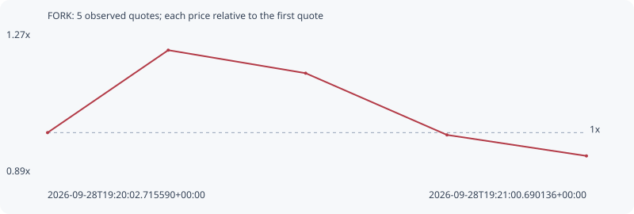

# FORK

**solana** / `AR1J8KzrcH1HhdNP1uM6b1AjBgSkNUrBtQf2u1Wupump`

[All tokens](README.md) · [Market window](../README.md)

## Native assessments

This contract is in the quote cohort; it has no native model assessment in this window.

## Series 2c545871afb5c33aa575

Pool: `not supplied`

[Complete series](../series/solana/2c545871afb5c33aa575.json)

Every dot is a captured quote. Lines connect observations; the curve ends at the last available quote.

| Peak | Final | Return | Maximum drawdown |
| ---: | ---: | ---: | ---: |
| 1.2235x | 0.9369x | -6.31% | 23.43% |

### Complete quote timeline

| Time (UTC) | Price (USD) | Multiple | Evidence |
| --- | ---: | ---: | --- |
| 2026-09-28T19:20:02.715590+00:00 | 5.67239e-06 | 1.0000x | `capture:60ff17d8-3b18-4f61-9bc7-006afd324cf2:rank:70` |
| 2026-09-28T19:20:15.699547+00:00 | 6.94034e-06 | 1.2235x | `capture:10a94828-637f-4580-a9f7-2fbd34d8589a:rank:65` |
| 2026-09-28T19:20:30.480194+00:00 | 6.58624e-06 | 1.1611x | `capture:54722132-db1d-4a2b-8c1c-2b0e71d01430:rank:56` |
| 2026-09-28T19:20:45.683165+00:00 | 5.63743e-06 | 0.9938x | `capture:17963a37-fd65-46b6-8e1c-350082721f8c:rank:48` |
| 2026-09-28T19:21:00.690136+00:00 | 5.31455e-06 | 0.9369x | `capture:f2ff842d-38e9-4cbe-a281-98c17d5a5672:rank:44` |

### Exit-policy timeline

Calculated from captured quotes under the window policy. Native assessments are linked separately above.

| Time (UTC) | Action | Price (USD) | Evidence |
| --- | --- | ---: | --- |
| 2026-09-28T19:20:02.715590+00:00 | BUY | 5.67239e-06 | `capture:60ff17d8-3b18-4f61-9bc7-006afd324cf2:rank:70` |
| 2026-09-28T19:20:15.699547+00:00 | HOLD | 6.94034e-06 | `capture:10a94828-637f-4580-a9f7-2fbd34d8589a:rank:65` |
| 2026-09-28T19:20:30.480194+00:00 | HOLD | 6.58624e-06 | `capture:54722132-db1d-4a2b-8c1c-2b0e71d01430:rank:56` |
| 2026-09-28T19:20:45.683165+00:00 | HOLD | 5.63743e-06 | `capture:17963a37-fd65-46b6-8e1c-350082721f8c:rank:48` |
| 2026-09-28T19:21:00.690136+00:00 | HOLD | 5.31455e-06 | `capture:f2ff842d-38e9-4cbe-a281-98c17d5a5672:rank:44` |
