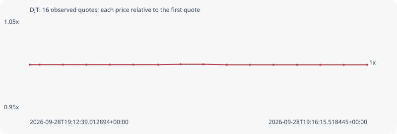

# DJT

**robinhood** / `0x1d11f0496982706c5e14a514d4e79f2e6bde4516`

[All tokens](README.md) · [Market window](../README.md)

## Native assessments

This contract is in the quote cohort; it has no native model assessment in this window.

## Series 5c84dfd8819e9f3037ce

Pool: `not supplied`

[Complete series](../series/robinhood/5c84dfd8819e9f3037ce.json)

Every dot is a captured quote. Lines connect observations; the curve ends at the last available quote.

| Peak | Final | Return | Maximum drawdown |
| ---: | ---: | ---: | ---: |
| 1.0005x | 0.9999x | -0.01% | 0.06% |

### Complete quote timeline

| Time (UTC) | Price (USD) | Multiple | Evidence |
| --- | ---: | ---: | --- |
| 2026-09-28T19:12:39.012894+00:00 | 9.11927 | 1.0000x | `capture:fe8ad944-154e-4481-bd56-8ab821bfbfe1:rank:60` |
| 2026-09-28T19:12:45.402569+00:00 | 9.11927 | 1.0000x | `capture:8deb508c-ea33-4c21-a5c5-f0991dd6dcac:rank:62` |
| 2026-09-28T19:13:00.335966+00:00 | 9.11927 | 1.0000x | `capture:ee3ee7f8-576f-4c42-a7e0-cd9f917fdb36:rank:62` |
| 2026-09-28T19:13:15.331879+00:00 | 9.11927 | 1.0000x | `capture:c384257a-4501-4701-8a0c-a6b08fe727d5:rank:62` |
| 2026-09-28T19:13:30.402311+00:00 | 9.11927 | 1.0000x | `capture:44090e9e-d515-41c4-a78f-893390e6f2b0:rank:63` |
| 2026-09-28T19:13:45.493213+00:00 | 9.11927 | 1.0000x | `capture:52264519-193b-4508-b560-e9ee4e3e0963:rank:62` |
| 2026-09-28T19:14:01.407289+00:00 | 9.11927 | 1.0000x | `capture:0a62cce6-2c27-4761-80c1-feb9130a0c83:rank:63` |
| 2026-09-28T19:14:15.755233+00:00 | 9.1234 | 1.0005x | `capture:09651124-e158-421c-bcdc-cb2310b48412:rank:60` |
| 2026-09-28T19:14:30.367936+00:00 | 9.1234 | 1.0005x | `capture:7a0b9f45-7248-4af6-b349-4bf6d5ef81be:rank:55` |
| 2026-09-28T19:14:45.422215+00:00 | 9.11815 | 0.9999x | `capture:bf6e34c4-c499-472e-8e2b-ebbb151300e2:rank:54` |
| 2026-09-28T19:15:00.325882+00:00 | 9.11815 | 0.9999x | `capture:663c0420-2b9e-4a94-998b-531fa9202dee:rank:55` |
| 2026-09-28T19:15:15.449577+00:00 | 9.11815 | 0.9999x | `capture:14452070-ab94-45a0-af6d-e6c54082daec:rank:51` |
| 2026-09-28T19:15:30.501058+00:00 | 9.11815 | 0.9999x | `capture:4e680297-1e75-418b-b818-8b2903e8b923:rank:51` |
| 2026-09-28T19:15:45.353664+00:00 | 9.11815 | 0.9999x | `capture:b9051b67-24e1-4469-9f82-bc08bd56807d:rank:86` |
| 2026-09-28T19:16:00.473367+00:00 | 9.11815 | 0.9999x | `capture:cd404827-1073-4901-b09c-82ef1488855b:rank:84` |
| 2026-09-28T19:16:15.518445+00:00 | 9.11815 | 0.9999x | `capture:c193221c-c80a-4a3b-ad88-59f12dcb1689:rank:83` |

### Exit-policy timeline

Calculated from captured quotes under the window policy. Native assessments are linked separately above.

| Time (UTC) | Action | Price (USD) | Evidence |
| --- | --- | ---: | --- |
| 2026-09-28T19:12:39.012894+00:00 | BUY | 9.11927 | `capture:fe8ad944-154e-4481-bd56-8ab821bfbfe1:rank:60` |
| 2026-09-28T19:12:45.402569+00:00 | HOLD | 9.11927 | `capture:8deb508c-ea33-4c21-a5c5-f0991dd6dcac:rank:62` |
| 2026-09-28T19:13:00.335966+00:00 | HOLD | 9.11927 | `capture:ee3ee7f8-576f-4c42-a7e0-cd9f917fdb36:rank:62` |
| 2026-09-28T19:13:15.331879+00:00 | HOLD | 9.11927 | `capture:c384257a-4501-4701-8a0c-a6b08fe727d5:rank:62` |
| 2026-09-28T19:13:30.402311+00:00 | HOLD | 9.11927 | `capture:44090e9e-d515-41c4-a78f-893390e6f2b0:rank:63` |
| 2026-09-28T19:13:45.493213+00:00 | HOLD | 9.11927 | `capture:52264519-193b-4508-b560-e9ee4e3e0963:rank:62` |
| 2026-09-28T19:14:01.407289+00:00 | HOLD | 9.11927 | `capture:0a62cce6-2c27-4761-80c1-feb9130a0c83:rank:63` |
| 2026-09-28T19:14:15.755233+00:00 | HOLD | 9.1234 | `capture:09651124-e158-421c-bcdc-cb2310b48412:rank:60` |
| 2026-09-28T19:14:30.367936+00:00 | HOLD | 9.1234 | `capture:7a0b9f45-7248-4af6-b349-4bf6d5ef81be:rank:55` |
| 2026-09-28T19:14:45.422215+00:00 | HOLD | 9.11815 | `capture:bf6e34c4-c499-472e-8e2b-ebbb151300e2:rank:54` |
| 2026-09-28T19:15:00.325882+00:00 | HOLD | 9.11815 | `capture:663c0420-2b9e-4a94-998b-531fa9202dee:rank:55` |
| 2026-09-28T19:15:15.449577+00:00 | HOLD | 9.11815 | `capture:14452070-ab94-45a0-af6d-e6c54082daec:rank:51` |
| 2026-09-28T19:15:30.501058+00:00 | HOLD | 9.11815 | `capture:4e680297-1e75-418b-b818-8b2903e8b923:rank:51` |
| 2026-09-28T19:15:45.353664+00:00 | HOLD | 9.11815 | `capture:b9051b67-24e1-4469-9f82-bc08bd56807d:rank:86` |
| 2026-09-28T19:16:00.473367+00:00 | HOLD | 9.11815 | `capture:cd404827-1073-4901-b09c-82ef1488855b:rank:84` |
| 2026-09-28T19:16:15.518445+00:00 | HOLD | 9.11815 | `capture:c193221c-c80a-4a3b-ad88-59f12dcb1689:rank:83` |
