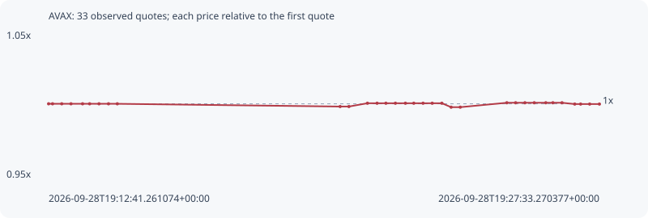

# AVAX

**bsc** / `0x1ce0c2827e2ef14d5c4f29a091d735a204794041`

[All tokens](README.md) · [Market window](../README.md)

## Native assessments

This contract is in the quote cohort; it has no native model assessment in this window.

## Series 77cf1e212ec451d89620

Pool: `not supplied`

[Complete series](../series/bsc/77cf1e212ec451d89620.json)

Every dot is a captured quote. Lines connect observations; the curve ends at the last available quote.

| Peak | Final | Return | Maximum drawdown |
| ---: | ---: | ---: | ---: |
| 1.0007x | 0.9998x | -0.02% | 0.28% |

### Complete quote timeline

| Time (UTC) | Price (USD) | Multiple | Evidence |
| --- | ---: | ---: | --- |
| 2026-09-28T19:12:41.261074+00:00 | 10.4319 | 1.0000x | `capture:795a88f0-804c-4f14-a3e8-ce8d9318f6df:rank:39` |
| 2026-09-28T19:12:47.639745+00:00 | 10.4319 | 1.0000x | `capture:c2d8bd1a-9ed6-4d75-91ae-006bea65a635:rank:40` |
| 2026-09-28T19:13:02.549284+00:00 | 10.4319 | 1.0000x | `capture:0aa38b41-b2e7-48f5-a3ba-8fd4a983fff8:rank:40` |
| 2026-09-28T19:13:17.511052+00:00 | 10.4319 | 1.0000x | `capture:87e92f15-0601-4987-bd47-ae2e9f91de16:rank:39` |
| 2026-09-28T19:13:36.268178+00:00 | 10.4319 | 1.0000x | `capture:577859f6-aadc-4653-b269-a860dbe8c41c:rank:41` |
| 2026-09-28T19:13:47.694462+00:00 | 10.4319 | 1.0000x | `capture:4e60f1a9-1927-46db-ae10-f1b1530de61d:rank:45` |
| 2026-09-28T19:14:02.894344+00:00 | 10.4319 | 1.0000x | `capture:6211f86d-6ba6-4eb3-a4e2-2f80b0dffff7:rank:46` |
| 2026-09-28T19:14:18.283251+00:00 | 10.4319 | 1.0000x | `capture:68440f72-d36c-4c27-867d-03a757db141f:rank:70` |
| 2026-09-28T19:14:32.527710+00:00 | 10.4319 | 1.0000x | `capture:4f6a3c72-f6f0-49d7-97fe-a760f1872e88:rank:71` |
| 2026-09-28T19:20:33.351338+00:00 | 10.4115 | 0.9980x | `capture:5752259a-2bcb-4e27-ac90-6ef5a52d1cf7:rank:98` |
| 2026-09-28T19:20:47.599416+00:00 | 10.4115 | 0.9980x | `capture:1ab71e23-e150-479b-a1fa-e2a362332d1e:rank:98` |
| 2026-09-28T19:21:17.612081+00:00 | 10.4361 | 1.0004x | `capture:cc46cbda-0be4-42ba-bcf4-4a03c9e7e894:rank:89` |
| 2026-09-28T19:21:33.217678+00:00 | 10.4361 | 1.0004x | `capture:3a34cabb-e5ee-4ff6-9f92-f0839c39884f:rank:90` |
| 2026-09-28T19:21:47.485842+00:00 | 10.4361 | 1.0004x | `capture:9e0730ff-182b-409c-b854-c06b993be570:rank:88` |
| 2026-09-28T19:22:02.883000+00:00 | 10.4361 | 1.0004x | `capture:eb8228cb-dfba-443e-9576-ee214dcd3354:rank:90` |
| 2026-09-28T19:22:19.090071+00:00 | 10.4361 | 1.0004x | `capture:30ef0b61-e0e1-4eba-95c6-de3dc48fe868:rank:88` |
| 2026-09-28T19:22:32.671189+00:00 | 10.4361 | 1.0004x | `capture:5d031323-644d-4272-bacc-8a363d4b77cb:rank:93` |
| 2026-09-28T19:22:47.674643+00:00 | 10.4361 | 1.0004x | `capture:c8838291-6f5a-42d9-9013-9d9421deb79e:rank:88` |
| 2026-09-28T19:23:02.516005+00:00 | 10.4361 | 1.0004x | `capture:f8b60e63-80ce-442a-9ca7-659f2b5ca21d:rank:92` |
| 2026-09-28T19:23:18.123882+00:00 | 10.4361 | 1.0004x | `capture:f689df34-2acf-42e7-a37b-1a7d50808302:rank:91` |
| 2026-09-28T19:23:33.140484+00:00 | 10.4069 | 0.9976x | `capture:ef2304f7-c374-4b90-a3e4-d8976f05c226:rank:75` |
| 2026-09-28T19:23:47.927661+00:00 | 10.4069 | 0.9976x | `capture:51aa913c-158f-4059-8727-ff1ace24834c:rank:95` |
| 2026-09-28T19:25:03.394485+00:00 | 10.4396 | 1.0007x | `capture:f1b0620f-7caf-483d-8db4-440b4d786962:rank:94` |
| 2026-09-28T19:25:17.566680+00:00 | 10.4396 | 1.0007x | `capture:89c3d45d-a145-4312-88dc-a4340e727616:rank:97` |
| 2026-09-28T19:25:32.640282+00:00 | 10.4396 | 1.0007x | `capture:a41f01eb-b1b7-4ed5-a604-19b71e522502:rank:99` |
| 2026-09-28T19:25:47.745538+00:00 | 10.4396 | 1.0007x | `capture:b20e5ea5-a03d-4b94-91ce-404a72f5de9b:rank:94` |
| 2026-09-28T19:26:06.431923+00:00 | 10.4396 | 1.0007x | `capture:a3278748-b5f3-45be-a966-ab473520d9c2:rank:90` |
| 2026-09-28T19:26:17.917162+00:00 | 10.4396 | 1.0007x | `capture:3b80c987-c82b-4a3e-8f0b-d3017a78edcb:rank:97` |
| 2026-09-28T19:26:32.687411+00:00 | 10.4396 | 1.0007x | `capture:d1fef60a-e7ad-4594-a8e8-74ee96c47ae4:rank:98` |
| 2026-09-28T19:26:53.320509+00:00 | 10.4299 | 0.9998x | `capture:5f09420c-1544-46ff-a2e4-39235f8f73a9:rank:85` |
| 2026-09-28T19:27:02.865937+00:00 | 10.4299 | 0.9998x | `capture:bd21661a-974d-4bab-9276-4e2f7e7d279a:rank:88` |
| 2026-09-28T19:27:17.494949+00:00 | 10.4299 | 0.9998x | `capture:c5d9da1a-7d95-4d7f-8cef-ffb660ac56d0:rank:87` |
| 2026-09-28T19:27:33.270377+00:00 | 10.4299 | 0.9998x | `capture:1cb6d037-a95b-477e-be82-4cc75b729c8b:rank:84` |

### Exit-policy timeline

Calculated from captured quotes under the window policy. Native assessments are linked separately above.

| Time (UTC) | Action | Price (USD) | Evidence |
| --- | --- | ---: | --- |
| 2026-09-28T19:12:41.261074+00:00 | BUY | 10.4319 | `capture:795a88f0-804c-4f14-a3e8-ce8d9318f6df:rank:39` |
| 2026-09-28T19:12:47.639745+00:00 | HOLD | 10.4319 | `capture:c2d8bd1a-9ed6-4d75-91ae-006bea65a635:rank:40` |
| 2026-09-28T19:13:02.549284+00:00 | HOLD | 10.4319 | `capture:0aa38b41-b2e7-48f5-a3ba-8fd4a983fff8:rank:40` |
| 2026-09-28T19:13:17.511052+00:00 | HOLD | 10.4319 | `capture:87e92f15-0601-4987-bd47-ae2e9f91de16:rank:39` |
| 2026-09-28T19:13:36.268178+00:00 | HOLD | 10.4319 | `capture:577859f6-aadc-4653-b269-a860dbe8c41c:rank:41` |
| 2026-09-28T19:13:47.694462+00:00 | HOLD | 10.4319 | `capture:4e60f1a9-1927-46db-ae10-f1b1530de61d:rank:45` |
| 2026-09-28T19:14:02.894344+00:00 | HOLD | 10.4319 | `capture:6211f86d-6ba6-4eb3-a4e2-2f80b0dffff7:rank:46` |
| 2026-09-28T19:14:18.283251+00:00 | HOLD | 10.4319 | `capture:68440f72-d36c-4c27-867d-03a757db141f:rank:70` |
| 2026-09-28T19:14:32.527710+00:00 | HOLD | 10.4319 | `capture:4f6a3c72-f6f0-49d7-97fe-a760f1872e88:rank:71` |
| 2026-09-28T19:20:33.351338+00:00 | HOLD | 10.4115 | `capture:5752259a-2bcb-4e27-ac90-6ef5a52d1cf7:rank:98` |
| 2026-09-28T19:20:47.599416+00:00 | HOLD | 10.4115 | `capture:1ab71e23-e150-479b-a1fa-e2a362332d1e:rank:98` |
| 2026-09-28T19:21:17.612081+00:00 | HOLD | 10.4361 | `capture:cc46cbda-0be4-42ba-bcf4-4a03c9e7e894:rank:89` |
| 2026-09-28T19:21:33.217678+00:00 | HOLD | 10.4361 | `capture:3a34cabb-e5ee-4ff6-9f92-f0839c39884f:rank:90` |
| 2026-09-28T19:21:47.485842+00:00 | HOLD | 10.4361 | `capture:9e0730ff-182b-409c-b854-c06b993be570:rank:88` |
| 2026-09-28T19:22:02.883000+00:00 | HOLD | 10.4361 | `capture:eb8228cb-dfba-443e-9576-ee214dcd3354:rank:90` |
| 2026-09-28T19:22:19.090071+00:00 | HOLD | 10.4361 | `capture:30ef0b61-e0e1-4eba-95c6-de3dc48fe868:rank:88` |
| 2026-09-28T19:22:32.671189+00:00 | HOLD | 10.4361 | `capture:5d031323-644d-4272-bacc-8a363d4b77cb:rank:93` |
| 2026-09-28T19:22:47.674643+00:00 | HOLD | 10.4361 | `capture:c8838291-6f5a-42d9-9013-9d9421deb79e:rank:88` |
| 2026-09-28T19:23:02.516005+00:00 | HOLD | 10.4361 | `capture:f8b60e63-80ce-442a-9ca7-659f2b5ca21d:rank:92` |
| 2026-09-28T19:23:18.123882+00:00 | HOLD | 10.4361 | `capture:f689df34-2acf-42e7-a37b-1a7d50808302:rank:91` |
| 2026-09-28T19:23:33.140484+00:00 | HOLD | 10.4069 | `capture:ef2304f7-c374-4b90-a3e4-d8976f05c226:rank:75` |
| 2026-09-28T19:23:47.927661+00:00 | HOLD | 10.4069 | `capture:51aa913c-158f-4059-8727-ff1ace24834c:rank:95` |
| 2026-09-28T19:25:03.394485+00:00 | HOLD | 10.4396 | `capture:f1b0620f-7caf-483d-8db4-440b4d786962:rank:94` |
| 2026-09-28T19:25:17.566680+00:00 | HOLD | 10.4396 | `capture:89c3d45d-a145-4312-88dc-a4340e727616:rank:97` |
| 2026-09-28T19:25:32.640282+00:00 | HOLD | 10.4396 | `capture:a41f01eb-b1b7-4ed5-a604-19b71e522502:rank:99` |
| 2026-09-28T19:25:47.745538+00:00 | HOLD | 10.4396 | `capture:b20e5ea5-a03d-4b94-91ce-404a72f5de9b:rank:94` |
| 2026-09-28T19:26:06.431923+00:00 | HOLD | 10.4396 | `capture:a3278748-b5f3-45be-a966-ab473520d9c2:rank:90` |
| 2026-09-28T19:26:17.917162+00:00 | HOLD | 10.4396 | `capture:3b80c987-c82b-4a3e-8f0b-d3017a78edcb:rank:97` |
| 2026-09-28T19:26:32.687411+00:00 | HOLD | 10.4396 | `capture:d1fef60a-e7ad-4594-a8e8-74ee96c47ae4:rank:98` |
| 2026-09-28T19:26:53.320509+00:00 | HOLD | 10.4299 | `capture:5f09420c-1544-46ff-a2e4-39235f8f73a9:rank:85` |
| 2026-09-28T19:27:02.865937+00:00 | HOLD | 10.4299 | `capture:bd21661a-974d-4bab-9276-4e2f7e7d279a:rank:88` |
| 2026-09-28T19:27:17.494949+00:00 | HOLD | 10.4299 | `capture:c5d9da1a-7d95-4d7f-8cef-ffb660ac56d0:rank:87` |
| 2026-09-28T19:27:33.270377+00:00 | HOLD | 10.4299 | `capture:1cb6d037-a95b-477e-be82-4cc75b729c8b:rank:84` |
