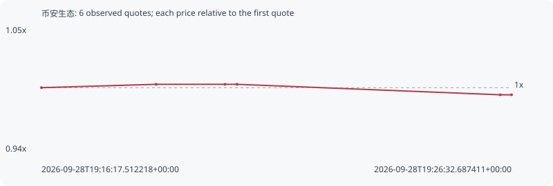

# 币安生态

**bsc** / `0x73495f9b2e2b5604a05278a50bd51e1996057777`

[All tokens](README.md) · [Market window](../README.md)

## Native assessments

This contract is in the quote cohort; it has no native model assessment in this window.

## Series 0aea9776bd21b56a928e

Pool: `not supplied`

[Complete series](../series/bsc/0aea9776bd21b56a928e.json)

Every dot is a captured quote. Lines connect observations; the curve ends at the last available quote.

| Peak | Final | Return | Maximum drawdown |
| ---: | ---: | ---: | ---: |
| 1.0030x | 0.9937x | -0.63% | 0.92% |

### Complete quote timeline

| Time (UTC) | Price (USD) | Multiple | Evidence |
| --- | ---: | ---: | --- |
| 2026-09-28T19:16:17.512218+00:00 | 0.000304058 | 1.0000x | `capture:a4477278-80c9-4a7a-9a8f-66687623072c:rank:97` |
| 2026-09-28T19:18:47.632598+00:00 | 0.000304958 | 1.0030x | `capture:bfa4352f-2279-41ec-a6fd-d3e101a21181:rank:96` |
| 2026-09-28T19:20:17.561225+00:00 | 0.000304958 | 1.0030x | `capture:0feecf05-56c0-4db7-a137-f63b427a7830:rank:96` |
| 2026-09-28T19:20:33.351338+00:00 | 0.000304958 | 1.0030x | `capture:5752259a-2bcb-4e27-ac90-6ef5a52d1cf7:rank:89` |
| 2026-09-28T19:26:17.917162+00:00 | 0.000302148 | 0.9937x | `capture:3b80c987-c82b-4a3e-8f0b-d3017a78edcb:rank:98` |
| 2026-09-28T19:26:32.687411+00:00 | 0.000302148 | 0.9937x | `capture:d1fef60a-e7ad-4594-a8e8-74ee96c47ae4:rank:99` |

### Exit-policy timeline

Calculated from captured quotes under the window policy. Native assessments are linked separately above.

| Time (UTC) | Action | Price (USD) | Evidence |
| --- | --- | ---: | --- |
| 2026-09-28T19:16:17.512218+00:00 | BUY | 0.000304058 | `capture:a4477278-80c9-4a7a-9a8f-66687623072c:rank:97` |
| 2026-09-28T19:18:47.632598+00:00 | HOLD | 0.000304958 | `capture:bfa4352f-2279-41ec-a6fd-d3e101a21181:rank:96` |
| 2026-09-28T19:20:17.561225+00:00 | HOLD | 0.000304958 | `capture:0feecf05-56c0-4db7-a137-f63b427a7830:rank:96` |
| 2026-09-28T19:20:33.351338+00:00 | HOLD | 0.000304958 | `capture:5752259a-2bcb-4e27-ac90-6ef5a52d1cf7:rank:89` |
| 2026-09-28T19:26:17.917162+00:00 | HOLD | 0.000302148 | `capture:3b80c987-c82b-4a3e-8f0b-d3017a78edcb:rank:98` |
| 2026-09-28T19:26:32.687411+00:00 | HOLD | 0.000302148 | `capture:d1fef60a-e7ad-4594-a8e8-74ee96c47ae4:rank:99` |
