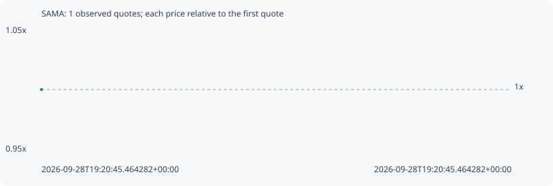

# SAMA

**robinhood** / `0x79f03ae1e2ed220d3721feaf5e2403d379f31e18`

[All tokens](README.md) · [Market window](../README.md)

## Native assessments

This contract is in the quote cohort; it has no native model assessment in this window.

## Series deb020e7357fa35b1e21

Pool: `not supplied`

[Complete series](../series/robinhood/deb020e7357fa35b1e21.json)

Every dot is a captured quote. Lines connect observations; the curve ends at the last available quote.

Fewer than two quotes: return and drawdown are not calculated.

### Complete quote timeline

| Time (UTC) | Price (USD) | Multiple | Evidence |
| --- | ---: | ---: | --- |
| 2026-09-28T19:20:45.464282+00:00 | 3.86857e-05 | 1.0000x | `capture:26559b75-812f-4386-982b-eba5073faf44:rank:61` |

### Exit-policy timeline

Calculated from captured quotes under the window policy. Native assessments are linked separately above.

| Time (UTC) | Action | Price (USD) | Evidence |
| --- | --- | ---: | --- |
