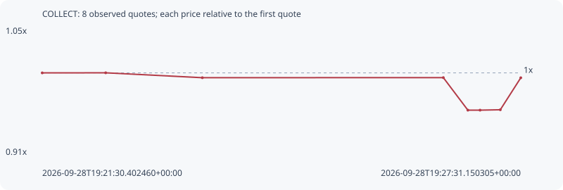

# COLLECT

**solana** / `nDZknLvfFRp5rgUHdzTrQsmSY5NKzoavqdLjSHVpump`

[All tokens](README.md) · [Market window](../README.md)

## Native assessments

This contract is in the quote cohort; it has no native model assessment in this window.

## Series fa429d4a7f57ec59315b

Pool: `not supplied`

[Complete series](../series/solana/fa429d4a7f57ec59315b.json)

Every dot is a captured quote. Lines connect observations; the curve ends at the last available quote.

| Peak | Final | Return | Maximum drawdown |
| ---: | ---: | ---: | ---: |
| 1.0001x | 0.9945x | -0.55% | 4.18% |

### Complete quote timeline

| Time (UTC) | Price (USD) | Multiple | Evidence |
| --- | ---: | ---: | --- |
| 2026-09-28T19:21:30.402460+00:00 | 0.00318624 | 1.0000x | `capture:d926629b-2050-4e50-a602-1638c6205870:rank:93` |
| 2026-09-28T19:22:18.240717+00:00 | 0.0031865 | 1.0001x | `capture:546b2c55-1845-4da7-bc9c-4439cd0ccdba:rank:97` |
| 2026-09-28T19:23:31.092727+00:00 | 0.00316905 | 0.9946x | `capture:0e687519-8b01-4d7e-b48c-e2ec34135d17:rank:97` |
| 2026-09-28T19:26:32.771713+00:00 | 0.00316932 | 0.9947x | `capture:2fed7296-b3d1-4ba6-8398-799ee55f1f2b:rank:94` |
| 2026-09-28T19:26:51.267717+00:00 | 0.00305329 | 0.9583x | `capture:4cc162c2-aa4a-403b-a901-4bb5058380d6:rank:93` |
| 2026-09-28T19:27:00.453239+00:00 | 0.00305329 | 0.9583x | `capture:4273fbb8-5342-4e37-8d61-ced6b88e542d:rank:95` |
| 2026-09-28T19:27:15.715818+00:00 | 0.0030547 | 0.9587x | `capture:d04c9116-4617-4b61-8b98-5489321cd1cc:rank:96` |
| 2026-09-28T19:27:31.150305+00:00 | 0.00316879 | 0.9945x | `capture:7cad37e8-83d3-4438-8055-245db6707e2e:rank:96` |

### Exit-policy timeline

Calculated from captured quotes under the window policy. Native assessments are linked separately above.

| Time (UTC) | Action | Price (USD) | Evidence |
| --- | --- | ---: | --- |
| 2026-09-28T19:21:30.402460+00:00 | BUY | 0.00318624 | `capture:d926629b-2050-4e50-a602-1638c6205870:rank:93` |
| 2026-09-28T19:22:18.240717+00:00 | HOLD | 0.0031865 | `capture:546b2c55-1845-4da7-bc9c-4439cd0ccdba:rank:97` |
| 2026-09-28T19:23:31.092727+00:00 | HOLD | 0.00316905 | `capture:0e687519-8b01-4d7e-b48c-e2ec34135d17:rank:97` |
| 2026-09-28T19:26:32.771713+00:00 | HOLD | 0.00316932 | `capture:2fed7296-b3d1-4ba6-8398-799ee55f1f2b:rank:94` |
| 2026-09-28T19:26:51.267717+00:00 | HOLD | 0.00305329 | `capture:4cc162c2-aa4a-403b-a901-4bb5058380d6:rank:93` |
| 2026-09-28T19:27:00.453239+00:00 | HOLD | 0.00305329 | `capture:4273fbb8-5342-4e37-8d61-ced6b88e542d:rank:95` |
| 2026-09-28T19:27:15.715818+00:00 | HOLD | 0.0030547 | `capture:d04c9116-4617-4b61-8b98-5489321cd1cc:rank:96` |
| 2026-09-28T19:27:31.150305+00:00 | HOLD | 0.00316879 | `capture:7cad37e8-83d3-4438-8055-245db6707e2e:rank:96` |
