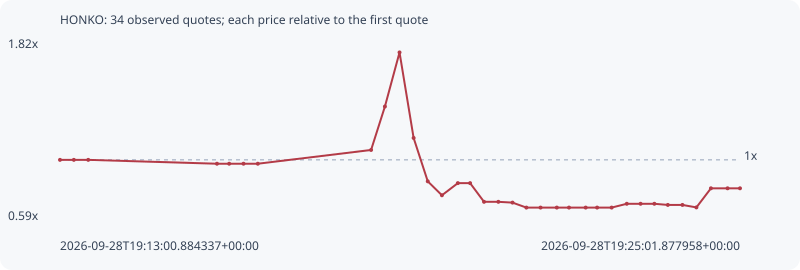

# HONKO

**solana** / `DzNsNL2bGrsCWQFarzC2pgohyWPvePD5URA7bMTzqWRh`

[All tokens](README.md) · [Market window](../README.md)

## Native assessments

This contract is in the quote cohort; it has no native model assessment in this window.

## Series 5bf01941b7bfa11db4ab

Pool: `not supplied`

[Complete series](../series/solana/5bf01941b7bfa11db4ab.json)

Every dot is a captured quote. Lines connect observations; the curve ends at the last available quote.

| Peak | Final | Return | Maximum drawdown |
| ---: | ---: | ---: | ---: |
| 1.7366x | 0.8051x | -19.49% | 61.25% |

### Complete quote timeline

| Time (UTC) | Price (USD) | Multiple | Evidence |
| --- | ---: | ---: | --- |
| 2026-09-28T19:13:00.884337+00:00 | 5.58974e-06 | 1.0000x | `capture:5867894f-39b4-4bcd-bd87-86394c63aab4:rank:93` |
| 2026-09-28T19:13:15.565374+00:00 | 5.58974e-06 | 1.0000x | `capture:ca31b3d4-ad60-4333-98b3-6d940a196f86:rank:96` |
| 2026-09-28T19:13:30.833894+00:00 | 5.58974e-06 | 1.0000x | `capture:2beb38a4-bfac-4502-bbc3-8c8c0f943007:rank:98` |
| 2026-09-28T19:15:47.323285+00:00 | 5.4418e-06 | 0.9735x | `capture:65003429-a569-4442-8d4f-b2c93db69061:rank:99` |
| 2026-09-28T19:16:00.259696+00:00 | 5.4418e-06 | 0.9735x | `capture:4236f8d5-90c4-4c9b-a73e-d6443ae3bf32:rank:97` |
| 2026-09-28T19:16:15.455827+00:00 | 5.4418e-06 | 0.9735x | `capture:acc657c6-9a43-46bf-986e-7b907c831cba:rank:98` |
| 2026-09-28T19:16:30.624202+00:00 | 5.4418e-06 | 0.9735x | `capture:0d391072-ec81-4bb7-9be0-0d6bbb801c70:rank:98` |
| 2026-09-28T19:18:30.722167+00:00 | 5.96925e-06 | 1.0679x | `capture:9f88d118-9108-4dff-bbfc-246eaed5ce38:rank:86` |
| 2026-09-28T19:18:45.386687+00:00 | 7.63368e-06 | 1.3657x | `capture:f533100a-ce62-4457-9107-42e7601ea5d7:rank:77` |
| 2026-09-28T19:19:00.883835+00:00 | 9.70706e-06 | 1.7366x | `capture:a2495d99-5671-4c7e-b87c-48f48d90f2f2:rank:66` |
| 2026-09-28T19:19:15.826416+00:00 | 6.42867e-06 | 1.1501x | `capture:ba1dc6a3-b8b7-461a-8110-8490f03539a5:rank:59` |
| 2026-09-28T19:19:30.814098+00:00 | 4.76707e-06 | 0.8528x | `capture:b25d90dc-c8db-4388-8a2b-d06541e5320f:rank:53` |
| 2026-09-28T19:19:45.817199+00:00 | 4.23268e-06 | 0.7572x | `capture:722d1b7b-ef4f-4ac5-883c-0557bae2b60b:rank:48` |
| 2026-09-28T19:20:02.715590+00:00 | 4.69818e-06 | 0.8405x | `capture:60ff17d8-3b18-4f61-9bc7-006afd324cf2:rank:34` |
| 2026-09-28T19:20:15.699547+00:00 | 4.69818e-06 | 0.8405x | `capture:10a94828-637f-4580-a9f7-2fbd34d8589a:rank:36` |
| 2026-09-28T19:20:30.480194+00:00 | 3.98212e-06 | 0.7124x | `capture:54722132-db1d-4a2b-8c1c-2b0e71d01430:rank:36` |
| 2026-09-28T19:20:45.683165+00:00 | 3.98212e-06 | 0.7124x | `capture:17963a37-fd65-46b6-8e1c-350082721f8c:rank:35` |
| 2026-09-28T19:21:00.690136+00:00 | 3.95159e-06 | 0.7069x | `capture:f2ff842d-38e9-4cbe-a281-98c17d5a5672:rank:33` |
| 2026-09-28T19:21:15.372716+00:00 | 3.76102e-06 | 0.6728x | `capture:a923b968-a768-495e-ae33-6de2042c551f:rank:32` |
| 2026-09-28T19:21:30.402460+00:00 | 3.76102e-06 | 0.6728x | `capture:d926629b-2050-4e50-a602-1638c6205870:rank:31` |
| 2026-09-28T19:21:47.649380+00:00 | 3.76102e-06 | 0.6728x | `capture:0799ec6d-0e89-46b5-ae88-5695bf6c5fc3:rank:34` |
| 2026-09-28T19:22:00.569928+00:00 | 3.76102e-06 | 0.6728x | `capture:263cda40-4b31-4b2d-b168-fa4310edb46d:rank:34` |
| 2026-09-28T19:22:18.240717+00:00 | 3.76102e-06 | 0.6728x | `capture:546b2c55-1845-4da7-bc9c-4439cd0ccdba:rank:33` |
| 2026-09-28T19:22:30.371968+00:00 | 3.76102e-06 | 0.6728x | `capture:507d17cb-af67-4a81-a2b2-d5ddfbc40021:rank:32` |
| 2026-09-28T19:22:45.783808+00:00 | 3.76102e-06 | 0.6728x | `capture:9558d322-c429-480b-885f-82f4481c8506:rank:34` |
| 2026-09-28T19:23:01.833252+00:00 | 3.9069e-06 | 0.6989x | `capture:c5462412-2da1-4432-8949-8fcd1492c57f:rank:34` |
| 2026-09-28T19:23:16.460099+00:00 | 3.9069e-06 | 0.6989x | `capture:2d456a2a-6755-4e1d-9a80-b6e3b2d44ec1:rank:35` |
| 2026-09-28T19:23:31.092727+00:00 | 3.9069e-06 | 0.6989x | `capture:0e687519-8b01-4d7e-b48c-e2ec34135d17:rank:35` |
| 2026-09-28T19:23:45.375171+00:00 | 3.86289e-06 | 0.6911x | `capture:1b404fa0-870b-4e7c-bafd-c3ef241c5093:rank:42` |
| 2026-09-28T19:24:00.852400+00:00 | 3.86289e-06 | 0.6911x | `capture:5205c587-4734-452c-b758-46c4814dded1:rank:44` |
| 2026-09-28T19:24:15.655418+00:00 | 3.7678e-06 | 0.6741x | `capture:5b9df0f6-51c0-4dbb-9de7-7df7a46bfee0:rank:46` |
| 2026-09-28T19:24:31.056437+00:00 | 4.50009e-06 | 0.8051x | `capture:971b5dda-397d-4fe7-b49e-94713bb088df:rank:49` |
| 2026-09-28T19:24:48.687179+00:00 | 4.50009e-06 | 0.8051x | `capture:feb72cbd-a170-4ba3-8a11-eb1df1686719:rank:51` |
| 2026-09-28T19:25:01.877958+00:00 | 4.50009e-06 | 0.8051x | `capture:fd6d01ae-d246-439e-ac58-27ae75880eb9:rank:51` |

### Exit-policy timeline

Calculated from captured quotes under the window policy. Native assessments are linked separately above.

| Time (UTC) | Action | Price (USD) | Evidence |
| --- | --- | ---: | --- |
| 2026-09-28T19:13:00.884337+00:00 | BUY | 5.58974e-06 | `capture:5867894f-39b4-4bcd-bd87-86394c63aab4:rank:93` |
| 2026-09-28T19:13:15.565374+00:00 | HOLD | 5.58974e-06 | `capture:ca31b3d4-ad60-4333-98b3-6d940a196f86:rank:96` |
| 2026-09-28T19:13:30.833894+00:00 | HOLD | 5.58974e-06 | `capture:2beb38a4-bfac-4502-bbc3-8c8c0f943007:rank:98` |
| 2026-09-28T19:15:47.323285+00:00 | HOLD | 5.4418e-06 | `capture:65003429-a569-4442-8d4f-b2c93db69061:rank:99` |
| 2026-09-28T19:16:00.259696+00:00 | HOLD | 5.4418e-06 | `capture:4236f8d5-90c4-4c9b-a73e-d6443ae3bf32:rank:97` |
| 2026-09-28T19:16:15.455827+00:00 | HOLD | 5.4418e-06 | `capture:acc657c6-9a43-46bf-986e-7b907c831cba:rank:98` |
| 2026-09-28T19:16:30.624202+00:00 | HOLD | 5.4418e-06 | `capture:0d391072-ec81-4bb7-9be0-0d6bbb801c70:rank:98` |
| 2026-09-28T19:18:30.722167+00:00 | HOLD | 5.96925e-06 | `capture:9f88d118-9108-4dff-bbfc-246eaed5ce38:rank:86` |
| 2026-09-28T19:18:45.386687+00:00 | PROFIT | 7.63368e-06 | `capture:f533100a-ce62-4457-9107-42e7601ea5d7:rank:77` |
| 2026-09-28T19:19:00.883835+00:00 | TP | 9.70706e-06 | `capture:a2495d99-5671-4c7e-b87c-48f48d90f2f2:rank:66` |
