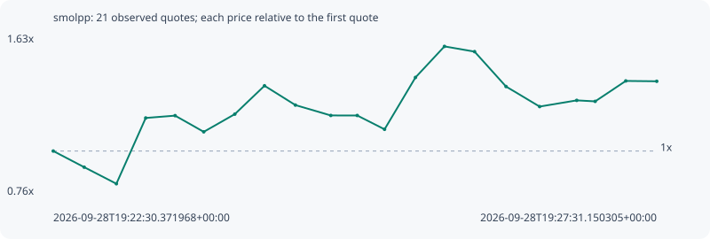

# smolpp

**solana** / `7wBt7aNt1DBzE3WPbPQruhvo4x7Y95PBHnBMVaBLpump`

[All tokens](README.md) · [Market window](../README.md)

## Native assessments

This contract is in the quote cohort; it has no native model assessment in this window.

## Series 01d48affa9ce894e30f3

Pool: `not supplied`

[Complete series](../series/solana/01d48affa9ce894e30f3.json)

Every dot is a captured quote. Lines connect observations; the curve ends at the last available quote.

| Peak | Final | Return | Maximum drawdown |
| ---: | ---: | ---: | ---: |
| 1.5672x | 1.3781x | +37.81% | 20.81% |

### Complete quote timeline

| Time (UTC) | Price (USD) | Multiple | Evidence |
| --- | ---: | ---: | --- |
| 2026-09-28T19:22:30.371968+00:00 | 5.79504e-05 | 1.0000x | `capture:507d17cb-af67-4a81-a2b2-d5ddfbc40021:rank:36` |
| 2026-09-28T19:22:45.783808+00:00 | 5.28812e-05 | 0.9125x | `capture:9558d322-c429-480b-885f-82f4481c8506:rank:25` |
| 2026-09-28T19:23:01.833252+00:00 | 4.76758e-05 | 0.8227x | `capture:c5462412-2da1-4432-8949-8fcd1492c57f:rank:21` |
| 2026-09-28T19:23:16.460099+00:00 | 6.83398e-05 | 1.1793x | `capture:2d456a2a-6755-4e1d-9a80-b6e3b2d44ec1:rank:16` |
| 2026-09-28T19:23:31.092727+00:00 | 6.90715e-05 | 1.1919x | `capture:0e687519-8b01-4d7e-b48c-e2ec34135d17:rank:14` |
| 2026-09-28T19:23:45.375171+00:00 | 6.39827e-05 | 1.1041x | `capture:1b404fa0-870b-4e7c-bafd-c3ef241c5093:rank:14` |
| 2026-09-28T19:24:00.852400+00:00 | 6.9538e-05 | 1.2000x | `capture:5205c587-4734-452c-b758-46c4814dded1:rank:13` |
| 2026-09-28T19:24:15.655418+00:00 | 7.84576e-05 | 1.3539x | `capture:5b9df0f6-51c0-4dbb-9de7-7df7a46bfee0:rank:13` |
| 2026-09-28T19:24:31.056437+00:00 | 7.23859e-05 | 1.2491x | `capture:971b5dda-397d-4fe7-b49e-94713bb088df:rank:13` |
| 2026-09-28T19:24:48.687179+00:00 | 6.91275e-05 | 1.1929x | `capture:feb72cbd-a170-4ba3-8a11-eb1df1686719:rank:13` |
| 2026-09-28T19:25:01.877958+00:00 | 6.91231e-05 | 1.1928x | `capture:fd6d01ae-d246-439e-ac58-27ae75880eb9:rank:13` |
| 2026-09-28T19:25:15.488701+00:00 | 6.47731e-05 | 1.1177x | `capture:b8fee87c-9981-475c-930b-99c255910a9f:rank:11` |
| 2026-09-28T19:25:30.900173+00:00 | 8.10674e-05 | 1.3989x | `capture:7f757769-25c3-429a-81d0-c6b2ee45ee15:rank:9` |
| 2026-09-28T19:25:45.342895+00:00 | 9.08185e-05 | 1.5672x | `capture:0ca3656d-ce8c-444b-8f77-acf34c08a1f4:rank:9` |
| 2026-09-28T19:26:00.340634+00:00 | 8.9175e-05 | 1.5388x | `capture:5b3728c5-aff9-43f3-bbb5-25b251825caa:rank:9` |
| 2026-09-28T19:26:16.031602+00:00 | 7.82137e-05 | 1.3497x | `capture:bb8d4bfc-85e1-4d55-a2ff-e47193bcce5f:rank:9` |
| 2026-09-28T19:26:32.771713+00:00 | 7.19191e-05 | 1.2410x | `capture:2fed7296-b3d1-4ba6-8398-799ee55f1f2b:rank:8` |
| 2026-09-28T19:26:51.267717+00:00 | 7.38658e-05 | 1.2746x | `capture:4cc162c2-aa4a-403b-a901-4bb5058380d6:rank:8` |
| 2026-09-28T19:27:00.453239+00:00 | 7.35513e-05 | 1.2692x | `capture:4273fbb8-5342-4e37-8d61-ced6b88e542d:rank:8` |
| 2026-09-28T19:27:15.715818+00:00 | 7.99711e-05 | 1.3800x | `capture:d04c9116-4617-4b61-8b98-5489321cd1cc:rank:8` |
| 2026-09-28T19:27:31.150305+00:00 | 7.98626e-05 | 1.3781x | `capture:7cad37e8-83d3-4438-8055-245db6707e2e:rank:6` |

### Exit-policy timeline

Calculated from captured quotes under the window policy. Native assessments are linked separately above.

| Time (UTC) | Action | Price (USD) | Evidence |
| --- | --- | ---: | --- |
| 2026-09-28T19:22:30.371968+00:00 | BUY | 5.79504e-05 | `capture:507d17cb-af67-4a81-a2b2-d5ddfbc40021:rank:36` |
| 2026-09-28T19:22:45.783808+00:00 | HOLD | 5.28812e-05 | `capture:9558d322-c429-480b-885f-82f4481c8506:rank:25` |
| 2026-09-28T19:23:01.833252+00:00 | SL | 4.76758e-05 | `capture:c5462412-2da1-4432-8949-8fcd1492c57f:rank:21` |
