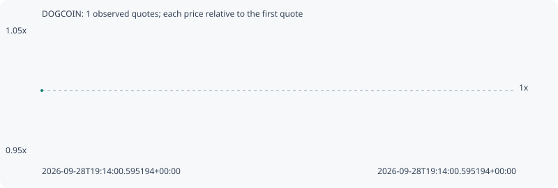

# DOGCOIN

**solana** / `DBrbyyYBukDRskqAHkv7NEuRBMo3w1tAZ4Yyadxfpump`

[All tokens](README.md) · [Market window](../README.md)

## Native assessments

This contract is in the quote cohort; it has no native model assessment in this window.

## Series 4b1dd3cd181761af481b

Pool: `not supplied`

[Complete series](../series/solana/4b1dd3cd181761af481b.json)

Every dot is a captured quote. Lines connect observations; the curve ends at the last available quote.

Fewer than two quotes: return and drawdown are not calculated.

### Complete quote timeline

| Time (UTC) | Price (USD) | Multiple | Evidence |
| --- | ---: | ---: | --- |
| 2026-09-28T19:14:00.595194+00:00 | 4.25751e-06 | 1.0000x | `capture:2c78112b-48e7-4f74-8c2e-1cb8642a79dc:rank:42` |

### Exit-policy timeline

Calculated from captured quotes under the window policy. Native assessments are linked separately above.

| Time (UTC) | Action | Price (USD) | Evidence |
| --- | --- | ---: | --- |
