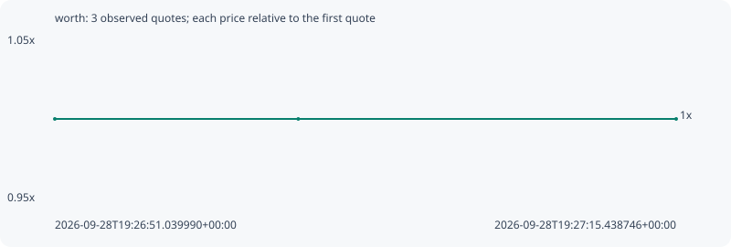

# worth

**robinhood** / `0xfb1bcb6817f7b8fa86896d3253b16aeb7bd6a5a8`

[All tokens](README.md) · [Market window](../README.md)

## Native assessments

This contract is in the quote cohort; it has no native model assessment in this window.

## Series 89d7a7b79a78a9aaad67

Pool: `not supplied`

[Complete series](../series/robinhood/89d7a7b79a78a9aaad67.json)

Every dot is a captured quote. Lines connect observations; the curve ends at the last available quote.

| Peak | Final | Return | Maximum drawdown |
| ---: | ---: | ---: | ---: |
| 1.0000x | 1.0000x | +0.00% | 0.00% |

### Complete quote timeline

| Time (UTC) | Price (USD) | Multiple | Evidence |
| --- | ---: | ---: | --- |
| 2026-09-28T19:26:51.039990+00:00 | 0.00152872 | 1.0000x | `capture:653b62fa-7a58-45fd-95e9-3b36912dc139:rank:91` |
| 2026-09-28T19:27:00.598930+00:00 | 0.00152872 | 1.0000x | `capture:8041f6b0-6188-445c-83ef-3a6fb7daf321:rank:92` |
| 2026-09-28T19:27:15.438746+00:00 | 0.00152872 | 1.0000x | `capture:b4c48612-e04d-4782-96a6-e80c2955d3b9:rank:96` |

### Exit-policy timeline

Calculated from captured quotes under the window policy. Native assessments are linked separately above.

| Time (UTC) | Action | Price (USD) | Evidence |
| --- | --- | ---: | --- |
| 2026-09-28T19:26:51.039990+00:00 | BUY | 0.00152872 | `capture:653b62fa-7a58-45fd-95e9-3b36912dc139:rank:91` |
| 2026-09-28T19:27:00.598930+00:00 | HOLD | 0.00152872 | `capture:8041f6b0-6188-445c-83ef-3a6fb7daf321:rank:92` |
| 2026-09-28T19:27:15.438746+00:00 | HOLD | 0.00152872 | `capture:b4c48612-e04d-4782-96a6-e80c2955d3b9:rank:96` |
