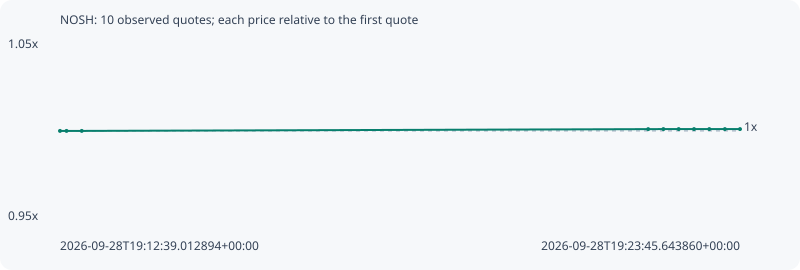

# NOSH

**robinhood** / `0xe02c53d448a62067b2ac10ed70f5bc6c29471386`

[All tokens](README.md) · [Market window](../README.md)

## Native assessments

This contract is in the quote cohort; it has no native model assessment in this window.

## Series dc7451be98e1559c159a

Pool: `not supplied`

[Complete series](../series/robinhood/dc7451be98e1559c159a.json)

Every dot is a captured quote. Lines connect observations; the curve ends at the last available quote.

| Peak | Final | Return | Maximum drawdown |
| ---: | ---: | ---: | ---: |
| 1.0010x | 1.0010x | +0.10% | 0.00% |

### Complete quote timeline

| Time (UTC) | Price (USD) | Multiple | Evidence |
| --- | ---: | ---: | --- |
| 2026-09-28T19:12:39.012894+00:00 | 0.00269454 | 1.0000x | `capture:fe8ad944-154e-4481-bd56-8ab821bfbfe1:rank:78` |
| 2026-09-28T19:12:45.402569+00:00 | 0.00269454 | 1.0000x | `capture:8deb508c-ea33-4c21-a5c5-f0991dd6dcac:rank:78` |
| 2026-09-28T19:13:00.335966+00:00 | 0.00269454 | 1.0000x | `capture:ee3ee7f8-576f-4c42-a7e0-cd9f917fdb36:rank:78` |
| 2026-09-28T19:22:15.632268+00:00 | 0.00269725 | 1.0010x | `capture:13e6d33e-e854-4b87-b3da-49aedec6950e:rank:98` |
| 2026-09-28T19:22:30.535979+00:00 | 0.00269731 | 1.0010x | `capture:091fb4d2-10fc-4d5f-9c22-af9f55e90e4a:rank:93` |
| 2026-09-28T19:22:45.520851+00:00 | 0.00269731 | 1.0010x | `capture:128617a9-4055-4a8d-8b04-c8876bad9c70:rank:92` |
| 2026-09-28T19:23:00.594785+00:00 | 0.00269731 | 1.0010x | `capture:b6c633f1-3960-4db3-a2ca-34618f913368:rank:96` |
| 2026-09-28T19:23:15.534636+00:00 | 0.00269731 | 1.0010x | `capture:d5a0d1a4-a366-4985-80da-e34160e2f58c:rank:93` |
| 2026-09-28T19:23:30.815940+00:00 | 0.00269731 | 1.0010x | `capture:c6f23ed9-c47c-4f73-bf08-86a494a11aa2:rank:90` |
| 2026-09-28T19:23:45.643860+00:00 | 0.00269731 | 1.0010x | `capture:0b8bbeb9-cbaa-4cb2-a853-2bb146bd23e5:rank:97` |

### Exit-policy timeline

Calculated from captured quotes under the window policy. Native assessments are linked separately above.

| Time (UTC) | Action | Price (USD) | Evidence |
| --- | --- | ---: | --- |
| 2026-09-28T19:12:39.012894+00:00 | BUY | 0.00269454 | `capture:fe8ad944-154e-4481-bd56-8ab821bfbfe1:rank:78` |
| 2026-09-28T19:12:45.402569+00:00 | HOLD | 0.00269454 | `capture:8deb508c-ea33-4c21-a5c5-f0991dd6dcac:rank:78` |
| 2026-09-28T19:13:00.335966+00:00 | HOLD | 0.00269454 | `capture:ee3ee7f8-576f-4c42-a7e0-cd9f917fdb36:rank:78` |
| 2026-09-28T19:22:15.632268+00:00 | HOLD | 0.00269725 | `capture:13e6d33e-e854-4b87-b3da-49aedec6950e:rank:98` |
| 2026-09-28T19:22:30.535979+00:00 | HOLD | 0.00269731 | `capture:091fb4d2-10fc-4d5f-9c22-af9f55e90e4a:rank:93` |
| 2026-09-28T19:22:45.520851+00:00 | HOLD | 0.00269731 | `capture:128617a9-4055-4a8d-8b04-c8876bad9c70:rank:92` |
| 2026-09-28T19:23:00.594785+00:00 | HOLD | 0.00269731 | `capture:b6c633f1-3960-4db3-a2ca-34618f913368:rank:96` |
| 2026-09-28T19:23:15.534636+00:00 | HOLD | 0.00269731 | `capture:d5a0d1a4-a366-4985-80da-e34160e2f58c:rank:93` |
| 2026-09-28T19:23:30.815940+00:00 | HOLD | 0.00269731 | `capture:c6f23ed9-c47c-4f73-bf08-86a494a11aa2:rank:90` |
| 2026-09-28T19:23:45.643860+00:00 | HOLD | 0.00269731 | `capture:0b8bbeb9-cbaa-4cb2-a853-2bb146bd23e5:rank:97` |
