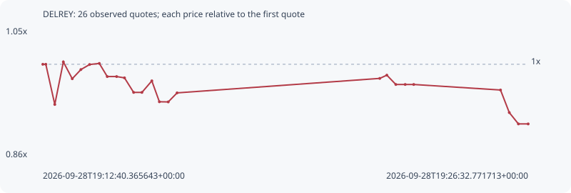

# DELREY

**solana** / `92BVgXufGjaMUyANA97dvg8LqNb5VMg2wgRfve9tPdCG`

[All tokens](README.md) · [Market window](../README.md)

## Native assessments

This contract is in the quote cohort; it has no native model assessment in this window.

## Series d73a0d604da493a9282f

Pool: `not supplied`

[Complete series](../series/solana/d73a0d604da493a9282f.json)

Every dot is a captured quote. Lines connect observations; the curve ends at the last available quote.

| Peak | Final | Return | Maximum drawdown |
| ---: | ---: | ---: | ---: |
| 1.0035x | 0.9106x | -8.94% | 9.26% |

### Complete quote timeline

| Time (UTC) | Price (USD) | Multiple | Evidence |
| --- | ---: | ---: | --- |
| 2026-09-28T19:12:40.365643+00:00 | 0.000252858 | 1.0000x | `capture:3af1faa1-2074-484e-893e-ed2c676e1576:rank:72` |
| 2026-09-28T19:12:45.490977+00:00 | 0.000252858 | 1.0000x | `capture:ac0279d6-7dd1-44b6-bf3e-910bf7b8eddf:rank:71` |
| 2026-09-28T19:13:00.884337+00:00 | 0.000237627 | 0.9398x | `capture:5867894f-39b4-4bcd-bd87-86394c63aab4:rank:67` |
| 2026-09-28T19:13:15.565374+00:00 | 0.000253749 | 1.0035x | `capture:ca31b3d4-ad60-4333-98b3-6d940a196f86:rank:66` |
| 2026-09-28T19:13:30.833894+00:00 | 0.000247383 | 0.9783x | `capture:2beb38a4-bfac-4502-bbc3-8c8c0f943007:rank:67` |
| 2026-09-28T19:13:45.640151+00:00 | 0.000250859 | 0.9921x | `capture:4d31b656-3ffe-4768-bef6-377adf019420:rank:71` |
| 2026-09-28T19:14:00.595194+00:00 | 0.000252774 | 0.9997x | `capture:2c78112b-48e7-4f74-8c2e-1cb8642a79dc:rank:75` |
| 2026-09-28T19:14:17.246316+00:00 | 0.000253185 | 1.0013x | `capture:7a923cde-d765-4388-a15c-4f47fde0a3b5:rank:74` |
| 2026-09-28T19:14:30.874732+00:00 | 0.000248207 | 0.9816x | `capture:fa585070-b1ae-4f9d-afbd-aa986f487793:rank:77` |
| 2026-09-28T19:14:46.892387+00:00 | 0.000248207 | 0.9816x | `capture:7d9e3e65-8bda-4696-b6d1-7a86825bd98c:rank:80` |
| 2026-09-28T19:15:00.432009+00:00 | 0.00024771 | 0.9796x | `capture:797f9a41-958a-44ba-ac57-3b9cacf5d06b:rank:86` |
| 2026-09-28T19:15:16.098308+00:00 | 0.0002422 | 0.9578x | `capture:ab2becb9-3f94-4a57-b9e8-472ad0998012:rank:90` |
| 2026-09-28T19:15:30.340579+00:00 | 0.0002422 | 0.9578x | `capture:564db5fc-5586-41d3-88fb-a9a955708f1d:rank:95` |
| 2026-09-28T19:15:47.323285+00:00 | 0.000246569 | 0.9751x | `capture:65003429-a569-4442-8d4f-b2c93db69061:rank:98` |
| 2026-09-28T19:16:00.259696+00:00 | 0.000238646 | 0.9438x | `capture:4236f8d5-90c4-4c9b-a73e-d6443ae3bf32:rank:96` |
| 2026-09-28T19:16:15.455827+00:00 | 0.000238593 | 0.9436x | `capture:acc657c6-9a43-46bf-986e-7b907c831cba:rank:99` |
| 2026-09-28T19:16:30.624202+00:00 | 0.000242018 | 0.9571x | `capture:0d391072-ec81-4bb7-9be0-0d6bbb801c70:rank:96` |
| 2026-09-28T19:22:18.240717+00:00 | 0.000247507 | 0.9788x | `capture:546b2c55-1845-4da7-bc9c-4439cd0ccdba:rank:90` |
| 2026-09-28T19:22:30.371968+00:00 | 0.000248735 | 0.9837x | `capture:507d17cb-af67-4a81-a2b2-d5ddfbc40021:rank:91` |
| 2026-09-28T19:22:45.783808+00:00 | 0.000245204 | 0.9697x | `capture:9558d322-c429-480b-885f-82f4481c8506:rank:97` |
| 2026-09-28T19:23:01.833252+00:00 | 0.000245204 | 0.9697x | `capture:c5462412-2da1-4432-8949-8fcd1492c57f:rank:96` |
| 2026-09-28T19:23:16.460099+00:00 | 0.000245204 | 0.9697x | `capture:2d456a2a-6755-4e1d-9a80-b6e3b2d44ec1:rank:99` |
| 2026-09-28T19:25:45.342895+00:00 | 0.000243106 | 0.9614x | `capture:0ca3656d-ce8c-444b-8f77-acf34c08a1f4:rank:99` |
| 2026-09-28T19:26:00.340634+00:00 | 0.000234559 | 0.9276x | `capture:5b3728c5-aff9-43f3-bbb5-25b251825caa:rank:99` |
| 2026-09-28T19:26:16.031602+00:00 | 0.00023025 | 0.9106x | `capture:bb8d4bfc-85e1-4d55-a2ff-e47193bcce5f:rank:89` |
| 2026-09-28T19:26:32.771713+00:00 | 0.00023025 | 0.9106x | `capture:2fed7296-b3d1-4ba6-8398-799ee55f1f2b:rank:98` |

### Exit-policy timeline

Calculated from captured quotes under the window policy. Native assessments are linked separately above.

| Time (UTC) | Action | Price (USD) | Evidence |
| --- | --- | ---: | --- |
| 2026-09-28T19:12:40.365643+00:00 | BUY | 0.000252858 | `capture:3af1faa1-2074-484e-893e-ed2c676e1576:rank:72` |
| 2026-09-28T19:12:45.490977+00:00 | HOLD | 0.000252858 | `capture:ac0279d6-7dd1-44b6-bf3e-910bf7b8eddf:rank:71` |
| 2026-09-28T19:13:00.884337+00:00 | HOLD | 0.000237627 | `capture:5867894f-39b4-4bcd-bd87-86394c63aab4:rank:67` |
| 2026-09-28T19:13:15.565374+00:00 | HOLD | 0.000253749 | `capture:ca31b3d4-ad60-4333-98b3-6d940a196f86:rank:66` |
| 2026-09-28T19:13:30.833894+00:00 | HOLD | 0.000247383 | `capture:2beb38a4-bfac-4502-bbc3-8c8c0f943007:rank:67` |
| 2026-09-28T19:13:45.640151+00:00 | HOLD | 0.000250859 | `capture:4d31b656-3ffe-4768-bef6-377adf019420:rank:71` |
| 2026-09-28T19:14:00.595194+00:00 | HOLD | 0.000252774 | `capture:2c78112b-48e7-4f74-8c2e-1cb8642a79dc:rank:75` |
| 2026-09-28T19:14:17.246316+00:00 | HOLD | 0.000253185 | `capture:7a923cde-d765-4388-a15c-4f47fde0a3b5:rank:74` |
| 2026-09-28T19:14:30.874732+00:00 | HOLD | 0.000248207 | `capture:fa585070-b1ae-4f9d-afbd-aa986f487793:rank:77` |
| 2026-09-28T19:14:46.892387+00:00 | HOLD | 0.000248207 | `capture:7d9e3e65-8bda-4696-b6d1-7a86825bd98c:rank:80` |
| 2026-09-28T19:15:00.432009+00:00 | HOLD | 0.00024771 | `capture:797f9a41-958a-44ba-ac57-3b9cacf5d06b:rank:86` |
| 2026-09-28T19:15:16.098308+00:00 | HOLD | 0.0002422 | `capture:ab2becb9-3f94-4a57-b9e8-472ad0998012:rank:90` |
| 2026-09-28T19:15:30.340579+00:00 | HOLD | 0.0002422 | `capture:564db5fc-5586-41d3-88fb-a9a955708f1d:rank:95` |
| 2026-09-28T19:15:47.323285+00:00 | HOLD | 0.000246569 | `capture:65003429-a569-4442-8d4f-b2c93db69061:rank:98` |
| 2026-09-28T19:16:00.259696+00:00 | HOLD | 0.000238646 | `capture:4236f8d5-90c4-4c9b-a73e-d6443ae3bf32:rank:96` |
| 2026-09-28T19:16:15.455827+00:00 | HOLD | 0.000238593 | `capture:acc657c6-9a43-46bf-986e-7b907c831cba:rank:99` |
| 2026-09-28T19:16:30.624202+00:00 | HOLD | 0.000242018 | `capture:0d391072-ec81-4bb7-9be0-0d6bbb801c70:rank:96` |
| 2026-09-28T19:22:18.240717+00:00 | HOLD | 0.000247507 | `capture:546b2c55-1845-4da7-bc9c-4439cd0ccdba:rank:90` |
| 2026-09-28T19:22:30.371968+00:00 | HOLD | 0.000248735 | `capture:507d17cb-af67-4a81-a2b2-d5ddfbc40021:rank:91` |
| 2026-09-28T19:22:45.783808+00:00 | HOLD | 0.000245204 | `capture:9558d322-c429-480b-885f-82f4481c8506:rank:97` |
| 2026-09-28T19:23:01.833252+00:00 | HOLD | 0.000245204 | `capture:c5462412-2da1-4432-8949-8fcd1492c57f:rank:96` |
| 2026-09-28T19:23:16.460099+00:00 | HOLD | 0.000245204 | `capture:2d456a2a-6755-4e1d-9a80-b6e3b2d44ec1:rank:99` |
| 2026-09-28T19:25:45.342895+00:00 | HOLD | 0.000243106 | `capture:0ca3656d-ce8c-444b-8f77-acf34c08a1f4:rank:99` |
| 2026-09-28T19:26:00.340634+00:00 | HOLD | 0.000234559 | `capture:5b3728c5-aff9-43f3-bbb5-25b251825caa:rank:99` |
| 2026-09-28T19:26:16.031602+00:00 | HOLD | 0.00023025 | `capture:bb8d4bfc-85e1-4d55-a2ff-e47193bcce5f:rank:89` |
| 2026-09-28T19:26:32.771713+00:00 | HOLD | 0.00023025 | `capture:2fed7296-b3d1-4ba6-8398-799ee55f1f2b:rank:98` |
