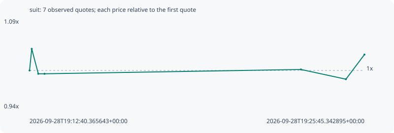

# suit

**solana** / `AVXPQqxd32ABAP5F7shHKNeWBpos9miktdH3uKqgXYJZ`

[All tokens](README.md) · [Market window](../README.md)

## Native assessments

This contract is in the quote cohort; it has no native model assessment in this window.

## Series 6a924889ca92bd4092fb

Pool: `not supplied`

[Complete series](../series/solana/6a924889ca92bd4092fb.json)

Every dot is a captured quote. Lines connect observations; the curve ends at the last available quote.

| Peak | Final | Return | Maximum drawdown |
| ---: | ---: | ---: | ---: |
| 1.0370x | 1.0273x | +2.73% | 5.01% |

### Complete quote timeline

| Time (UTC) | Price (USD) | Multiple | Evidence |
| --- | ---: | ---: | --- |
| 2026-09-28T19:12:40.365643+00:00 | 0.000274347 | 1.0000x | `capture:3af1faa1-2074-484e-893e-ed2c676e1576:rank:83` |
| 2026-09-28T19:12:45.490977+00:00 | 0.000284496 | 1.0370x | `capture:ac0279d6-7dd1-44b6-bf3e-910bf7b8eddf:rank:82` |
| 2026-09-28T19:13:00.884337+00:00 | 0.00027279 | 0.9943x | `capture:5867894f-39b4-4bcd-bd87-86394c63aab4:rank:83` |
| 2026-09-28T19:13:15.565374+00:00 | 0.00027279 | 0.9943x | `capture:ca31b3d4-ad60-4333-98b3-6d940a196f86:rank:97` |
| 2026-09-28T19:23:16.460099+00:00 | 0.000274821 | 1.0017x | `capture:2d456a2a-6755-4e1d-9a80-b6e3b2d44ec1:rank:96` |
| 2026-09-28T19:25:01.877958+00:00 | 0.000270242 | 0.9850x | `capture:fd6d01ae-d246-439e-ac58-27ae75880eb9:rank:99` |
| 2026-09-28T19:25:45.342895+00:00 | 0.000281827 | 1.0273x | `capture:0ca3656d-ce8c-444b-8f77-acf34c08a1f4:rank:95` |

### Exit-policy timeline

Calculated from captured quotes under the window policy. Native assessments are linked separately above.

| Time (UTC) | Action | Price (USD) | Evidence |
| --- | --- | ---: | --- |
| 2026-09-28T19:12:40.365643+00:00 | BUY | 0.000274347 | `capture:3af1faa1-2074-484e-893e-ed2c676e1576:rank:83` |
| 2026-09-28T19:12:45.490977+00:00 | HOLD | 0.000284496 | `capture:ac0279d6-7dd1-44b6-bf3e-910bf7b8eddf:rank:82` |
| 2026-09-28T19:13:00.884337+00:00 | HOLD | 0.00027279 | `capture:5867894f-39b4-4bcd-bd87-86394c63aab4:rank:83` |
| 2026-09-28T19:13:15.565374+00:00 | HOLD | 0.00027279 | `capture:ca31b3d4-ad60-4333-98b3-6d940a196f86:rank:97` |
| 2026-09-28T19:23:16.460099+00:00 | HOLD | 0.000274821 | `capture:2d456a2a-6755-4e1d-9a80-b6e3b2d44ec1:rank:96` |
| 2026-09-28T19:25:01.877958+00:00 | HOLD | 0.000270242 | `capture:fd6d01ae-d246-439e-ac58-27ae75880eb9:rank:99` |
| 2026-09-28T19:25:45.342895+00:00 | HOLD | 0.000281827 | `capture:0ca3656d-ce8c-444b-8f77-acf34c08a1f4:rank:95` |
