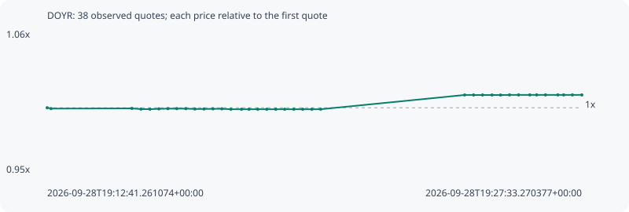

# DOYR

**bsc** / `0x925c8ab7a9a8a148e87cd7f1ec7ecc3625864444`

[All tokens](README.md) · [Market window](../README.md)

## Native assessments

This contract is in the quote cohort; it has no native model assessment in this window.

## Series 3656e6119c5944a11794

Pool: `not supplied`

[Complete series](../series/bsc/3656e6119c5944a11794.json)

Every dot is a captured quote. Lines connect observations; the curve ends at the last available quote.

| Peak | Final | Return | Maximum drawdown |
| ---: | ---: | ---: | ---: |
| 1.0101x | 1.0101x | +1.01% | 0.12% |

### Complete quote timeline

| Time (UTC) | Price (USD) | Multiple | Evidence |
| --- | ---: | ---: | --- |
| 2026-09-28T19:12:41.261074+00:00 | 0.000383676 | 1.0000x | `capture:795a88f0-804c-4f14-a3e8-ce8d9318f6df:rank:68` |
| 2026-09-28T19:12:47.639745+00:00 | 0.000383426 | 0.9993x | `capture:c2d8bd1a-9ed6-4d75-91ae-006bea65a635:rank:72` |
| 2026-09-28T19:15:02.698030+00:00 | 0.000383479 | 0.9995x | `capture:d9b7eccd-b77f-4cc6-8305-4a84d44c62e0:rank:37` |
| 2026-09-28T19:15:17.739331+00:00 | 0.000383262 | 0.9989x | `capture:08cc1e53-32bc-48e9-9abe-0b7caf40b440:rank:32` |
| 2026-09-28T19:15:32.749915+00:00 | 0.000383246 | 0.9989x | `capture:81e75e19-4c52-4e91-ba7d-af89c6539b19:rank:27` |
| 2026-09-28T19:15:47.591170+00:00 | 0.000383342 | 0.9991x | `capture:98b3c66b-c70a-4987-9342-10165ae058ec:rank:18` |
| 2026-09-28T19:16:02.665866+00:00 | 0.000383414 | 0.9993x | `capture:831c8e00-640d-4942-9ad6-ae68e842f3cf:rank:18` |
| 2026-09-28T19:16:17.512218+00:00 | 0.000383414 | 0.9993x | `capture:a4477278-80c9-4a7a-9a8f-66687623072c:rank:19` |
| 2026-09-28T19:16:32.607943+00:00 | 0.000383414 | 0.9993x | `capture:4487eb62-651f-462e-aece-4003e9e61067:rank:19` |
| 2026-09-28T19:16:47.751534+00:00 | 0.0003833 | 0.9990x | `capture:39d9c9d0-d8a7-439e-86b7-5fff162807b9:rank:19` |
| 2026-09-28T19:17:02.908604+00:00 | 0.0003833 | 0.9990x | `capture:16fde76e-cae4-4138-b96e-57b291931df8:rank:20` |
| 2026-09-28T19:17:17.816055+00:00 | 0.000383353 | 0.9992x | `capture:7f9359fa-2f23-4e78-9500-f9df7d85a6b2:rank:19` |
| 2026-09-28T19:17:32.654140+00:00 | 0.000383353 | 0.9992x | `capture:4e95b3e2-d20d-4729-ac41-d7699561b97b:rank:20` |
| 2026-09-28T19:17:47.717594+00:00 | 0.00038323 | 0.9988x | `capture:2cc72c7e-c2ae-4eb2-929b-e80f3d8c4e15:rank:18` |
| 2026-09-28T19:18:05.582121+00:00 | 0.00038323 | 0.9988x | `capture:07127a86-393c-4e05-bde5-d28a70a854fb:rank:18` |
| 2026-09-28T19:18:17.953086+00:00 | 0.00038323 | 0.9988x | `capture:ca903b0a-a9a8-4246-873f-5115402fbf9c:rank:19` |
| 2026-09-28T19:18:32.607444+00:00 | 0.00038323 | 0.9988x | `capture:86009bbc-85b0-465e-8657-55be8d6c15de:rank:19` |
| 2026-09-28T19:18:47.632598+00:00 | 0.00038323 | 0.9988x | `capture:bfa4352f-2279-41ec-a6fd-d3e101a21181:rank:19` |
| 2026-09-28T19:19:02.666276+00:00 | 0.00038323 | 0.9988x | `capture:6fe1da90-a254-48b3-b112-ab24c6060e81:rank:20` |
| 2026-09-28T19:19:17.488471+00:00 | 0.00038323 | 0.9988x | `capture:b87f439a-4825-4a6f-b17c-0b78464d9310:rank:19` |
| 2026-09-28T19:19:32.672995+00:00 | 0.00038323 | 0.9988x | `capture:ceae4194-4b79-45b3-9a66-758dd19e2a7b:rank:25` |
| 2026-09-28T19:19:47.615151+00:00 | 0.00038323 | 0.9988x | `capture:0dedf968-cc48-4422-8bbf-180ff2103dbf:rank:41` |
| 2026-09-28T19:20:02.835112+00:00 | 0.00038323 | 0.9988x | `capture:adbb19f8-5a81-4d70-8990-a6ffd414f250:rank:44` |
| 2026-09-28T19:20:17.561225+00:00 | 0.00038323 | 0.9988x | `capture:0feecf05-56c0-4db7-a137-f63b427a7830:rank:47` |
| 2026-09-28T19:24:17.754261+00:00 | 0.000387537 | 1.0101x | `capture:9e642626-a894-4304-aad8-bfad3e85b1e6:rank:99` |
| 2026-09-28T19:24:32.694463+00:00 | 0.000387532 | 1.0101x | `capture:2934d705-4adf-40dc-b5ef-2f9f3edbbe61:rank:83` |
| 2026-09-28T19:24:47.591753+00:00 | 0.000387532 | 1.0101x | `capture:1cb45dcb-fe83-4fcc-8cfd-c5de8d369858:rank:83` |
| 2026-09-28T19:25:03.394485+00:00 | 0.000387532 | 1.0101x | `capture:f1b0620f-7caf-483d-8db4-440b4d786962:rank:84` |
| 2026-09-28T19:25:17.566680+00:00 | 0.000387518 | 1.0100x | `capture:89c3d45d-a145-4312-88dc-a4340e727616:rank:71` |
| 2026-09-28T19:25:32.640282+00:00 | 0.00038755 | 1.0101x | `capture:a41f01eb-b1b7-4ed5-a604-19b71e522502:rank:71` |
| 2026-09-28T19:25:47.745538+00:00 | 0.00038755 | 1.0101x | `capture:b20e5ea5-a03d-4b94-91ce-404a72f5de9b:rank:69` |
| 2026-09-28T19:26:06.431923+00:00 | 0.00038755 | 1.0101x | `capture:a3278748-b5f3-45be-a966-ab473520d9c2:rank:70` |
| 2026-09-28T19:26:17.917162+00:00 | 0.00038755 | 1.0101x | `capture:3b80c987-c82b-4a3e-8f0b-d3017a78edcb:rank:77` |
| 2026-09-28T19:26:32.687411+00:00 | 0.00038755 | 1.0101x | `capture:d1fef60a-e7ad-4594-a8e8-74ee96c47ae4:rank:77` |
| 2026-09-28T19:26:53.320509+00:00 | 0.00038755 | 1.0101x | `capture:5f09420c-1544-46ff-a2e4-39235f8f73a9:rank:77` |
| 2026-09-28T19:27:02.865937+00:00 | 0.00038755 | 1.0101x | `capture:bd21661a-974d-4bab-9276-4e2f7e7d279a:rank:78` |
| 2026-09-28T19:27:17.494949+00:00 | 0.00038755 | 1.0101x | `capture:c5d9da1a-7d95-4d7f-8cef-ffb660ac56d0:rank:77` |
| 2026-09-28T19:27:33.270377+00:00 | 0.00038755 | 1.0101x | `capture:1cb6d037-a95b-477e-be82-4cc75b729c8b:rank:78` |

### Exit-policy timeline

Calculated from captured quotes under the window policy. Native assessments are linked separately above.

| Time (UTC) | Action | Price (USD) | Evidence |
| --- | --- | ---: | --- |
| 2026-09-28T19:12:41.261074+00:00 | BUY | 0.000383676 | `capture:795a88f0-804c-4f14-a3e8-ce8d9318f6df:rank:68` |
| 2026-09-28T19:12:47.639745+00:00 | HOLD | 0.000383426 | `capture:c2d8bd1a-9ed6-4d75-91ae-006bea65a635:rank:72` |
| 2026-09-28T19:15:02.698030+00:00 | HOLD | 0.000383479 | `capture:d9b7eccd-b77f-4cc6-8305-4a84d44c62e0:rank:37` |
| 2026-09-28T19:15:17.739331+00:00 | HOLD | 0.000383262 | `capture:08cc1e53-32bc-48e9-9abe-0b7caf40b440:rank:32` |
| 2026-09-28T19:15:32.749915+00:00 | HOLD | 0.000383246 | `capture:81e75e19-4c52-4e91-ba7d-af89c6539b19:rank:27` |
| 2026-09-28T19:15:47.591170+00:00 | HOLD | 0.000383342 | `capture:98b3c66b-c70a-4987-9342-10165ae058ec:rank:18` |
| 2026-09-28T19:16:02.665866+00:00 | HOLD | 0.000383414 | `capture:831c8e00-640d-4942-9ad6-ae68e842f3cf:rank:18` |
| 2026-09-28T19:16:17.512218+00:00 | HOLD | 0.000383414 | `capture:a4477278-80c9-4a7a-9a8f-66687623072c:rank:19` |
| 2026-09-28T19:16:32.607943+00:00 | HOLD | 0.000383414 | `capture:4487eb62-651f-462e-aece-4003e9e61067:rank:19` |
| 2026-09-28T19:16:47.751534+00:00 | HOLD | 0.0003833 | `capture:39d9c9d0-d8a7-439e-86b7-5fff162807b9:rank:19` |
| 2026-09-28T19:17:02.908604+00:00 | HOLD | 0.0003833 | `capture:16fde76e-cae4-4138-b96e-57b291931df8:rank:20` |
| 2026-09-28T19:17:17.816055+00:00 | HOLD | 0.000383353 | `capture:7f9359fa-2f23-4e78-9500-f9df7d85a6b2:rank:19` |
| 2026-09-28T19:17:32.654140+00:00 | HOLD | 0.000383353 | `capture:4e95b3e2-d20d-4729-ac41-d7699561b97b:rank:20` |
| 2026-09-28T19:17:47.717594+00:00 | HOLD | 0.00038323 | `capture:2cc72c7e-c2ae-4eb2-929b-e80f3d8c4e15:rank:18` |
| 2026-09-28T19:18:05.582121+00:00 | HOLD | 0.00038323 | `capture:07127a86-393c-4e05-bde5-d28a70a854fb:rank:18` |
| 2026-09-28T19:18:17.953086+00:00 | HOLD | 0.00038323 | `capture:ca903b0a-a9a8-4246-873f-5115402fbf9c:rank:19` |
| 2026-09-28T19:18:32.607444+00:00 | HOLD | 0.00038323 | `capture:86009bbc-85b0-465e-8657-55be8d6c15de:rank:19` |
| 2026-09-28T19:18:47.632598+00:00 | HOLD | 0.00038323 | `capture:bfa4352f-2279-41ec-a6fd-d3e101a21181:rank:19` |
| 2026-09-28T19:19:02.666276+00:00 | HOLD | 0.00038323 | `capture:6fe1da90-a254-48b3-b112-ab24c6060e81:rank:20` |
| 2026-09-28T19:19:17.488471+00:00 | HOLD | 0.00038323 | `capture:b87f439a-4825-4a6f-b17c-0b78464d9310:rank:19` |
| 2026-09-28T19:19:32.672995+00:00 | HOLD | 0.00038323 | `capture:ceae4194-4b79-45b3-9a66-758dd19e2a7b:rank:25` |
| 2026-09-28T19:19:47.615151+00:00 | HOLD | 0.00038323 | `capture:0dedf968-cc48-4422-8bbf-180ff2103dbf:rank:41` |
| 2026-09-28T19:20:02.835112+00:00 | HOLD | 0.00038323 | `capture:adbb19f8-5a81-4d70-8990-a6ffd414f250:rank:44` |
| 2026-09-28T19:20:17.561225+00:00 | HOLD | 0.00038323 | `capture:0feecf05-56c0-4db7-a137-f63b427a7830:rank:47` |
| 2026-09-28T19:24:17.754261+00:00 | HOLD | 0.000387537 | `capture:9e642626-a894-4304-aad8-bfad3e85b1e6:rank:99` |
| 2026-09-28T19:24:32.694463+00:00 | HOLD | 0.000387532 | `capture:2934d705-4adf-40dc-b5ef-2f9f3edbbe61:rank:83` |
| 2026-09-28T19:24:47.591753+00:00 | HOLD | 0.000387532 | `capture:1cb45dcb-fe83-4fcc-8cfd-c5de8d369858:rank:83` |
| 2026-09-28T19:25:03.394485+00:00 | HOLD | 0.000387532 | `capture:f1b0620f-7caf-483d-8db4-440b4d786962:rank:84` |
| 2026-09-28T19:25:17.566680+00:00 | HOLD | 0.000387518 | `capture:89c3d45d-a145-4312-88dc-a4340e727616:rank:71` |
| 2026-09-28T19:25:32.640282+00:00 | HOLD | 0.00038755 | `capture:a41f01eb-b1b7-4ed5-a604-19b71e522502:rank:71` |
| 2026-09-28T19:25:47.745538+00:00 | HOLD | 0.00038755 | `capture:b20e5ea5-a03d-4b94-91ce-404a72f5de9b:rank:69` |
| 2026-09-28T19:26:06.431923+00:00 | HOLD | 0.00038755 | `capture:a3278748-b5f3-45be-a966-ab473520d9c2:rank:70` |
| 2026-09-28T19:26:17.917162+00:00 | HOLD | 0.00038755 | `capture:3b80c987-c82b-4a3e-8f0b-d3017a78edcb:rank:77` |
| 2026-09-28T19:26:32.687411+00:00 | HOLD | 0.00038755 | `capture:d1fef60a-e7ad-4594-a8e8-74ee96c47ae4:rank:77` |
| 2026-09-28T19:26:53.320509+00:00 | HOLD | 0.00038755 | `capture:5f09420c-1544-46ff-a2e4-39235f8f73a9:rank:77` |
| 2026-09-28T19:27:02.865937+00:00 | HOLD | 0.00038755 | `capture:bd21661a-974d-4bab-9276-4e2f7e7d279a:rank:78` |
| 2026-09-28T19:27:17.494949+00:00 | HOLD | 0.00038755 | `capture:c5d9da1a-7d95-4d7f-8cef-ffb660ac56d0:rank:77` |
| 2026-09-28T19:27:33.270377+00:00 | HOLD | 0.00038755 | `capture:1cb6d037-a95b-477e-be82-4cc75b729c8b:rank:78` |
