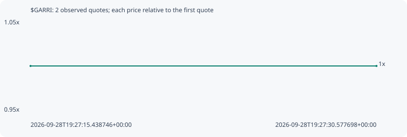

# $GARRI

**robinhood** / `0xdddf7ab756c35b4d0537825497e6932780710241`

[All tokens](README.md) · [Market window](../README.md)

## Native assessments

This contract is in the quote cohort; it has no native model assessment in this window.

## Series 7a8f13e00c508b936ae3

Pool: `not supplied`

[Complete series](../series/robinhood/7a8f13e00c508b936ae3.json)

Every dot is a captured quote. Lines connect observations; the curve ends at the last available quote.

| Peak | Final | Return | Maximum drawdown |
| ---: | ---: | ---: | ---: |
| 1.0000x | 1.0000x | +0.00% | 0.00% |

### Complete quote timeline

| Time (UTC) | Price (USD) | Multiple | Evidence |
| --- | ---: | ---: | --- |
| 2026-09-28T19:27:15.438746+00:00 | 1.52222e-05 | 1.0000x | `capture:b4c48612-e04d-4782-96a6-e80c2955d3b9:rank:99` |
| 2026-09-28T19:27:30.577698+00:00 | 1.52222e-05 | 1.0000x | `capture:ff6b3949-9c3c-4cdf-b48c-d4010666c140:rank:98` |

### Exit-policy timeline

Calculated from captured quotes under the window policy. Native assessments are linked separately above.

| Time (UTC) | Action | Price (USD) | Evidence |
| --- | --- | ---: | --- |
| 2026-09-28T19:27:15.438746+00:00 | BUY | 1.52222e-05 | `capture:b4c48612-e04d-4782-96a6-e80c2955d3b9:rank:99` |
| 2026-09-28T19:27:30.577698+00:00 | HOLD | 1.52222e-05 | `capture:ff6b3949-9c3c-4cdf-b48c-d4010666c140:rank:98` |
