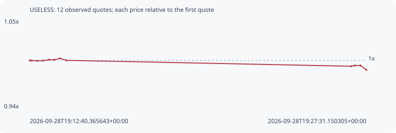

# USELESS

**solana** / `Dz9mQ9NzkBcCsuGPFJ3r1bS4wgqKMHBPiVuniW8Mbonk`

[All tokens](README.md) · [Market window](../README.md)

## Native assessments

This contract is in the quote cohort; it has no native model assessment in this window.

## Series 18a814280350d1fe038d

Pool: `not supplied`

[Complete series](../series/solana/18a814280350d1fe038d.json)

Every dot is a captured quote. Lines connect observations; the curve ends at the last available quote.

| Peak | Final | Return | Maximum drawdown |
| ---: | ---: | ---: | ---: |
| 1.0028x | 0.9880x | -1.20% | 1.48% |

### Complete quote timeline

| Time (UTC) | Price (USD) | Multiple | Evidence |
| --- | ---: | ---: | --- |
| 2026-09-28T19:12:40.365643+00:00 | 0.24235 | 1.0000x | `capture:3af1faa1-2074-484e-893e-ed2c676e1576:rank:79` |
| 2026-09-28T19:12:45.490977+00:00 | 0.24235 | 1.0000x | `capture:ac0279d6-7dd1-44b6-bf3e-910bf7b8eddf:rank:79` |
| 2026-09-28T19:13:00.884337+00:00 | 0.242254 | 0.9996x | `capture:5867894f-39b4-4bcd-bd87-86394c63aab4:rank:78` |
| 2026-09-28T19:13:15.565374+00:00 | 0.242309 | 0.9998x | `capture:ca31b3d4-ad60-4333-98b3-6d940a196f86:rank:80` |
| 2026-09-28T19:13:30.833894+00:00 | 0.242593 | 1.0010x | `capture:2beb38a4-bfac-4502-bbc3-8c8c0f943007:rank:86` |
| 2026-09-28T19:13:45.640151+00:00 | 0.242564 | 1.0009x | `capture:4d31b656-3ffe-4768-bef6-377adf019420:rank:90` |
| 2026-09-28T19:14:00.595194+00:00 | 0.243033 | 1.0028x | `capture:2c78112b-48e7-4f74-8c2e-1cb8642a79dc:rank:89` |
| 2026-09-28T19:14:17.246316+00:00 | 0.242399 | 1.0002x | `capture:7a923cde-d765-4388-a15c-4f47fde0a3b5:rank:89` |
| 2026-09-28T19:26:51.267717+00:00 | 0.240544 | 0.9925x | `capture:4cc162c2-aa4a-403b-a901-4bb5058380d6:rank:96` |
| 2026-09-28T19:27:00.453239+00:00 | 0.240769 | 0.9935x | `capture:4273fbb8-5342-4e37-8d61-ced6b88e542d:rank:96` |
| 2026-09-28T19:27:15.715818+00:00 | 0.240769 | 0.9935x | `capture:d04c9116-4617-4b61-8b98-5489321cd1cc:rank:92` |
| 2026-09-28T19:27:31.150305+00:00 | 0.23944 | 0.9880x | `capture:7cad37e8-83d3-4438-8055-245db6707e2e:rank:70` |

### Exit-policy timeline

Calculated from captured quotes under the window policy. Native assessments are linked separately above.

| Time (UTC) | Action | Price (USD) | Evidence |
| --- | --- | ---: | --- |
| 2026-09-28T19:12:40.365643+00:00 | BUY | 0.24235 | `capture:3af1faa1-2074-484e-893e-ed2c676e1576:rank:79` |
| 2026-09-28T19:12:45.490977+00:00 | HOLD | 0.24235 | `capture:ac0279d6-7dd1-44b6-bf3e-910bf7b8eddf:rank:79` |
| 2026-09-28T19:13:00.884337+00:00 | HOLD | 0.242254 | `capture:5867894f-39b4-4bcd-bd87-86394c63aab4:rank:78` |
| 2026-09-28T19:13:15.565374+00:00 | HOLD | 0.242309 | `capture:ca31b3d4-ad60-4333-98b3-6d940a196f86:rank:80` |
| 2026-09-28T19:13:30.833894+00:00 | HOLD | 0.242593 | `capture:2beb38a4-bfac-4502-bbc3-8c8c0f943007:rank:86` |
| 2026-09-28T19:13:45.640151+00:00 | HOLD | 0.242564 | `capture:4d31b656-3ffe-4768-bef6-377adf019420:rank:90` |
| 2026-09-28T19:14:00.595194+00:00 | HOLD | 0.243033 | `capture:2c78112b-48e7-4f74-8c2e-1cb8642a79dc:rank:89` |
| 2026-09-28T19:14:17.246316+00:00 | HOLD | 0.242399 | `capture:7a923cde-d765-4388-a15c-4f47fde0a3b5:rank:89` |
| 2026-09-28T19:26:51.267717+00:00 | HOLD | 0.240544 | `capture:4cc162c2-aa4a-403b-a901-4bb5058380d6:rank:96` |
| 2026-09-28T19:27:00.453239+00:00 | HOLD | 0.240769 | `capture:4273fbb8-5342-4e37-8d61-ced6b88e542d:rank:96` |
| 2026-09-28T19:27:15.715818+00:00 | HOLD | 0.240769 | `capture:d04c9116-4617-4b61-8b98-5489321cd1cc:rank:92` |
| 2026-09-28T19:27:31.150305+00:00 | HOLD | 0.23944 | `capture:7cad37e8-83d3-4438-8055-245db6707e2e:rank:70` |
