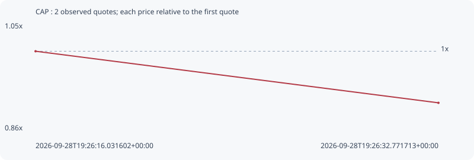

# CAP

**solana** / `3TMMM3u7vhLwRaeEJzvbo2177M3Cj2bSrPE3q2xepump`

[All tokens](README.md) · [Market window](../README.md)

## Native assessments

This contract is in the quote cohort; it has no native model assessment in this window.

## Series 330a12bfb58b7933a7b2

Pool: `not supplied`

[Complete series](../series/solana/330a12bfb58b7933a7b2.json)

Every dot is a captured quote. Lines connect observations; the curve ends at the last available quote.

| Peak | Final | Return | Maximum drawdown |
| ---: | ---: | ---: | ---: |
| 1.0000x | 0.9063x | -9.37% | 9.37% |

### Complete quote timeline

| Time (UTC) | Price (USD) | Multiple | Evidence |
| --- | ---: | ---: | --- |
| 2026-09-28T19:26:16.031602+00:00 | 6.12929e-06 | 1.0000x | `capture:bb8d4bfc-85e1-4d55-a2ff-e47193bcce5f:rank:82` |
| 2026-09-28T19:26:32.771713+00:00 | 5.55508e-06 | 0.9063x | `capture:2fed7296-b3d1-4ba6-8398-799ee55f1f2b:rank:61` |

### Exit-policy timeline

Calculated from captured quotes under the window policy. Native assessments are linked separately above.

| Time (UTC) | Action | Price (USD) | Evidence |
| --- | --- | ---: | --- |
| 2026-09-28T19:26:16.031602+00:00 | BUY | 6.12929e-06 | `capture:bb8d4bfc-85e1-4d55-a2ff-e47193bcce5f:rank:82` |
| 2026-09-28T19:26:32.771713+00:00 | HOLD | 5.55508e-06 | `capture:2fed7296-b3d1-4ba6-8398-799ee55f1f2b:rank:61` |
