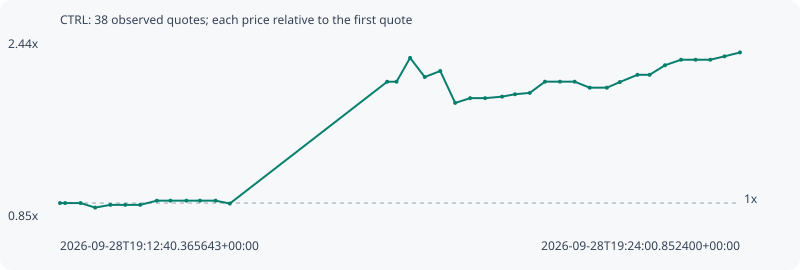

# CTRL

**solana** / `A3tykDf9NeAcCYKtKGQJHXmgY3BRT5K3CU9F6sXwjVQN`

[All tokens](README.md) · [Market window](../README.md)

## Native assessments

This contract is in the quote cohort; it has no native model assessment in this window.

## Series b7904d61f1adeebb0795

Pool: `not supplied`

[Complete series](../series/solana/b7904d61f1adeebb0795.json)

Every dot is a captured quote. Lines connect observations; the curve ends at the last available quote.

| Peak | Final | Return | Maximum drawdown |
| ---: | ---: | ---: | ---: |
| 2.3331x | 2.3331x | +133.31% | 17.45% |

### Complete quote timeline

| Time (UTC) | Price (USD) | Multiple | Evidence |
| --- | ---: | ---: | --- |
| 2026-09-28T19:12:40.365643+00:00 | 9.75144e-06 | 1.0000x | `capture:3af1faa1-2074-484e-893e-ed2c676e1576:rank:44` |
| 2026-09-28T19:12:45.490977+00:00 | 9.75144e-06 | 1.0000x | `capture:ac0279d6-7dd1-44b6-bf3e-910bf7b8eddf:rank:43` |
| 2026-09-28T19:13:00.884337+00:00 | 9.75144e-06 | 1.0000x | `capture:5867894f-39b4-4bcd-bd87-86394c63aab4:rank:45` |
| 2026-09-28T19:13:15.565374+00:00 | 9.36025e-06 | 0.9599x | `capture:ca31b3d4-ad60-4333-98b3-6d940a196f86:rank:46` |
| 2026-09-28T19:13:30.833894+00:00 | 9.59596e-06 | 0.9841x | `capture:2beb38a4-bfac-4502-bbc3-8c8c0f943007:rank:48` |
| 2026-09-28T19:13:45.640151+00:00 | 9.59596e-06 | 0.9841x | `capture:4d31b656-3ffe-4768-bef6-377adf019420:rank:45` |
| 2026-09-28T19:14:00.595194+00:00 | 9.59596e-06 | 0.9841x | `capture:2c78112b-48e7-4f74-8c2e-1cb8642a79dc:rank:46` |
| 2026-09-28T19:14:17.246316+00:00 | 9.95644e-06 | 1.0210x | `capture:7a923cde-d765-4388-a15c-4f47fde0a3b5:rank:48` |
| 2026-09-28T19:14:30.874732+00:00 | 9.95644e-06 | 1.0210x | `capture:fa585070-b1ae-4f9d-afbd-aa986f487793:rank:58` |
| 2026-09-28T19:14:46.892387+00:00 | 9.95644e-06 | 1.0210x | `capture:7d9e3e65-8bda-4696-b6d1-7a86825bd98c:rank:66` |
| 2026-09-28T19:15:00.432009+00:00 | 9.95644e-06 | 1.0210x | `capture:797f9a41-958a-44ba-ac57-3b9cacf5d06b:rank:75` |
| 2026-09-28T19:15:16.098308+00:00 | 9.95644e-06 | 1.0210x | `capture:ab2becb9-3f94-4a57-b9e8-472ad0998012:rank:81` |
| 2026-09-28T19:15:30.340579+00:00 | 9.70942e-06 | 0.9957x | `capture:564db5fc-5586-41d3-88fb-a9a955708f1d:rank:99` |
| 2026-09-28T19:18:07.749963+00:00 | 2.02202e-05 | 2.0736x | `capture:b0fb1b47-4973-472f-9619-8480bc7d294e:rank:83` |
| 2026-09-28T19:18:17.126008+00:00 | 2.02202e-05 | 2.0736x | `capture:5ed98f51-d1e1-422a-81df-4186a8b0a0a2:rank:81` |
| 2026-09-28T19:18:30.722167+00:00 | 2.22803e-05 | 2.2848x | `capture:9f88d118-9108-4dff-bbfc-246eaed5ce38:rank:72` |
| 2026-09-28T19:18:45.386687+00:00 | 2.06261e-05 | 2.1152x | `capture:f533100a-ce62-4457-9107-42e7601ea5d7:rank:70` |
| 2026-09-28T19:19:00.883835+00:00 | 2.11482e-05 | 2.1687x | `capture:a2495d99-5671-4c7e-b87c-48f48d90f2f2:rank:69` |
| 2026-09-28T19:19:15.826416+00:00 | 1.83921e-05 | 1.8861x | `capture:ba1dc6a3-b8b7-461a-8110-8490f03539a5:rank:71` |
| 2026-09-28T19:19:30.814098+00:00 | 1.88032e-05 | 1.9282x | `capture:b25d90dc-c8db-4388-8a2b-d06541e5320f:rank:65` |
| 2026-09-28T19:19:45.817199+00:00 | 1.88032e-05 | 1.9282x | `capture:722d1b7b-ef4f-4ac5-883c-0557bae2b60b:rank:61` |
| 2026-09-28T19:20:02.715590+00:00 | 1.89329e-05 | 1.9415x | `capture:60ff17d8-3b18-4f61-9bc7-006afd324cf2:rank:59` |
| 2026-09-28T19:20:15.699547+00:00 | 1.91414e-05 | 1.9629x | `capture:10a94828-637f-4580-a9f7-2fbd34d8589a:rank:60` |
| 2026-09-28T19:20:30.480194+00:00 | 1.92568e-05 | 1.9748x | `capture:54722132-db1d-4a2b-8c1c-2b0e71d01430:rank:57` |
| 2026-09-28T19:20:45.683165+00:00 | 2.02261e-05 | 2.0742x | `capture:17963a37-fd65-46b6-8e1c-350082721f8c:rank:59` |
| 2026-09-28T19:21:00.690136+00:00 | 2.02261e-05 | 2.0742x | `capture:f2ff842d-38e9-4cbe-a281-98c17d5a5672:rank:56` |
| 2026-09-28T19:21:15.372716+00:00 | 2.02261e-05 | 2.0742x | `capture:a923b968-a768-495e-ae33-6de2042c551f:rank:54` |
| 2026-09-28T19:21:30.402460+00:00 | 1.97062e-05 | 2.0209x | `capture:d926629b-2050-4e50-a602-1638c6205870:rank:50` |
| 2026-09-28T19:21:47.649380+00:00 | 1.97062e-05 | 2.0209x | `capture:0799ec6d-0e89-46b5-ae88-5695bf6c5fc3:rank:51` |
| 2026-09-28T19:22:00.569928+00:00 | 2.01923e-05 | 2.0707x | `capture:263cda40-4b31-4b2d-b168-fa4310edb46d:rank:50` |
| 2026-09-28T19:22:18.240717+00:00 | 2.08183e-05 | 2.1349x | `capture:546b2c55-1845-4da7-bc9c-4439cd0ccdba:rank:50` |
| 2026-09-28T19:22:30.371968+00:00 | 2.08183e-05 | 2.1349x | `capture:507d17cb-af67-4a81-a2b2-d5ddfbc40021:rank:52` |
| 2026-09-28T19:22:45.783808+00:00 | 2.16435e-05 | 2.2195x | `capture:9558d322-c429-480b-885f-82f4481c8506:rank:56` |
| 2026-09-28T19:23:01.833252+00:00 | 2.21196e-05 | 2.2683x | `capture:c5462412-2da1-4432-8949-8fcd1492c57f:rank:56` |
| 2026-09-28T19:23:16.460099+00:00 | 2.21196e-05 | 2.2683x | `capture:2d456a2a-6755-4e1d-9a80-b6e3b2d44ec1:rank:66` |
| 2026-09-28T19:23:31.092727+00:00 | 2.21196e-05 | 2.2683x | `capture:0e687519-8b01-4d7e-b48c-e2ec34135d17:rank:67` |
| 2026-09-28T19:23:45.375171+00:00 | 2.24133e-05 | 2.2985x | `capture:1b404fa0-870b-4e7c-bafd-c3ef241c5093:rank:84` |
| 2026-09-28T19:24:00.852400+00:00 | 2.27508e-05 | 2.3331x | `capture:5205c587-4734-452c-b758-46c4814dded1:rank:90` |

### Exit-policy timeline

Calculated from captured quotes under the window policy. Native assessments are linked separately above.

| Time (UTC) | Action | Price (USD) | Evidence |
| --- | --- | ---: | --- |
| 2026-09-28T19:12:40.365643+00:00 | BUY | 9.75144e-06 | `capture:3af1faa1-2074-484e-893e-ed2c676e1576:rank:44` |
| 2026-09-28T19:12:45.490977+00:00 | HOLD | 9.75144e-06 | `capture:ac0279d6-7dd1-44b6-bf3e-910bf7b8eddf:rank:43` |
| 2026-09-28T19:13:00.884337+00:00 | HOLD | 9.75144e-06 | `capture:5867894f-39b4-4bcd-bd87-86394c63aab4:rank:45` |
| 2026-09-28T19:13:15.565374+00:00 | HOLD | 9.36025e-06 | `capture:ca31b3d4-ad60-4333-98b3-6d940a196f86:rank:46` |
| 2026-09-28T19:13:30.833894+00:00 | HOLD | 9.59596e-06 | `capture:2beb38a4-bfac-4502-bbc3-8c8c0f943007:rank:48` |
| 2026-09-28T19:13:45.640151+00:00 | HOLD | 9.59596e-06 | `capture:4d31b656-3ffe-4768-bef6-377adf019420:rank:45` |
| 2026-09-28T19:14:00.595194+00:00 | HOLD | 9.59596e-06 | `capture:2c78112b-48e7-4f74-8c2e-1cb8642a79dc:rank:46` |
| 2026-09-28T19:14:17.246316+00:00 | HOLD | 9.95644e-06 | `capture:7a923cde-d765-4388-a15c-4f47fde0a3b5:rank:48` |
| 2026-09-28T19:14:30.874732+00:00 | HOLD | 9.95644e-06 | `capture:fa585070-b1ae-4f9d-afbd-aa986f487793:rank:58` |
| 2026-09-28T19:14:46.892387+00:00 | HOLD | 9.95644e-06 | `capture:7d9e3e65-8bda-4696-b6d1-7a86825bd98c:rank:66` |
| 2026-09-28T19:15:00.432009+00:00 | HOLD | 9.95644e-06 | `capture:797f9a41-958a-44ba-ac57-3b9cacf5d06b:rank:75` |
| 2026-09-28T19:15:16.098308+00:00 | HOLD | 9.95644e-06 | `capture:ab2becb9-3f94-4a57-b9e8-472ad0998012:rank:81` |
| 2026-09-28T19:15:30.340579+00:00 | HOLD | 9.70942e-06 | `capture:564db5fc-5586-41d3-88fb-a9a955708f1d:rank:99` |
| 2026-09-28T19:18:07.749963+00:00 | TP | 2.02202e-05 | `capture:b0fb1b47-4973-472f-9619-8480bc7d294e:rank:83` |
