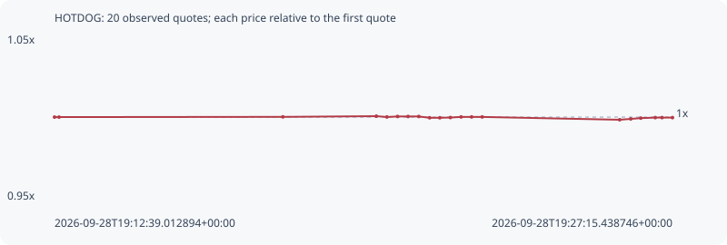

# HOTDOG

**robinhood** / `0x45443a4a7b58ab26a4b4d72616cf36d5aae7188c`

[All tokens](README.md) · [Market window](../README.md)

## Native assessments

This contract is in the quote cohort; it has no native model assessment in this window.

## Series 5a9733d25dcb66384f40

Pool: `not supplied`

[Complete series](../series/robinhood/5a9733d25dcb66384f40.json)

Every dot is a captured quote. Lines connect observations; the curve ends at the last available quote.

| Peak | Final | Return | Maximum drawdown |
| ---: | ---: | ---: | ---: |
| 1.0006x | 0.9997x | -0.03% | 0.22% |

### Complete quote timeline

| Time (UTC) | Price (USD) | Multiple | Evidence |
| --- | ---: | ---: | --- |
| 2026-09-28T19:12:39.012894+00:00 | 0.00118447 | 1.0000x | `capture:fe8ad944-154e-4481-bd56-8ab821bfbfe1:rank:88` |
| 2026-09-28T19:12:45.402569+00:00 | 0.00118447 | 1.0000x | `capture:8deb508c-ea33-4c21-a5c5-f0991dd6dcac:rank:89` |
| 2026-09-28T19:18:02.849542+00:00 | 0.00118463 | 1.0001x | `capture:53a348cd-74d6-4031-ba2b-02d70c63e42b:rank:99` |
| 2026-09-28T19:20:15.393373+00:00 | 0.00118515 | 1.0006x | `capture:17802da9-7cee-48c3-9f5b-5829781be3f6:rank:93` |
| 2026-09-28T19:20:30.417446+00:00 | 0.00118454 | 1.0001x | `capture:f2fe9ac4-89a0-4ad3-8f15-5a70d7e1d5f7:rank:82` |
| 2026-09-28T19:20:45.464282+00:00 | 0.00118492 | 1.0004x | `capture:26559b75-812f-4386-982b-eba5073faf44:rank:74` |
| 2026-09-28T19:21:00.449260+00:00 | 0.00118492 | 1.0004x | `capture:186445b2-8971-4639-85b9-26b2e8fb9d2c:rank:74` |
| 2026-09-28T19:21:15.606838+00:00 | 0.00118492 | 1.0004x | `capture:c2a8ab31-038e-42f4-8e33-852fee1b9a24:rank:80` |
| 2026-09-28T19:21:30.959683+00:00 | 0.00118396 | 0.9996x | `capture:300e0f35-12d4-46a9-a17e-17adbe8e1059:rank:74` |
| 2026-09-28T19:21:45.420062+00:00 | 0.00118396 | 0.9996x | `capture:ec22b61b-732a-44d2-be85-c577051928eb:rank:90` |
| 2026-09-28T19:22:00.489634+00:00 | 0.00118414 | 0.9997x | `capture:d6c64542-18c5-48a0-a6c9-f0e2a9c54b41:rank:81` |
| 2026-09-28T19:22:15.632268+00:00 | 0.00118458 | 1.0001x | `capture:13e6d33e-e854-4b87-b3da-49aedec6950e:rank:79` |
| 2026-09-28T19:22:30.535979+00:00 | 0.00118458 | 1.0001x | `capture:091fb4d2-10fc-4d5f-9c22-af9f55e90e4a:rank:85` |
| 2026-09-28T19:22:45.520851+00:00 | 0.00118458 | 1.0001x | `capture:128617a9-4055-4a8d-8b04-c8876bad9c70:rank:95` |
| 2026-09-28T19:26:00.522113+00:00 | 0.00118249 | 0.9983x | `capture:a33301e4-8f37-4fb5-af69-629635c54fe6:rank:97` |
| 2026-09-28T19:26:16.279485+00:00 | 0.00118312 | 0.9989x | `capture:085b2ea9-3985-4608-a1cd-1eddc6b16122:rank:90` |
| 2026-09-28T19:26:30.447392+00:00 | 0.00118371 | 0.9994x | `capture:36fd4b46-5420-443d-b1ed-b86b98706671:rank:85` |
| 2026-09-28T19:26:51.039990+00:00 | 0.00118408 | 0.9997x | `capture:653b62fa-7a58-45fd-95e9-3b36912dc139:rank:83` |
| 2026-09-28T19:27:00.598930+00:00 | 0.00118408 | 0.9997x | `capture:8041f6b0-6188-445c-83ef-3a6fb7daf321:rank:85` |
| 2026-09-28T19:27:15.438746+00:00 | 0.00118408 | 0.9997x | `capture:b4c48612-e04d-4782-96a6-e80c2955d3b9:rank:95` |

### Exit-policy timeline

Calculated from captured quotes under the window policy. Native assessments are linked separately above.

| Time (UTC) | Action | Price (USD) | Evidence |
| --- | --- | ---: | --- |
| 2026-09-28T19:12:39.012894+00:00 | BUY | 0.00118447 | `capture:fe8ad944-154e-4481-bd56-8ab821bfbfe1:rank:88` |
| 2026-09-28T19:12:45.402569+00:00 | HOLD | 0.00118447 | `capture:8deb508c-ea33-4c21-a5c5-f0991dd6dcac:rank:89` |
| 2026-09-28T19:18:02.849542+00:00 | HOLD | 0.00118463 | `capture:53a348cd-74d6-4031-ba2b-02d70c63e42b:rank:99` |
| 2026-09-28T19:20:15.393373+00:00 | HOLD | 0.00118515 | `capture:17802da9-7cee-48c3-9f5b-5829781be3f6:rank:93` |
| 2026-09-28T19:20:30.417446+00:00 | HOLD | 0.00118454 | `capture:f2fe9ac4-89a0-4ad3-8f15-5a70d7e1d5f7:rank:82` |
| 2026-09-28T19:20:45.464282+00:00 | HOLD | 0.00118492 | `capture:26559b75-812f-4386-982b-eba5073faf44:rank:74` |
| 2026-09-28T19:21:00.449260+00:00 | HOLD | 0.00118492 | `capture:186445b2-8971-4639-85b9-26b2e8fb9d2c:rank:74` |
| 2026-09-28T19:21:15.606838+00:00 | HOLD | 0.00118492 | `capture:c2a8ab31-038e-42f4-8e33-852fee1b9a24:rank:80` |
| 2026-09-28T19:21:30.959683+00:00 | HOLD | 0.00118396 | `capture:300e0f35-12d4-46a9-a17e-17adbe8e1059:rank:74` |
| 2026-09-28T19:21:45.420062+00:00 | HOLD | 0.00118396 | `capture:ec22b61b-732a-44d2-be85-c577051928eb:rank:90` |
| 2026-09-28T19:22:00.489634+00:00 | HOLD | 0.00118414 | `capture:d6c64542-18c5-48a0-a6c9-f0e2a9c54b41:rank:81` |
| 2026-09-28T19:22:15.632268+00:00 | HOLD | 0.00118458 | `capture:13e6d33e-e854-4b87-b3da-49aedec6950e:rank:79` |
| 2026-09-28T19:22:30.535979+00:00 | HOLD | 0.00118458 | `capture:091fb4d2-10fc-4d5f-9c22-af9f55e90e4a:rank:85` |
| 2026-09-28T19:22:45.520851+00:00 | HOLD | 0.00118458 | `capture:128617a9-4055-4a8d-8b04-c8876bad9c70:rank:95` |
| 2026-09-28T19:26:00.522113+00:00 | HOLD | 0.00118249 | `capture:a33301e4-8f37-4fb5-af69-629635c54fe6:rank:97` |
| 2026-09-28T19:26:16.279485+00:00 | HOLD | 0.00118312 | `capture:085b2ea9-3985-4608-a1cd-1eddc6b16122:rank:90` |
| 2026-09-28T19:26:30.447392+00:00 | HOLD | 0.00118371 | `capture:36fd4b46-5420-443d-b1ed-b86b98706671:rank:85` |
| 2026-09-28T19:26:51.039990+00:00 | HOLD | 0.00118408 | `capture:653b62fa-7a58-45fd-95e9-3b36912dc139:rank:83` |
| 2026-09-28T19:27:00.598930+00:00 | HOLD | 0.00118408 | `capture:8041f6b0-6188-445c-83ef-3a6fb7daf321:rank:85` |
| 2026-09-28T19:27:15.438746+00:00 | HOLD | 0.00118408 | `capture:b4c48612-e04d-4782-96a6-e80c2955d3b9:rank:95` |
