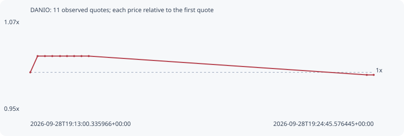

# DANIO

**robinhood** / `0xd17badeaa23ef8afe9e4aa393c9e4160be2b9f7b`

[All tokens](README.md) · [Market window](../README.md)

## Native assessments

This contract is in the quote cohort; it has no native model assessment in this window.

## Series c6416f2ca9b74ad5a959

Pool: `not supplied`

[Complete series](../series/robinhood/c6416f2ca9b74ad5a959.json)

Every dot is a captured quote. Lines connect observations; the curve ends at the last available quote.

| Peak | Final | Return | Maximum drawdown |
| ---: | ---: | ---: | ---: |
| 1.0226x | 0.9965x | -0.35% | 2.56% |

### Complete quote timeline

| Time (UTC) | Price (USD) | Multiple | Evidence |
| --- | ---: | ---: | --- |
| 2026-09-28T19:13:00.335966+00:00 | 9.34105e-06 | 1.0000x | `capture:ee3ee7f8-576f-4c42-a7e0-cd9f917fdb36:rank:27` |
| 2026-09-28T19:13:15.331879+00:00 | 9.55233e-06 | 1.0226x | `capture:c384257a-4501-4701-8a0c-a6b08fe727d5:rank:26` |
| 2026-09-28T19:13:30.402311+00:00 | 9.55233e-06 | 1.0226x | `capture:44090e9e-d515-41c4-a78f-893390e6f2b0:rank:43` |
| 2026-09-28T19:13:45.493213+00:00 | 9.55233e-06 | 1.0226x | `capture:52264519-193b-4508-b560-e9ee4e3e0963:rank:47` |
| 2026-09-28T19:14:01.407289+00:00 | 9.55233e-06 | 1.0226x | `capture:0a62cce6-2c27-4761-80c1-feb9130a0c83:rank:54` |
| 2026-09-28T19:14:15.755233+00:00 | 9.55233e-06 | 1.0226x | `capture:09651124-e158-421c-bcdc-cb2310b48412:rank:57` |
| 2026-09-28T19:14:30.367936+00:00 | 9.55233e-06 | 1.0226x | `capture:7a0b9f45-7248-4af6-b349-4bf6d5ef81be:rank:54` |
| 2026-09-28T19:14:45.422215+00:00 | 9.55233e-06 | 1.0226x | `capture:bf6e34c4-c499-472e-8e2b-ebbb151300e2:rank:53` |
| 2026-09-28T19:15:00.325882+00:00 | 9.55233e-06 | 1.0226x | `capture:663c0420-2b9e-4a94-998b-531fa9202dee:rank:52` |
| 2026-09-28T19:24:31.344409+00:00 | 9.30791e-06 | 0.9965x | `capture:85f4db1c-c852-45c3-99aa-4320f3839031:rank:49` |
| 2026-09-28T19:24:45.576445+00:00 | 9.30791e-06 | 0.9965x | `capture:da07dfaa-56d9-4a51-99df-1ad071803eb0:rank:52` |

### Exit-policy timeline

Calculated from captured quotes under the window policy. Native assessments are linked separately above.

| Time (UTC) | Action | Price (USD) | Evidence |
| --- | --- | ---: | --- |
| 2026-09-28T19:13:00.335966+00:00 | BUY | 9.34105e-06 | `capture:ee3ee7f8-576f-4c42-a7e0-cd9f917fdb36:rank:27` |
| 2026-09-28T19:13:15.331879+00:00 | HOLD | 9.55233e-06 | `capture:c384257a-4501-4701-8a0c-a6b08fe727d5:rank:26` |
| 2026-09-28T19:13:30.402311+00:00 | HOLD | 9.55233e-06 | `capture:44090e9e-d515-41c4-a78f-893390e6f2b0:rank:43` |
| 2026-09-28T19:13:45.493213+00:00 | HOLD | 9.55233e-06 | `capture:52264519-193b-4508-b560-e9ee4e3e0963:rank:47` |
| 2026-09-28T19:14:01.407289+00:00 | HOLD | 9.55233e-06 | `capture:0a62cce6-2c27-4761-80c1-feb9130a0c83:rank:54` |
| 2026-09-28T19:14:15.755233+00:00 | HOLD | 9.55233e-06 | `capture:09651124-e158-421c-bcdc-cb2310b48412:rank:57` |
| 2026-09-28T19:14:30.367936+00:00 | HOLD | 9.55233e-06 | `capture:7a0b9f45-7248-4af6-b349-4bf6d5ef81be:rank:54` |
| 2026-09-28T19:14:45.422215+00:00 | HOLD | 9.55233e-06 | `capture:bf6e34c4-c499-472e-8e2b-ebbb151300e2:rank:53` |
| 2026-09-28T19:15:00.325882+00:00 | HOLD | 9.55233e-06 | `capture:663c0420-2b9e-4a94-998b-531fa9202dee:rank:52` |
| 2026-09-28T19:24:31.344409+00:00 | HOLD | 9.30791e-06 | `capture:85f4db1c-c852-45c3-99aa-4320f3839031:rank:49` |
| 2026-09-28T19:24:45.576445+00:00 | HOLD | 9.30791e-06 | `capture:da07dfaa-56d9-4a51-99df-1ad071803eb0:rank:52` |
