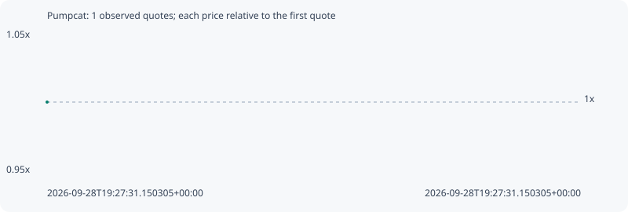

# Pumpcat

**solana** / `G9U27fAmKg8b8kjMWt53VTNvVq8KvDy2u3ojyZVFpump`

[All tokens](README.md) · [Market window](../README.md)

## Native assessments

This contract is in the quote cohort; it has no native model assessment in this window.

## Series 7958ff19db25d6dafb04

Pool: `not supplied`

[Complete series](../series/solana/7958ff19db25d6dafb04.json)

Every dot is a captured quote. Lines connect observations; the curve ends at the last available quote.

Fewer than two quotes: return and drawdown are not calculated.

### Complete quote timeline

| Time (UTC) | Price (USD) | Multiple | Evidence |
| --- | ---: | ---: | --- |
| 2026-09-28T19:27:31.150305+00:00 | 8.88846e-06 | 1.0000x | `capture:7cad37e8-83d3-4438-8055-245db6707e2e:rank:38` |

### Exit-policy timeline

Calculated from captured quotes under the window policy. Native assessments are linked separately above.

| Time (UTC) | Action | Price (USD) | Evidence |
| --- | --- | ---: | --- |
