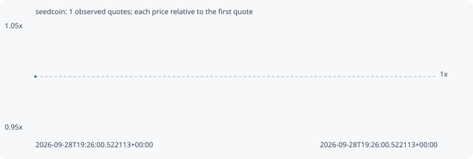

# seedcoin

**robinhood** / `0xd8d1c08a8ba4fc64bac744f74290b89adcb6bf25`

[All tokens](README.md) · [Market window](../README.md)

## Native assessments

This contract is in the quote cohort; it has no native model assessment in this window.

## Series cf201d8370f628426211

Pool: `not supplied`

[Complete series](../series/robinhood/cf201d8370f628426211.json)

Every dot is a captured quote. Lines connect observations; the curve ends at the last available quote.

Fewer than two quotes: return and drawdown are not calculated.

### Complete quote timeline

| Time (UTC) | Price (USD) | Multiple | Evidence |
| --- | ---: | ---: | --- |
| 2026-09-28T19:26:00.522113+00:00 | 2.9064e-05 | 1.0000x | `capture:a33301e4-8f37-4fb5-af69-629635c54fe6:rank:58` |

### Exit-policy timeline

Calculated from captured quotes under the window policy. Native assessments are linked separately above.

| Time (UTC) | Action | Price (USD) | Evidence |
| --- | --- | ---: | --- |
