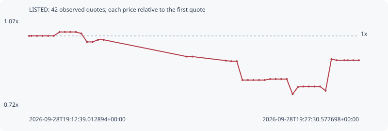

# LISTED

**robinhood** / `0x398aca5e6ae801b002d684333affadc1a25e897c`

[All tokens](README.md) · [Market window](../README.md)

## Native assessments

This contract is in the quote cohort; it has no native model assessment in this window.

## Series 37bba3798439491b7020

Pool: `not supplied`

[Complete series](../series/robinhood/37bba3798439491b7020.json)

Every dot is a captured quote. Lines connect observations; the curve ends at the last available quote.

| Peak | Final | Return | Maximum drawdown |
| ---: | ---: | ---: | ---: |
| 1.0155x | 0.9030x | -9.70% | 24.36% |

### Complete quote timeline

| Time (UTC) | Price (USD) | Multiple | Evidence |
| --- | ---: | ---: | --- |
| 2026-09-28T19:12:39.012894+00:00 | 0.000533278 | 1.0000x | `capture:fe8ad944-154e-4481-bd56-8ab821bfbfe1:rank:42` |
| 2026-09-28T19:12:45.402569+00:00 | 0.000533278 | 1.0000x | `capture:8deb508c-ea33-4c21-a5c5-f0991dd6dcac:rank:42` |
| 2026-09-28T19:13:00.335966+00:00 | 0.000533278 | 1.0000x | `capture:ee3ee7f8-576f-4c42-a7e0-cd9f917fdb36:rank:47` |
| 2026-09-28T19:13:15.331879+00:00 | 0.000533278 | 1.0000x | `capture:c384257a-4501-4701-8a0c-a6b08fe727d5:rank:52` |
| 2026-09-28T19:13:30.402311+00:00 | 0.000533278 | 1.0000x | `capture:44090e9e-d515-41c4-a78f-893390e6f2b0:rank:50` |
| 2026-09-28T19:13:45.493213+00:00 | 0.000533278 | 1.0000x | `capture:52264519-193b-4508-b560-e9ee4e3e0963:rank:49` |
| 2026-09-28T19:14:01.407289+00:00 | 0.000541555 | 1.0155x | `capture:0a62cce6-2c27-4761-80c1-feb9130a0c83:rank:46` |
| 2026-09-28T19:14:15.755233+00:00 | 0.000541555 | 1.0155x | `capture:09651124-e158-421c-bcdc-cb2310b48412:rank:62` |
| 2026-09-28T19:14:30.367936+00:00 | 0.000541555 | 1.0155x | `capture:7a0b9f45-7248-4af6-b349-4bf6d5ef81be:rank:62` |
| 2026-09-28T19:14:45.422215+00:00 | 0.000541555 | 1.0155x | `capture:bf6e34c4-c499-472e-8e2b-ebbb151300e2:rank:62` |
| 2026-09-28T19:15:00.325882+00:00 | 0.000538219 | 1.0093x | `capture:663c0420-2b9e-4a94-998b-531fa9202dee:rank:54` |
| 2026-09-28T19:15:15.449577+00:00 | 0.000520464 | 0.9760x | `capture:14452070-ab94-45a0-af6d-e6c54082daec:rank:58` |
| 2026-09-28T19:15:30.501058+00:00 | 0.000520464 | 0.9760x | `capture:4e680297-1e75-418b-b818-8b2903e8b923:rank:69` |
| 2026-09-28T19:15:45.353664+00:00 | 0.000524967 | 0.9844x | `capture:b9051b67-24e1-4469-9f82-bc08bd56807d:rank:76` |
| 2026-09-28T19:16:00.473367+00:00 | 0.000524967 | 0.9844x | `capture:cd404827-1073-4901-b09c-82ef1488855b:rank:98` |
| 2026-09-28T19:19:45.438706+00:00 | 0.000489346 | 0.9176x | `capture:59b12f7b-2112-42c7-834a-a2eb9bcaee3d:rank:89` |
| 2026-09-28T19:20:00.494705+00:00 | 0.000489346 | 0.9176x | `capture:5b06d6b3-9eca-4487-82fb-6b28820c37d9:rank:92` |
| 2026-09-28T19:21:30.959683+00:00 | 0.000480807 | 0.9016x | `capture:300e0f35-12d4-46a9-a17e-17adbe8e1059:rank:99` |
| 2026-09-28T19:21:45.420062+00:00 | 0.00047949 | 0.8991x | `capture:ec22b61b-732a-44d2-be85-c577051928eb:rank:85` |
| 2026-09-28T19:22:00.489634+00:00 | 0.00047949 | 0.8991x | `capture:d6c64542-18c5-48a0-a6c9-f0e2a9c54b41:rank:86` |
| 2026-09-28T19:22:15.632268+00:00 | 0.000439592 | 0.8243x | `capture:13e6d33e-e854-4b87-b3da-49aedec6950e:rank:61` |
| 2026-09-28T19:22:30.535979+00:00 | 0.000439592 | 0.8243x | `capture:091fb4d2-10fc-4d5f-9c22-af9f55e90e4a:rank:65` |
| 2026-09-28T19:22:45.520851+00:00 | 0.000439592 | 0.8243x | `capture:128617a9-4055-4a8d-8b04-c8876bad9c70:rank:67` |
| 2026-09-28T19:23:00.594785+00:00 | 0.000439592 | 0.8243x | `capture:b6c633f1-3960-4db3-a2ca-34618f913368:rank:66` |
| 2026-09-28T19:23:15.534636+00:00 | 0.000439592 | 0.8243x | `capture:d5a0d1a4-a366-4985-80da-e34160e2f58c:rank:65` |
| 2026-09-28T19:23:30.815940+00:00 | 0.000441668 | 0.8282x | `capture:c6f23ed9-c47c-4f73-bf08-86a494a11aa2:rank:63` |
| 2026-09-28T19:23:45.643860+00:00 | 0.000441668 | 0.8282x | `capture:0b8bbeb9-cbaa-4cb2-a853-2bb146bd23e5:rank:62` |
| 2026-09-28T19:24:00.467430+00:00 | 0.000441668 | 0.8282x | `capture:4a231962-827e-445d-ab7d-bb974bfc841b:rank:59` |
| 2026-09-28T19:24:15.505143+00:00 | 0.000441668 | 0.8282x | `capture:b7273a78-8f87-4dcc-877e-f47f549e0fe8:rank:68` |
| 2026-09-28T19:24:31.344409+00:00 | 0.000409612 | 0.7681x | `capture:85f4db1c-c852-45c3-99aa-4320f3839031:rank:51` |
| 2026-09-28T19:24:45.576445+00:00 | 0.000424767 | 0.7965x | `capture:da07dfaa-56d9-4a51-99df-1ad071803eb0:rank:48` |
| 2026-09-28T19:25:00.412700+00:00 | 0.000425841 | 0.7985x | `capture:1dec2f8f-4694-4c32-8be8-eeec3980c853:rank:48` |
| 2026-09-28T19:25:15.316372+00:00 | 0.000425841 | 0.7985x | `capture:52eaf5a3-351e-4c29-b00b-a167107703e3:rank:47` |
| 2026-09-28T19:25:30.354898+00:00 | 0.000425841 | 0.7985x | `capture:d70b1f6a-3ec3-4ec2-8c88-db476beae4f9:rank:44` |
| 2026-09-28T19:25:45.483791+00:00 | 0.000425841 | 0.7985x | `capture:ebb21e05-3dc6-4a8f-a800-fa79ba147200:rank:46` |
| 2026-09-28T19:26:00.522113+00:00 | 0.000416989 | 0.7819x | `capture:a33301e4-8f37-4fb5-af69-629635c54fe6:rank:39` |
| 2026-09-28T19:26:16.279485+00:00 | 0.000483976 | 0.9075x | `capture:085b2ea9-3985-4608-a1cd-1eddc6b16122:rank:35` |
| 2026-09-28T19:26:30.447392+00:00 | 0.000481545 | 0.9030x | `capture:36fd4b46-5420-443d-b1ed-b86b98706671:rank:34` |
| 2026-09-28T19:26:51.039990+00:00 | 0.000481545 | 0.9030x | `capture:653b62fa-7a58-45fd-95e9-3b36912dc139:rank:33` |
| 2026-09-28T19:27:00.598930+00:00 | 0.000481545 | 0.9030x | `capture:8041f6b0-6188-445c-83ef-3a6fb7daf321:rank:33` |
| 2026-09-28T19:27:15.438746+00:00 | 0.000481545 | 0.9030x | `capture:b4c48612-e04d-4782-96a6-e80c2955d3b9:rank:32` |
| 2026-09-28T19:27:30.577698+00:00 | 0.000481545 | 0.9030x | `capture:ff6b3949-9c3c-4cdf-b48c-d4010666c140:rank:45` |

### Exit-policy timeline

Calculated from captured quotes under the window policy. Native assessments are linked separately above.

| Time (UTC) | Action | Price (USD) | Evidence |
| --- | --- | ---: | --- |
| 2026-09-28T19:12:39.012894+00:00 | BUY | 0.000533278 | `capture:fe8ad944-154e-4481-bd56-8ab821bfbfe1:rank:42` |
| 2026-09-28T19:12:45.402569+00:00 | HOLD | 0.000533278 | `capture:8deb508c-ea33-4c21-a5c5-f0991dd6dcac:rank:42` |
| 2026-09-28T19:13:00.335966+00:00 | HOLD | 0.000533278 | `capture:ee3ee7f8-576f-4c42-a7e0-cd9f917fdb36:rank:47` |
| 2026-09-28T19:13:15.331879+00:00 | HOLD | 0.000533278 | `capture:c384257a-4501-4701-8a0c-a6b08fe727d5:rank:52` |
| 2026-09-28T19:13:30.402311+00:00 | HOLD | 0.000533278 | `capture:44090e9e-d515-41c4-a78f-893390e6f2b0:rank:50` |
| 2026-09-28T19:13:45.493213+00:00 | HOLD | 0.000533278 | `capture:52264519-193b-4508-b560-e9ee4e3e0963:rank:49` |
| 2026-09-28T19:14:01.407289+00:00 | HOLD | 0.000541555 | `capture:0a62cce6-2c27-4761-80c1-feb9130a0c83:rank:46` |
| 2026-09-28T19:14:15.755233+00:00 | HOLD | 0.000541555 | `capture:09651124-e158-421c-bcdc-cb2310b48412:rank:62` |
| 2026-09-28T19:14:30.367936+00:00 | HOLD | 0.000541555 | `capture:7a0b9f45-7248-4af6-b349-4bf6d5ef81be:rank:62` |
| 2026-09-28T19:14:45.422215+00:00 | HOLD | 0.000541555 | `capture:bf6e34c4-c499-472e-8e2b-ebbb151300e2:rank:62` |
| 2026-09-28T19:15:00.325882+00:00 | HOLD | 0.000538219 | `capture:663c0420-2b9e-4a94-998b-531fa9202dee:rank:54` |
| 2026-09-28T19:15:15.449577+00:00 | HOLD | 0.000520464 | `capture:14452070-ab94-45a0-af6d-e6c54082daec:rank:58` |
| 2026-09-28T19:15:30.501058+00:00 | HOLD | 0.000520464 | `capture:4e680297-1e75-418b-b818-8b2903e8b923:rank:69` |
| 2026-09-28T19:15:45.353664+00:00 | HOLD | 0.000524967 | `capture:b9051b67-24e1-4469-9f82-bc08bd56807d:rank:76` |
| 2026-09-28T19:16:00.473367+00:00 | HOLD | 0.000524967 | `capture:cd404827-1073-4901-b09c-82ef1488855b:rank:98` |
| 2026-09-28T19:19:45.438706+00:00 | HOLD | 0.000489346 | `capture:59b12f7b-2112-42c7-834a-a2eb9bcaee3d:rank:89` |
| 2026-09-28T19:20:00.494705+00:00 | HOLD | 0.000489346 | `capture:5b06d6b3-9eca-4487-82fb-6b28820c37d9:rank:92` |
| 2026-09-28T19:21:30.959683+00:00 | HOLD | 0.000480807 | `capture:300e0f35-12d4-46a9-a17e-17adbe8e1059:rank:99` |
| 2026-09-28T19:21:45.420062+00:00 | SL | 0.00047949 | `capture:ec22b61b-732a-44d2-be85-c577051928eb:rank:85` |
