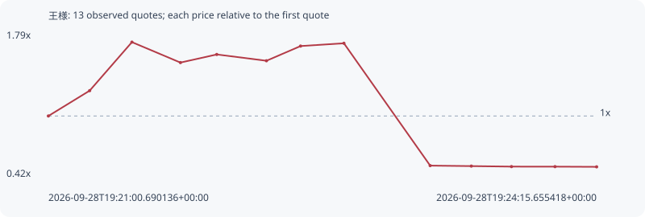

# 王様

**solana** / `7STQRJKjUicpcCqbU3jdUrTDbhk3vvNnHMqvM1oepQ5A`

[All tokens](README.md) · [Market window](../README.md)

## Native assessments

This contract is in the quote cohort; it has no native model assessment in this window.

## Series 158344539a14bb832b61

Pool: `not supplied`

[Complete series](../series/solana/158344539a14bb832b61.json)

Every dot is a captured quote. Lines connect observations; the curve ends at the last available quote.

| Peak | Final | Return | Maximum drawdown |
| ---: | ---: | ---: | ---: |
| 1.7003x | 0.5176x | -48.24% | 69.56% |

### Complete quote timeline

| Time (UTC) | Price (USD) | Multiple | Evidence |
| --- | ---: | ---: | --- |
| 2026-09-28T19:21:00.690136+00:00 | 7.14826e-06 | 1.0000x | `capture:f2ff842d-38e9-4cbe-a281-98c17d5a5672:rank:59` |
| 2026-09-28T19:21:15.372716+00:00 | 8.86493e-06 | 1.2402x | `capture:a923b968-a768-495e-ae33-6de2042c551f:rank:42` |
| 2026-09-28T19:21:30.402460+00:00 | 1.21545e-05 | 1.7003x | `capture:d926629b-2050-4e50-a602-1638c6205870:rank:33` |
| 2026-09-28T19:21:47.649380+00:00 | 1.07682e-05 | 1.5064x | `capture:0799ec6d-0e89-46b5-ae88-5695bf6c5fc3:rank:31` |
| 2026-09-28T19:22:00.569928+00:00 | 1.13181e-05 | 1.5833x | `capture:263cda40-4b31-4b2d-b168-fa4310edb46d:rank:28` |
| 2026-09-28T19:22:18.240717+00:00 | 1.08911e-05 | 1.5236x | `capture:546b2c55-1845-4da7-bc9c-4439cd0ccdba:rank:24` |
| 2026-09-28T19:22:30.371968+00:00 | 1.18879e-05 | 1.6630x | `capture:507d17cb-af67-4a81-a2b2-d5ddfbc40021:rank:23` |
| 2026-09-28T19:22:45.783808+00:00 | 1.20766e-05 | 1.6894x | `capture:9558d322-c429-480b-885f-82f4481c8506:rank:28` |
| 2026-09-28T19:23:16.460099+00:00 | 3.78334e-06 | 0.5293x | `capture:2d456a2a-6755-4e1d-9a80-b6e3b2d44ec1:rank:24` |
| 2026-09-28T19:23:31.092727+00:00 | 3.75042e-06 | 0.5247x | `capture:0e687519-8b01-4d7e-b48c-e2ec34135d17:rank:22` |
| 2026-09-28T19:23:45.375171+00:00 | 3.71642e-06 | 0.5199x | `capture:1b404fa0-870b-4e7c-bafd-c3ef241c5093:rank:22` |
| 2026-09-28T19:24:00.852400+00:00 | 3.71344e-06 | 0.5195x | `capture:5205c587-4734-452c-b758-46c4814dded1:rank:23` |
| 2026-09-28T19:24:15.655418+00:00 | 3.70025e-06 | 0.5176x | `capture:5b9df0f6-51c0-4dbb-9de7-7df7a46bfee0:rank:23` |

### Exit-policy timeline

Calculated from captured quotes under the window policy. Native assessments are linked separately above.

| Time (UTC) | Action | Price (USD) | Evidence |
| --- | --- | ---: | --- |
| 2026-09-28T19:21:00.690136+00:00 | BUY | 7.14826e-06 | `capture:f2ff842d-38e9-4cbe-a281-98c17d5a5672:rank:59` |
| 2026-09-28T19:21:15.372716+00:00 | HOLD | 8.86493e-06 | `capture:a923b968-a768-495e-ae33-6de2042c551f:rank:42` |
| 2026-09-28T19:21:30.402460+00:00 | TP | 1.21545e-05 | `capture:d926629b-2050-4e50-a602-1638c6205870:rank:33` |
