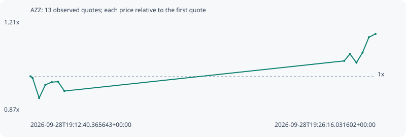

# AZZ

**solana** / `CZWyKU9MghRchXXw6x34aPN7MGeQR8QJKwymX6cpump`

[All tokens](README.md) · [Market window](../README.md)

## Native assessments

This contract is in the quote cohort; it has no native model assessment in this window.

## Series e85a7ba6e637b39a7f5d

Pool: `not supplied`

[Complete series](../series/solana/e85a7ba6e637b39a7f5d.json)

Every dot is a captured quote. Lines connect observations; the curve ends at the last available quote.

| Peak | Final | Return | Maximum drawdown |
| ---: | ---: | ---: | ---: |
| 1.1558x | 1.1558x | +15.58% | 7.97% |

### Complete quote timeline

| Time (UTC) | Price (USD) | Multiple | Evidence |
| --- | ---: | ---: | --- |
| 2026-09-28T19:12:40.365643+00:00 | 2.54329e-05 | 1.0000x | `capture:3af1faa1-2074-484e-893e-ed2c676e1576:rank:89` |
| 2026-09-28T19:12:45.490977+00:00 | 2.52689e-05 | 0.9936x | `capture:ac0279d6-7dd1-44b6-bf3e-910bf7b8eddf:rank:86` |
| 2026-09-28T19:13:00.884337+00:00 | 2.34067e-05 | 0.9203x | `capture:5867894f-39b4-4bcd-bd87-86394c63aab4:rank:82` |
| 2026-09-28T19:13:15.565374+00:00 | 2.46404e-05 | 0.9688x | `capture:ca31b3d4-ad60-4333-98b3-6d940a196f86:rank:87` |
| 2026-09-28T19:13:30.833894+00:00 | 2.48906e-05 | 0.9787x | `capture:2beb38a4-bfac-4502-bbc3-8c8c0f943007:rank:90` |
| 2026-09-28T19:13:45.640151+00:00 | 2.49329e-05 | 0.9803x | `capture:4d31b656-3ffe-4768-bef6-377adf019420:rank:88` |
| 2026-09-28T19:14:00.595194+00:00 | 2.4059e-05 | 0.9460x | `capture:2c78112b-48e7-4f74-8c2e-1cb8642a79dc:rank:95` |
| 2026-09-28T19:25:01.877958+00:00 | 2.68735e-05 | 1.0566x | `capture:fd6d01ae-d246-439e-ac58-27ae75880eb9:rank:98` |
| 2026-09-28T19:25:15.488701+00:00 | 2.75235e-05 | 1.0822x | `capture:b8fee87c-9981-475c-930b-99c255910a9f:rank:94` |
| 2026-09-28T19:25:30.900173+00:00 | 2.67067e-05 | 1.0501x | `capture:7f757769-25c3-429a-81d0-c6b2ee45ee15:rank:93` |
| 2026-09-28T19:25:45.342895+00:00 | 2.76545e-05 | 1.0874x | `capture:0ca3656d-ce8c-444b-8f77-acf34c08a1f4:rank:93` |
| 2026-09-28T19:26:00.340634+00:00 | 2.90901e-05 | 1.1438x | `capture:5b3728c5-aff9-43f3-bbb5-25b251825caa:rank:93` |
| 2026-09-28T19:26:16.031602+00:00 | 2.93941e-05 | 1.1558x | `capture:bb8d4bfc-85e1-4d55-a2ff-e47193bcce5f:rank:97` |

### Exit-policy timeline

Calculated from captured quotes under the window policy. Native assessments are linked separately above.

| Time (UTC) | Action | Price (USD) | Evidence |
| --- | --- | ---: | --- |
| 2026-09-28T19:12:40.365643+00:00 | BUY | 2.54329e-05 | `capture:3af1faa1-2074-484e-893e-ed2c676e1576:rank:89` |
| 2026-09-28T19:12:45.490977+00:00 | HOLD | 2.52689e-05 | `capture:ac0279d6-7dd1-44b6-bf3e-910bf7b8eddf:rank:86` |
| 2026-09-28T19:13:00.884337+00:00 | HOLD | 2.34067e-05 | `capture:5867894f-39b4-4bcd-bd87-86394c63aab4:rank:82` |
| 2026-09-28T19:13:15.565374+00:00 | HOLD | 2.46404e-05 | `capture:ca31b3d4-ad60-4333-98b3-6d940a196f86:rank:87` |
| 2026-09-28T19:13:30.833894+00:00 | HOLD | 2.48906e-05 | `capture:2beb38a4-bfac-4502-bbc3-8c8c0f943007:rank:90` |
| 2026-09-28T19:13:45.640151+00:00 | HOLD | 2.49329e-05 | `capture:4d31b656-3ffe-4768-bef6-377adf019420:rank:88` |
| 2026-09-28T19:14:00.595194+00:00 | HOLD | 2.4059e-05 | `capture:2c78112b-48e7-4f74-8c2e-1cb8642a79dc:rank:95` |
| 2026-09-28T19:25:01.877958+00:00 | HOLD | 2.68735e-05 | `capture:fd6d01ae-d246-439e-ac58-27ae75880eb9:rank:98` |
| 2026-09-28T19:25:15.488701+00:00 | HOLD | 2.75235e-05 | `capture:b8fee87c-9981-475c-930b-99c255910a9f:rank:94` |
| 2026-09-28T19:25:30.900173+00:00 | HOLD | 2.67067e-05 | `capture:7f757769-25c3-429a-81d0-c6b2ee45ee15:rank:93` |
| 2026-09-28T19:25:45.342895+00:00 | HOLD | 2.76545e-05 | `capture:0ca3656d-ce8c-444b-8f77-acf34c08a1f4:rank:93` |
| 2026-09-28T19:26:00.340634+00:00 | HOLD | 2.90901e-05 | `capture:5b3728c5-aff9-43f3-bbb5-25b251825caa:rank:93` |
| 2026-09-28T19:26:16.031602+00:00 | HOLD | 2.93941e-05 | `capture:bb8d4bfc-85e1-4d55-a2ff-e47193bcce5f:rank:97` |
