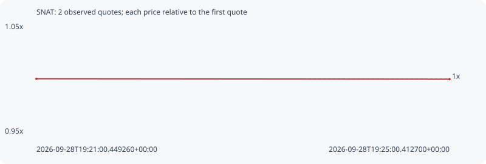

# SNAT

**robinhood** / `0x02c83495bb67b325f9694dd9bfacd51c8218bdc9`

[All tokens](README.md) · [Market window](../README.md)

## Native assessments

This contract is in the quote cohort; it has no native model assessment in this window.

## Series 76550011646e42c7bd78

Pool: `not supplied`

[Complete series](../series/robinhood/76550011646e42c7bd78.json)

Every dot is a captured quote. Lines connect observations; the curve ends at the last available quote.

| Peak | Final | Return | Maximum drawdown |
| ---: | ---: | ---: | ---: |
| 1.0000x | 0.9996x | -0.04% | 0.04% |

### Complete quote timeline

| Time (UTC) | Price (USD) | Multiple | Evidence |
| --- | ---: | ---: | --- |
| 2026-09-28T19:21:00.449260+00:00 | 0.000201452 | 1.0000x | `capture:186445b2-8971-4639-85b9-26b2e8fb9d2c:rank:99` |
| 2026-09-28T19:25:00.412700+00:00 | 0.000201377 | 0.9996x | `capture:1dec2f8f-4694-4c32-8be8-eeec3980c853:rank:97` |

### Exit-policy timeline

Calculated from captured quotes under the window policy. Native assessments are linked separately above.

| Time (UTC) | Action | Price (USD) | Evidence |
| --- | --- | ---: | --- |
| 2026-09-28T19:21:00.449260+00:00 | BUY | 0.000201452 | `capture:186445b2-8971-4639-85b9-26b2e8fb9d2c:rank:99` |
| 2026-09-28T19:25:00.412700+00:00 | HOLD | 0.000201377 | `capture:1dec2f8f-4694-4c32-8be8-eeec3980c853:rank:97` |
