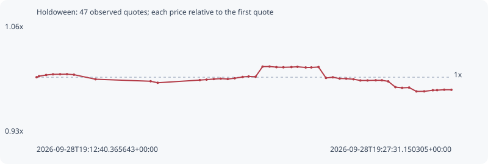

# Holdoween

**solana** / `BxftAowY2dVa2h9KMqDTPk4oMxzU9k6uVbZuoorXpump`

[All tokens](README.md) · [Market window](../README.md)

## Native assessments

This contract is in the quote cohort; it has no native model assessment in this window.

## Series 86cfa5c5ee31c4277b4e

Pool: `not supplied`

[Complete series](../series/solana/86cfa5c5ee31c4277b4e.json)

Every dot is a captured quote. Lines connect observations; the curve ends at the last available quote.

| Peak | Final | Return | Maximum drawdown |
| ---: | ---: | ---: | ---: |
| 1.0127x | 0.9851x | -1.49% | 2.91% |

### Complete quote timeline

| Time (UTC) | Price (USD) | Multiple | Evidence |
| --- | ---: | ---: | --- |
| 2026-09-28T19:12:40.365643+00:00 | 0.000750893 | 1.0000x | `capture:3af1faa1-2074-484e-893e-ed2c676e1576:rank:15` |
| 2026-09-28T19:12:45.490977+00:00 | 0.000751785 | 1.0012x | `capture:ac0279d6-7dd1-44b6-bf3e-910bf7b8eddf:rank:15` |
| 2026-09-28T19:13:00.884337+00:00 | 0.000752859 | 1.0026x | `capture:5867894f-39b4-4bcd-bd87-86394c63aab4:rank:15` |
| 2026-09-28T19:13:15.565374+00:00 | 0.000753474 | 1.0034x | `capture:ca31b3d4-ad60-4333-98b3-6d940a196f86:rank:17` |
| 2026-09-28T19:13:30.833894+00:00 | 0.000753537 | 1.0035x | `capture:2beb38a4-bfac-4502-bbc3-8c8c0f943007:rank:18` |
| 2026-09-28T19:13:45.640151+00:00 | 0.0007536 | 1.0036x | `capture:4d31b656-3ffe-4768-bef6-377adf019420:rank:19` |
| 2026-09-28T19:14:00.595194+00:00 | 0.000753149 | 1.0030x | `capture:2c78112b-48e7-4f74-8c2e-1cb8642a79dc:rank:17` |
| 2026-09-28T19:14:46.892387+00:00 | 0.000749101 | 0.9976x | `capture:7d9e3e65-8bda-4696-b6d1-7a86825bd98c:rank:15` |
| 2026-09-28T19:16:45.311485+00:00 | 0.000747303 | 0.9952x | `capture:72cccbac-c3fe-4991-8f62-08c53849b146:rank:11` |
| 2026-09-28T19:17:00.368914+00:00 | 0.000745963 | 0.9934x | `capture:1232cf18-7088-40a1-9f55-ad9ae22b44f5:rank:11` |
| 2026-09-28T19:18:30.722167+00:00 | 0.000748341 | 0.9966x | `capture:9f88d118-9108-4dff-bbfc-246eaed5ce38:rank:19` |
| 2026-09-28T19:18:45.386687+00:00 | 0.000748781 | 0.9972x | `capture:f533100a-ce62-4457-9107-42e7601ea5d7:rank:20` |
| 2026-09-28T19:19:00.883835+00:00 | 0.000749251 | 0.9978x | `capture:a2495d99-5671-4c7e-b87c-48f48d90f2f2:rank:19` |
| 2026-09-28T19:19:15.826416+00:00 | 0.000749629 | 0.9983x | `capture:ba1dc6a3-b8b7-461a-8110-8490f03539a5:rank:18` |
| 2026-09-28T19:19:30.814098+00:00 | 0.000749283 | 0.9979x | `capture:b25d90dc-c8db-4388-8a2b-d06541e5320f:rank:17` |
| 2026-09-28T19:19:45.817199+00:00 | 0.000749957 | 0.9988x | `capture:722d1b7b-ef4f-4ac5-883c-0557bae2b60b:rank:16` |
| 2026-09-28T19:20:02.715590+00:00 | 0.000751131 | 1.0003x | `capture:60ff17d8-3b18-4f61-9bc7-006afd324cf2:rank:14` |
| 2026-09-28T19:20:15.699547+00:00 | 0.000751573 | 1.0009x | `capture:10a94828-637f-4580-a9f7-2fbd34d8589a:rank:16` |
| 2026-09-28T19:20:30.480194+00:00 | 0.000751294 | 1.0005x | `capture:54722132-db1d-4a2b-8c1c-2b0e71d01430:rank:17` |
| 2026-09-28T19:20:45.683165+00:00 | 0.000760337 | 1.0126x | `capture:17963a37-fd65-46b6-8e1c-350082721f8c:rank:17` |
| 2026-09-28T19:21:00.690136+00:00 | 0.000760401 | 1.0127x | `capture:f2ff842d-38e9-4cbe-a281-98c17d5a5672:rank:16` |
| 2026-09-28T19:21:15.372716+00:00 | 0.000759853 | 1.0119x | `capture:a923b968-a768-495e-ae33-6de2042c551f:rank:15` |
| 2026-09-28T19:21:30.402460+00:00 | 0.000759717 | 1.0118x | `capture:d926629b-2050-4e50-a602-1638c6205870:rank:15` |
| 2026-09-28T19:21:47.649380+00:00 | 0.000759909 | 1.0120x | `capture:0799ec6d-0e89-46b5-ae88-5695bf6c5fc3:rank:15` |
| 2026-09-28T19:22:00.569928+00:00 | 0.00076015 | 1.0123x | `capture:263cda40-4b31-4b2d-b168-fa4310edb46d:rank:14` |
| 2026-09-28T19:22:18.240717+00:00 | 0.000759571 | 1.0116x | `capture:546b2c55-1845-4da7-bc9c-4439cd0ccdba:rank:16` |
| 2026-09-28T19:22:30.371968+00:00 | 0.000759609 | 1.0116x | `capture:507d17cb-af67-4a81-a2b2-d5ddfbc40021:rank:14` |
| 2026-09-28T19:22:45.783808+00:00 | 0.000759949 | 1.0121x | `capture:9558d322-c429-480b-885f-82f4481c8506:rank:16` |
| 2026-09-28T19:23:01.833252+00:00 | 0.000750246 | 0.9991x | `capture:c5462412-2da1-4432-8949-8fcd1492c57f:rank:15` |
| 2026-09-28T19:23:16.460099+00:00 | 0.000750825 | 0.9999x | `capture:2d456a2a-6755-4e1d-9a80-b6e3b2d44ec1:rank:15` |
| 2026-09-28T19:23:31.092727+00:00 | 0.000749721 | 0.9984x | `capture:0e687519-8b01-4d7e-b48c-e2ec34135d17:rank:16` |
| 2026-09-28T19:23:45.375171+00:00 | 0.000749639 | 0.9983x | `capture:1b404fa0-870b-4e7c-bafd-c3ef241c5093:rank:17` |
| 2026-09-28T19:24:00.852400+00:00 | 0.000749088 | 0.9976x | `capture:5205c587-4734-452c-b758-46c4814dded1:rank:17` |
| 2026-09-28T19:24:15.655418+00:00 | 0.000748016 | 0.9962x | `capture:5b9df0f6-51c0-4dbb-9de7-7df7a46bfee0:rank:16` |
| 2026-09-28T19:24:31.056437+00:00 | 0.000748016 | 0.9962x | `capture:971b5dda-397d-4fe7-b49e-94713bb088df:rank:17` |
| 2026-09-28T19:24:48.687179+00:00 | 0.000748169 | 0.9964x | `capture:feb72cbd-a170-4ba3-8a11-eb1df1686719:rank:18` |
| 2026-09-28T19:25:01.877958+00:00 | 0.000748169 | 0.9964x | `capture:fd6d01ae-d246-439e-ac58-27ae75880eb9:rank:18` |
| 2026-09-28T19:25:15.488701+00:00 | 0.000747198 | 0.9951x | `capture:b8fee87c-9981-475c-930b-99c255910a9f:rank:17` |
| 2026-09-28T19:25:30.900173+00:00 | 0.000742074 | 0.9883x | `capture:7f757769-25c3-429a-81d0-c6b2ee45ee15:rank:18` |
| 2026-09-28T19:25:45.342895+00:00 | 0.000741456 | 0.9874x | `capture:0ca3656d-ce8c-444b-8f77-acf34c08a1f4:rank:19` |
| 2026-09-28T19:26:00.340634+00:00 | 0.000741705 | 0.9878x | `capture:5b3728c5-aff9-43f3-bbb5-25b251825caa:rank:18` |
| 2026-09-28T19:26:16.031602+00:00 | 0.000738281 | 0.9832x | `capture:bb8d4bfc-85e1-4d55-a2ff-e47193bcce5f:rank:18` |
| 2026-09-28T19:26:32.771713+00:00 | 0.000738333 | 0.9833x | `capture:2fed7296-b3d1-4ba6-8398-799ee55f1f2b:rank:17` |
| 2026-09-28T19:26:51.267717+00:00 | 0.000739297 | 0.9846x | `capture:4cc162c2-aa4a-403b-a901-4bb5058380d6:rank:18` |
| 2026-09-28T19:27:00.453239+00:00 | 0.00073936 | 0.9846x | `capture:4273fbb8-5342-4e37-8d61-ced6b88e542d:rank:17` |
| 2026-09-28T19:27:15.715818+00:00 | 0.000739791 | 0.9852x | `capture:d04c9116-4617-4b61-8b98-5489321cd1cc:rank:18` |
| 2026-09-28T19:27:31.150305+00:00 | 0.000739729 | 0.9851x | `capture:7cad37e8-83d3-4438-8055-245db6707e2e:rank:18` |

### Exit-policy timeline

Calculated from captured quotes under the window policy. Native assessments are linked separately above.

| Time (UTC) | Action | Price (USD) | Evidence |
| --- | --- | ---: | --- |
| 2026-09-28T19:12:40.365643+00:00 | BUY | 0.000750893 | `capture:3af1faa1-2074-484e-893e-ed2c676e1576:rank:15` |
| 2026-09-28T19:12:45.490977+00:00 | HOLD | 0.000751785 | `capture:ac0279d6-7dd1-44b6-bf3e-910bf7b8eddf:rank:15` |
| 2026-09-28T19:13:00.884337+00:00 | HOLD | 0.000752859 | `capture:5867894f-39b4-4bcd-bd87-86394c63aab4:rank:15` |
| 2026-09-28T19:13:15.565374+00:00 | HOLD | 0.000753474 | `capture:ca31b3d4-ad60-4333-98b3-6d940a196f86:rank:17` |
| 2026-09-28T19:13:30.833894+00:00 | HOLD | 0.000753537 | `capture:2beb38a4-bfac-4502-bbc3-8c8c0f943007:rank:18` |
| 2026-09-28T19:13:45.640151+00:00 | HOLD | 0.0007536 | `capture:4d31b656-3ffe-4768-bef6-377adf019420:rank:19` |
| 2026-09-28T19:14:00.595194+00:00 | HOLD | 0.000753149 | `capture:2c78112b-48e7-4f74-8c2e-1cb8642a79dc:rank:17` |
| 2026-09-28T19:14:46.892387+00:00 | HOLD | 0.000749101 | `capture:7d9e3e65-8bda-4696-b6d1-7a86825bd98c:rank:15` |
| 2026-09-28T19:16:45.311485+00:00 | HOLD | 0.000747303 | `capture:72cccbac-c3fe-4991-8f62-08c53849b146:rank:11` |
| 2026-09-28T19:17:00.368914+00:00 | HOLD | 0.000745963 | `capture:1232cf18-7088-40a1-9f55-ad9ae22b44f5:rank:11` |
| 2026-09-28T19:18:30.722167+00:00 | HOLD | 0.000748341 | `capture:9f88d118-9108-4dff-bbfc-246eaed5ce38:rank:19` |
| 2026-09-28T19:18:45.386687+00:00 | HOLD | 0.000748781 | `capture:f533100a-ce62-4457-9107-42e7601ea5d7:rank:20` |
| 2026-09-28T19:19:00.883835+00:00 | HOLD | 0.000749251 | `capture:a2495d99-5671-4c7e-b87c-48f48d90f2f2:rank:19` |
| 2026-09-28T19:19:15.826416+00:00 | HOLD | 0.000749629 | `capture:ba1dc6a3-b8b7-461a-8110-8490f03539a5:rank:18` |
| 2026-09-28T19:19:30.814098+00:00 | HOLD | 0.000749283 | `capture:b25d90dc-c8db-4388-8a2b-d06541e5320f:rank:17` |
| 2026-09-28T19:19:45.817199+00:00 | HOLD | 0.000749957 | `capture:722d1b7b-ef4f-4ac5-883c-0557bae2b60b:rank:16` |
| 2026-09-28T19:20:02.715590+00:00 | HOLD | 0.000751131 | `capture:60ff17d8-3b18-4f61-9bc7-006afd324cf2:rank:14` |
| 2026-09-28T19:20:15.699547+00:00 | HOLD | 0.000751573 | `capture:10a94828-637f-4580-a9f7-2fbd34d8589a:rank:16` |
| 2026-09-28T19:20:30.480194+00:00 | HOLD | 0.000751294 | `capture:54722132-db1d-4a2b-8c1c-2b0e71d01430:rank:17` |
| 2026-09-28T19:20:45.683165+00:00 | HOLD | 0.000760337 | `capture:17963a37-fd65-46b6-8e1c-350082721f8c:rank:17` |
| 2026-09-28T19:21:00.690136+00:00 | HOLD | 0.000760401 | `capture:f2ff842d-38e9-4cbe-a281-98c17d5a5672:rank:16` |
| 2026-09-28T19:21:15.372716+00:00 | HOLD | 0.000759853 | `capture:a923b968-a768-495e-ae33-6de2042c551f:rank:15` |
| 2026-09-28T19:21:30.402460+00:00 | HOLD | 0.000759717 | `capture:d926629b-2050-4e50-a602-1638c6205870:rank:15` |
| 2026-09-28T19:21:47.649380+00:00 | HOLD | 0.000759909 | `capture:0799ec6d-0e89-46b5-ae88-5695bf6c5fc3:rank:15` |
| 2026-09-28T19:22:00.569928+00:00 | HOLD | 0.00076015 | `capture:263cda40-4b31-4b2d-b168-fa4310edb46d:rank:14` |
| 2026-09-28T19:22:18.240717+00:00 | HOLD | 0.000759571 | `capture:546b2c55-1845-4da7-bc9c-4439cd0ccdba:rank:16` |
| 2026-09-28T19:22:30.371968+00:00 | HOLD | 0.000759609 | `capture:507d17cb-af67-4a81-a2b2-d5ddfbc40021:rank:14` |
| 2026-09-28T19:22:45.783808+00:00 | HOLD | 0.000759949 | `capture:9558d322-c429-480b-885f-82f4481c8506:rank:16` |
| 2026-09-28T19:23:01.833252+00:00 | HOLD | 0.000750246 | `capture:c5462412-2da1-4432-8949-8fcd1492c57f:rank:15` |
| 2026-09-28T19:23:16.460099+00:00 | HOLD | 0.000750825 | `capture:2d456a2a-6755-4e1d-9a80-b6e3b2d44ec1:rank:15` |
| 2026-09-28T19:23:31.092727+00:00 | HOLD | 0.000749721 | `capture:0e687519-8b01-4d7e-b48c-e2ec34135d17:rank:16` |
| 2026-09-28T19:23:45.375171+00:00 | HOLD | 0.000749639 | `capture:1b404fa0-870b-4e7c-bafd-c3ef241c5093:rank:17` |
| 2026-09-28T19:24:00.852400+00:00 | HOLD | 0.000749088 | `capture:5205c587-4734-452c-b758-46c4814dded1:rank:17` |
| 2026-09-28T19:24:15.655418+00:00 | HOLD | 0.000748016 | `capture:5b9df0f6-51c0-4dbb-9de7-7df7a46bfee0:rank:16` |
| 2026-09-28T19:24:31.056437+00:00 | HOLD | 0.000748016 | `capture:971b5dda-397d-4fe7-b49e-94713bb088df:rank:17` |
| 2026-09-28T19:24:48.687179+00:00 | HOLD | 0.000748169 | `capture:feb72cbd-a170-4ba3-8a11-eb1df1686719:rank:18` |
| 2026-09-28T19:25:01.877958+00:00 | HOLD | 0.000748169 | `capture:fd6d01ae-d246-439e-ac58-27ae75880eb9:rank:18` |
| 2026-09-28T19:25:15.488701+00:00 | HOLD | 0.000747198 | `capture:b8fee87c-9981-475c-930b-99c255910a9f:rank:17` |
| 2026-09-28T19:25:30.900173+00:00 | HOLD | 0.000742074 | `capture:7f757769-25c3-429a-81d0-c6b2ee45ee15:rank:18` |
| 2026-09-28T19:25:45.342895+00:00 | HOLD | 0.000741456 | `capture:0ca3656d-ce8c-444b-8f77-acf34c08a1f4:rank:19` |
| 2026-09-28T19:26:00.340634+00:00 | HOLD | 0.000741705 | `capture:5b3728c5-aff9-43f3-bbb5-25b251825caa:rank:18` |
| 2026-09-28T19:26:16.031602+00:00 | HOLD | 0.000738281 | `capture:bb8d4bfc-85e1-4d55-a2ff-e47193bcce5f:rank:18` |
| 2026-09-28T19:26:32.771713+00:00 | HOLD | 0.000738333 | `capture:2fed7296-b3d1-4ba6-8398-799ee55f1f2b:rank:17` |
| 2026-09-28T19:26:51.267717+00:00 | HOLD | 0.000739297 | `capture:4cc162c2-aa4a-403b-a901-4bb5058380d6:rank:18` |
| 2026-09-28T19:27:00.453239+00:00 | HOLD | 0.00073936 | `capture:4273fbb8-5342-4e37-8d61-ced6b88e542d:rank:17` |
| 2026-09-28T19:27:15.715818+00:00 | HOLD | 0.000739791 | `capture:d04c9116-4617-4b61-8b98-5489321cd1cc:rank:18` |
| 2026-09-28T19:27:31.150305+00:00 | HOLD | 0.000739729 | `capture:7cad37e8-83d3-4438-8055-245db6707e2e:rank:18` |
