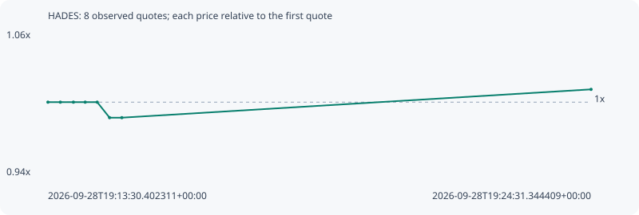

# HADES

**robinhood** / `0x923d915ddf0fe60c04addac68e13f0d5af03164f`

[All tokens](README.md) · [Market window](../README.md)

## Native assessments

This contract is in the quote cohort; it has no native model assessment in this window.

## Series 85c943e7e463a1ae8ad1

Pool: `not supplied`

[Complete series](../series/robinhood/85c943e7e463a1ae8ad1.json)

Every dot is a captured quote. Lines connect observations; the curve ends at the last available quote.

| Peak | Final | Return | Maximum drawdown |
| ---: | ---: | ---: | ---: |
| 1.0111x | 1.0111x | +1.11% | 1.35% |

### Complete quote timeline

| Time (UTC) | Price (USD) | Multiple | Evidence |
| --- | ---: | ---: | --- |
| 2026-09-28T19:13:30.402311+00:00 | 0.000550939 | 1.0000x | `capture:44090e9e-d515-41c4-a78f-893390e6f2b0:rank:83` |
| 2026-09-28T19:13:45.493213+00:00 | 0.000550939 | 1.0000x | `capture:52264519-193b-4508-b560-e9ee4e3e0963:rank:84` |
| 2026-09-28T19:14:01.407289+00:00 | 0.000550939 | 1.0000x | `capture:0a62cce6-2c27-4761-80c1-feb9130a0c83:rank:88` |
| 2026-09-28T19:14:15.755233+00:00 | 0.000550939 | 1.0000x | `capture:09651124-e158-421c-bcdc-cb2310b48412:rank:87` |
| 2026-09-28T19:14:30.367936+00:00 | 0.000550939 | 1.0000x | `capture:7a0b9f45-7248-4af6-b349-4bf6d5ef81be:rank:83` |
| 2026-09-28T19:14:45.422215+00:00 | 0.000543508 | 0.9865x | `capture:bf6e34c4-c499-472e-8e2b-ebbb151300e2:rank:68` |
| 2026-09-28T19:15:00.325882+00:00 | 0.000543508 | 0.9865x | `capture:663c0420-2b9e-4a94-998b-531fa9202dee:rank:77` |
| 2026-09-28T19:24:31.344409+00:00 | 0.00055706 | 1.0111x | `capture:85f4db1c-c852-45c3-99aa-4320f3839031:rank:95` |

### Exit-policy timeline

Calculated from captured quotes under the window policy. Native assessments are linked separately above.

| Time (UTC) | Action | Price (USD) | Evidence |
| --- | --- | ---: | --- |
| 2026-09-28T19:13:30.402311+00:00 | BUY | 0.000550939 | `capture:44090e9e-d515-41c4-a78f-893390e6f2b0:rank:83` |
| 2026-09-28T19:13:45.493213+00:00 | HOLD | 0.000550939 | `capture:52264519-193b-4508-b560-e9ee4e3e0963:rank:84` |
| 2026-09-28T19:14:01.407289+00:00 | HOLD | 0.000550939 | `capture:0a62cce6-2c27-4761-80c1-feb9130a0c83:rank:88` |
| 2026-09-28T19:14:15.755233+00:00 | HOLD | 0.000550939 | `capture:09651124-e158-421c-bcdc-cb2310b48412:rank:87` |
| 2026-09-28T19:14:30.367936+00:00 | HOLD | 0.000550939 | `capture:7a0b9f45-7248-4af6-b349-4bf6d5ef81be:rank:83` |
| 2026-09-28T19:14:45.422215+00:00 | HOLD | 0.000543508 | `capture:bf6e34c4-c499-472e-8e2b-ebbb151300e2:rank:68` |
| 2026-09-28T19:15:00.325882+00:00 | HOLD | 0.000543508 | `capture:663c0420-2b9e-4a94-998b-531fa9202dee:rank:77` |
| 2026-09-28T19:24:31.344409+00:00 | HOLD | 0.00055706 | `capture:85f4db1c-c852-45c3-99aa-4320f3839031:rank:95` |
