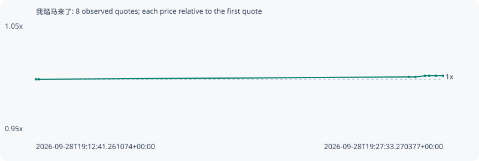

# 我踏马来了

**bsc** / `0xc51a9250795c0186a6fb4a7d20a90330651e4444`

[All tokens](README.md) · [Market window](../README.md)

## Native assessments

This contract is in the quote cohort; it has no native model assessment in this window.

## Series 5d85f558925be117e201

Pool: `not supplied`

[Complete series](../series/bsc/5d85f558925be117e201.json)

Every dot is a captured quote. Lines connect observations; the curve ends at the last available quote.

| Peak | Final | Return | Maximum drawdown |
| ---: | ---: | ---: | ---: |
| 1.0034x | 1.0034x | +0.34% | 0.00% |

### Complete quote timeline

| Time (UTC) | Price (USD) | Multiple | Evidence |
| --- | ---: | ---: | --- |
| 2026-09-28T19:12:41.261074+00:00 | 0.0120673 | 1.0000x | `capture:795a88f0-804c-4f14-a3e8-ce8d9318f6df:rank:69` |
| 2026-09-28T19:12:47.639745+00:00 | 0.0120673 | 1.0000x | `capture:c2d8bd1a-9ed6-4d75-91ae-006bea65a635:rank:74` |
| 2026-09-28T19:26:17.917162+00:00 | 0.0120943 | 1.0022x | `capture:3b80c987-c82b-4a3e-8f0b-d3017a78edcb:rank:79` |
| 2026-09-28T19:26:32.687411+00:00 | 0.0120943 | 1.0022x | `capture:d1fef60a-e7ad-4594-a8e8-74ee96c47ae4:rank:79` |
| 2026-09-28T19:26:53.320509+00:00 | 0.012108 | 1.0034x | `capture:5f09420c-1544-46ff-a2e4-39235f8f73a9:rank:54` |
| 2026-09-28T19:27:02.865937+00:00 | 0.012108 | 1.0034x | `capture:bd21661a-974d-4bab-9276-4e2f7e7d279a:rank:54` |
| 2026-09-28T19:27:17.494949+00:00 | 0.012108 | 1.0034x | `capture:c5d9da1a-7d95-4d7f-8cef-ffb660ac56d0:rank:55` |
| 2026-09-28T19:27:33.270377+00:00 | 0.012108 | 1.0034x | `capture:1cb6d037-a95b-477e-be82-4cc75b729c8b:rank:56` |

### Exit-policy timeline

Calculated from captured quotes under the window policy. Native assessments are linked separately above.

| Time (UTC) | Action | Price (USD) | Evidence |
| --- | --- | ---: | --- |
| 2026-09-28T19:12:41.261074+00:00 | BUY | 0.0120673 | `capture:795a88f0-804c-4f14-a3e8-ce8d9318f6df:rank:69` |
| 2026-09-28T19:12:47.639745+00:00 | HOLD | 0.0120673 | `capture:c2d8bd1a-9ed6-4d75-91ae-006bea65a635:rank:74` |
| 2026-09-28T19:26:17.917162+00:00 | HOLD | 0.0120943 | `capture:3b80c987-c82b-4a3e-8f0b-d3017a78edcb:rank:79` |
| 2026-09-28T19:26:32.687411+00:00 | HOLD | 0.0120943 | `capture:d1fef60a-e7ad-4594-a8e8-74ee96c47ae4:rank:79` |
| 2026-09-28T19:26:53.320509+00:00 | HOLD | 0.012108 | `capture:5f09420c-1544-46ff-a2e4-39235f8f73a9:rank:54` |
| 2026-09-28T19:27:02.865937+00:00 | HOLD | 0.012108 | `capture:bd21661a-974d-4bab-9276-4e2f7e7d279a:rank:54` |
| 2026-09-28T19:27:17.494949+00:00 | HOLD | 0.012108 | `capture:c5d9da1a-7d95-4d7f-8cef-ffb660ac56d0:rank:55` |
| 2026-09-28T19:27:33.270377+00:00 | HOLD | 0.012108 | `capture:1cb6d037-a95b-477e-be82-4cc75b729c8b:rank:56` |
