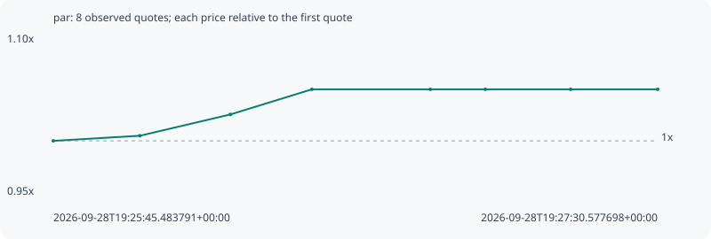

# par

**robinhood** / `0x507b6f349a80114097a67b8b4677367acc15b220`

[All tokens](README.md) · [Market window](../README.md)

## Native assessments

This contract is in the quote cohort; it has no native model assessment in this window.

## Series 00584fa22cc2db85dca6

Pool: `not supplied`

[Complete series](../series/robinhood/00584fa22cc2db85dca6.json)

Every dot is a captured quote. Lines connect observations; the curve ends at the last available quote.

| Peak | Final | Return | Maximum drawdown |
| ---: | ---: | ---: | ---: |
| 1.0478x | 1.0478x | +4.78% | 0.00% |

### Complete quote timeline

| Time (UTC) | Price (USD) | Multiple | Evidence |
| --- | ---: | ---: | --- |
| 2026-09-28T19:25:45.483791+00:00 | 0.000691081 | 1.0000x | `capture:ebb21e05-3dc6-4a8f-a800-fa79ba147200:rank:94` |
| 2026-09-28T19:26:00.522113+00:00 | 0.000694339 | 1.0047x | `capture:a33301e4-8f37-4fb5-af69-629635c54fe6:rank:86` |
| 2026-09-28T19:26:16.279485+00:00 | 0.000708003 | 1.0245x | `capture:085b2ea9-3985-4608-a1cd-1eddc6b16122:rank:69` |
| 2026-09-28T19:26:30.447392+00:00 | 0.000724099 | 1.0478x | `capture:36fd4b46-5420-443d-b1ed-b86b98706671:rank:66` |
| 2026-09-28T19:26:51.039990+00:00 | 0.000724099 | 1.0478x | `capture:653b62fa-7a58-45fd-95e9-3b36912dc139:rank:63` |
| 2026-09-28T19:27:00.598930+00:00 | 0.000724099 | 1.0478x | `capture:8041f6b0-6188-445c-83ef-3a6fb7daf321:rank:67` |
| 2026-09-28T19:27:15.438746+00:00 | 0.000724099 | 1.0478x | `capture:b4c48612-e04d-4782-96a6-e80c2955d3b9:rank:64` |
| 2026-09-28T19:27:30.577698+00:00 | 0.000724099 | 1.0478x | `capture:ff6b3949-9c3c-4cdf-b48c-d4010666c140:rank:65` |

### Exit-policy timeline

Calculated from captured quotes under the window policy. Native assessments are linked separately above.

| Time (UTC) | Action | Price (USD) | Evidence |
| --- | --- | ---: | --- |
| 2026-09-28T19:25:45.483791+00:00 | BUY | 0.000691081 | `capture:ebb21e05-3dc6-4a8f-a800-fa79ba147200:rank:94` |
| 2026-09-28T19:26:00.522113+00:00 | HOLD | 0.000694339 | `capture:a33301e4-8f37-4fb5-af69-629635c54fe6:rank:86` |
| 2026-09-28T19:26:16.279485+00:00 | HOLD | 0.000708003 | `capture:085b2ea9-3985-4608-a1cd-1eddc6b16122:rank:69` |
| 2026-09-28T19:26:30.447392+00:00 | HOLD | 0.000724099 | `capture:36fd4b46-5420-443d-b1ed-b86b98706671:rank:66` |
| 2026-09-28T19:26:51.039990+00:00 | HOLD | 0.000724099 | `capture:653b62fa-7a58-45fd-95e9-3b36912dc139:rank:63` |
| 2026-09-28T19:27:00.598930+00:00 | HOLD | 0.000724099 | `capture:8041f6b0-6188-445c-83ef-3a6fb7daf321:rank:67` |
| 2026-09-28T19:27:15.438746+00:00 | HOLD | 0.000724099 | `capture:b4c48612-e04d-4782-96a6-e80c2955d3b9:rank:64` |
| 2026-09-28T19:27:30.577698+00:00 | HOLD | 0.000724099 | `capture:ff6b3949-9c3c-4cdf-b48c-d4010666c140:rank:65` |
