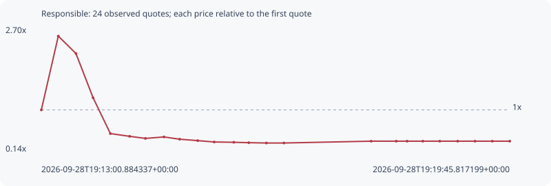

# Responsible

**solana** / `T2g5NaX71HVsr46yg4W2vz3rtaW8RjTeTMpG8qZGdgz`

[All tokens](README.md) · [Market window](../README.md)

## Native assessments

This contract is in the quote cohort; it has no native model assessment in this window.

## Series 0a89535714f3440358a3

Pool: `not supplied`

[Complete series](../series/solana/0a89535714f3440358a3.json)

Every dot is a captured quote. Lines connect observations; the curve ends at the last available quote.

| Peak | Final | Return | Maximum drawdown |
| ---: | ---: | ---: | ---: |
| 2.5251x | 0.3536x | -64.64% | 87.49% |

### Complete quote timeline

| Time (UTC) | Price (USD) | Multiple | Evidence |
| --- | ---: | ---: | --- |
| 2026-09-28T19:13:00.884337+00:00 | 1.11337e-05 | 1.0000x | `capture:5867894f-39b4-4bcd-bd87-86394c63aab4:rank:61` |
| 2026-09-28T19:13:15.565374+00:00 | 2.81136e-05 | 2.5251x | `capture:ca31b3d4-ad60-4333-98b3-6d940a196f86:rank:30` |
| 2026-09-28T19:13:30.833894+00:00 | 2.41006e-05 | 2.1647x | `capture:2beb38a4-bfac-4502-bbc3-8c8c0f943007:rank:13` |
| 2026-09-28T19:13:45.640151+00:00 | 1.39247e-05 | 1.2507x | `capture:4d31b656-3ffe-4768-bef6-377adf019420:rank:12` |
| 2026-09-28T19:14:00.595194+00:00 | 5.68451e-06 | 0.5106x | `capture:2c78112b-48e7-4f74-8c2e-1cb8642a79dc:rank:9` |
| 2026-09-28T19:14:17.246316+00:00 | 5.05398e-06 | 0.4539x | `capture:7a923cde-d765-4388-a15c-4f47fde0a3b5:rank:8` |
| 2026-09-28T19:14:30.874732+00:00 | 4.57715e-06 | 0.4111x | `capture:fa585070-b1ae-4f9d-afbd-aa986f487793:rank:9` |
| 2026-09-28T19:14:46.892387+00:00 | 4.91009e-06 | 0.4410x | `capture:7d9e3e65-8bda-4696-b6d1-7a86825bd98c:rank:8` |
| 2026-09-28T19:15:00.432009+00:00 | 4.39409e-06 | 0.3947x | `capture:797f9a41-958a-44ba-ac57-3b9cacf5d06b:rank:9` |
| 2026-09-28T19:15:16.098308+00:00 | 4.06694e-06 | 0.3653x | `capture:ab2becb9-3f94-4a57-b9e8-472ad0998012:rank:9` |
| 2026-09-28T19:15:30.340579+00:00 | 3.75108e-06 | 0.3369x | `capture:564db5fc-5586-41d3-88fb-a9a955708f1d:rank:8` |
| 2026-09-28T19:15:47.323285+00:00 | 3.68391e-06 | 0.3309x | `capture:65003429-a569-4442-8d4f-b2c93db69061:rank:8` |
| 2026-09-28T19:16:00.259696+00:00 | 3.5914e-06 | 0.3226x | `capture:4236f8d5-90c4-4c9b-a73e-d6443ae3bf32:rank:8` |
| 2026-09-28T19:16:15.455827+00:00 | 3.51711e-06 | 0.3159x | `capture:acc657c6-9a43-46bf-986e-7b907c831cba:rank:8` |
| 2026-09-28T19:16:30.624202+00:00 | 3.51711e-06 | 0.3159x | `capture:0d391072-ec81-4bb7-9be0-0d6bbb801c70:rank:8` |
| 2026-09-28T19:17:46.087880+00:00 | 3.93741e-06 | 0.3536x | `capture:ee91a1c6-bc99-4c7a-9cdc-bd6cb5478a9b:rank:8` |
| 2026-09-28T19:18:07.749963+00:00 | 3.93741e-06 | 0.3536x | `capture:b0fb1b47-4973-472f-9619-8480bc7d294e:rank:8` |
| 2026-09-28T19:18:17.126008+00:00 | 3.93741e-06 | 0.3536x | `capture:5ed98f51-d1e1-422a-81df-4186a8b0a0a2:rank:8` |
| 2026-09-28T19:18:30.722167+00:00 | 3.93741e-06 | 0.3536x | `capture:9f88d118-9108-4dff-bbfc-246eaed5ce38:rank:15` |
| 2026-09-28T19:18:45.386687+00:00 | 3.93741e-06 | 0.3536x | `capture:f533100a-ce62-4457-9107-42e7601ea5d7:rank:25` |
| 2026-09-28T19:19:00.883835+00:00 | 3.93741e-06 | 0.3536x | `capture:a2495d99-5671-4c7e-b87c-48f48d90f2f2:rank:30` |
| 2026-09-28T19:19:15.826416+00:00 | 3.93741e-06 | 0.3536x | `capture:ba1dc6a3-b8b7-461a-8110-8490f03539a5:rank:65` |
| 2026-09-28T19:19:30.814098+00:00 | 3.93741e-06 | 0.3536x | `capture:b25d90dc-c8db-4388-8a2b-d06541e5320f:rank:78` |
| 2026-09-28T19:19:45.817199+00:00 | 3.93741e-06 | 0.3536x | `capture:722d1b7b-ef4f-4ac5-883c-0557bae2b60b:rank:90` |

### Exit-policy timeline

Calculated from captured quotes under the window policy. Native assessments are linked separately above.

| Time (UTC) | Action | Price (USD) | Evidence |
| --- | --- | ---: | --- |
| 2026-09-28T19:13:00.884337+00:00 | BUY | 1.11337e-05 | `capture:5867894f-39b4-4bcd-bd87-86394c63aab4:rank:61` |
| 2026-09-28T19:13:15.565374+00:00 | TP | 2.81136e-05 | `capture:ca31b3d4-ad60-4333-98b3-6d940a196f86:rank:30` |
