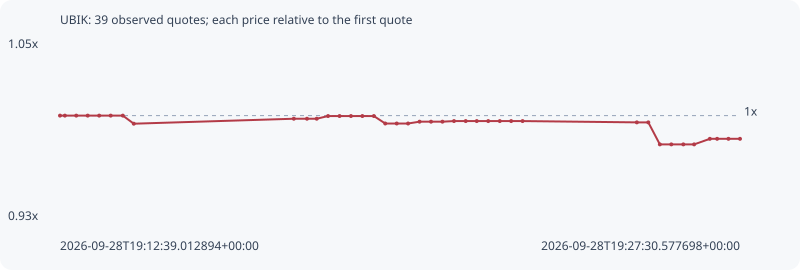

# UBIK

**robinhood** / `0x812486eaea648819853f8e372dc9f1516c7868bd`

[All tokens](README.md) · [Market window](../README.md)

## Native assessments

This contract is in the quote cohort; it has no native model assessment in this window.

## Series 661403aff5e556fd058c

Pool: `not supplied`

[Complete series](../series/robinhood/661403aff5e556fd058c.json)

Every dot is a captured quote. Lines connect observations; the curve ends at the last available quote.

| Peak | Final | Return | Maximum drawdown |
| ---: | ---: | ---: | ---: |
| 1.0000x | 0.9847x | -1.53% | 1.90% |

### Complete quote timeline

| Time (UTC) | Price (USD) | Multiple | Evidence |
| --- | ---: | ---: | --- |
| 2026-09-28T19:12:39.012894+00:00 | 0.0205959 | 1.0000x | `capture:fe8ad944-154e-4481-bd56-8ab821bfbfe1:rank:70` |
| 2026-09-28T19:12:45.402569+00:00 | 0.0205959 | 1.0000x | `capture:8deb508c-ea33-4c21-a5c5-f0991dd6dcac:rank:73` |
| 2026-09-28T19:13:00.335966+00:00 | 0.0205959 | 1.0000x | `capture:ee3ee7f8-576f-4c42-a7e0-cd9f917fdb36:rank:73` |
| 2026-09-28T19:13:15.331879+00:00 | 0.0205959 | 1.0000x | `capture:c384257a-4501-4701-8a0c-a6b08fe727d5:rank:76` |
| 2026-09-28T19:13:30.402311+00:00 | 0.0205959 | 1.0000x | `capture:44090e9e-d515-41c4-a78f-893390e6f2b0:rank:72` |
| 2026-09-28T19:13:45.493213+00:00 | 0.0205959 | 1.0000x | `capture:52264519-193b-4508-b560-e9ee4e3e0963:rank:76` |
| 2026-09-28T19:14:01.407289+00:00 | 0.0205959 | 1.0000x | `capture:0a62cce6-2c27-4761-80c1-feb9130a0c83:rank:78` |
| 2026-09-28T19:14:15.755233+00:00 | 0.0204858 | 0.9947x | `capture:09651124-e158-421c-bcdc-cb2310b48412:rank:99` |
| 2026-09-28T19:17:45.582227+00:00 | 0.0205534 | 0.9979x | `capture:a3f98285-516a-4bd4-b2c4-63596c968a6b:rank:89` |
| 2026-09-28T19:18:02.849542+00:00 | 0.0205534 | 0.9979x | `capture:53a348cd-74d6-4031-ba2b-02d70c63e42b:rank:84` |
| 2026-09-28T19:18:15.585380+00:00 | 0.0205534 | 0.9979x | `capture:ea19027f-d2c1-43cc-973f-0d8eb46ed64e:rank:87` |
| 2026-09-28T19:18:30.489414+00:00 | 0.0205901 | 0.9997x | `capture:c5cd70df-4ca4-4388-b3c5-f977fa86f8a2:rank:72` |
| 2026-09-28T19:18:45.550203+00:00 | 0.0205901 | 0.9997x | `capture:728d4974-5fe3-40a8-8e99-2139c59da3e3:rank:72` |
| 2026-09-28T19:19:00.487408+00:00 | 0.0205901 | 0.9997x | `capture:297e4fae-3bb5-49eb-b490-a4f34898851c:rank:70` |
| 2026-09-28T19:19:15.451095+00:00 | 0.0205901 | 0.9997x | `capture:0bcc0576-3637-4b2c-b0e4-f9e05871b187:rank:68` |
| 2026-09-28T19:19:30.512866+00:00 | 0.0205901 | 0.9997x | `capture:bb499bdc-159a-4072-a450-312045f32cef:rank:74` |
| 2026-09-28T19:19:45.438706+00:00 | 0.0204885 | 0.9948x | `capture:59b12f7b-2112-42c7-834a-a2eb9bcaee3d:rank:69` |
| 2026-09-28T19:20:00.494705+00:00 | 0.0204885 | 0.9948x | `capture:5b06d6b3-9eca-4487-82fb-6b28820c37d9:rank:72` |
| 2026-09-28T19:20:15.393373+00:00 | 0.0204885 | 0.9948x | `capture:17802da9-7cee-48c3-9f5b-5829781be3f6:rank:72` |
| 2026-09-28T19:20:30.417446+00:00 | 0.0205132 | 0.9960x | `capture:f2fe9ac4-89a0-4ad3-8f15-5a70d7e1d5f7:rank:68` |
| 2026-09-28T19:20:45.464282+00:00 | 0.0205132 | 0.9960x | `capture:26559b75-812f-4386-982b-eba5073faf44:rank:70` |
| 2026-09-28T19:21:00.449260+00:00 | 0.0205132 | 0.9960x | `capture:186445b2-8971-4639-85b9-26b2e8fb9d2c:rank:72` |
| 2026-09-28T19:21:15.606838+00:00 | 0.0205216 | 0.9964x | `capture:c2a8ab31-038e-42f4-8e33-852fee1b9a24:rank:78` |
| 2026-09-28T19:21:30.959683+00:00 | 0.0205216 | 0.9964x | `capture:300e0f35-12d4-46a9-a17e-17adbe8e1059:rank:82` |
| 2026-09-28T19:21:45.420062+00:00 | 0.0205216 | 0.9964x | `capture:ec22b61b-732a-44d2-be85-c577051928eb:rank:80` |
| 2026-09-28T19:22:00.489634+00:00 | 0.0205216 | 0.9964x | `capture:d6c64542-18c5-48a0-a6c9-f0e2a9c54b41:rank:79` |
| 2026-09-28T19:22:15.632268+00:00 | 0.0205216 | 0.9964x | `capture:13e6d33e-e854-4b87-b3da-49aedec6950e:rank:76` |
| 2026-09-28T19:22:30.535979+00:00 | 0.0205216 | 0.9964x | `capture:091fb4d2-10fc-4d5f-9c22-af9f55e90e4a:rank:83` |
| 2026-09-28T19:22:45.520851+00:00 | 0.0205216 | 0.9964x | `capture:128617a9-4055-4a8d-8b04-c8876bad9c70:rank:94` |
| 2026-09-28T19:25:15.316372+00:00 | 0.0205039 | 0.9955x | `capture:52eaf5a3-351e-4c29-b00b-a167107703e3:rank:98` |
| 2026-09-28T19:25:30.354898+00:00 | 0.0205039 | 0.9955x | `capture:d70b1f6a-3ec3-4ec2-8c88-db476beae4f9:rank:95` |
| 2026-09-28T19:25:45.483791+00:00 | 0.0202041 | 0.9810x | `capture:ebb21e05-3dc6-4a8f-a800-fa79ba147200:rank:68` |
| 2026-09-28T19:26:00.522113+00:00 | 0.0202041 | 0.9810x | `capture:a33301e4-8f37-4fb5-af69-629635c54fe6:rank:71` |
| 2026-09-28T19:26:16.279485+00:00 | 0.0202041 | 0.9810x | `capture:085b2ea9-3985-4608-a1cd-1eddc6b16122:rank:70` |
| 2026-09-28T19:26:30.447392+00:00 | 0.0202041 | 0.9810x | `capture:36fd4b46-5420-443d-b1ed-b86b98706671:rank:84` |
| 2026-09-28T19:26:51.039990+00:00 | 0.0202798 | 0.9847x | `capture:653b62fa-7a58-45fd-95e9-3b36912dc139:rank:75` |
| 2026-09-28T19:27:00.598930+00:00 | 0.0202798 | 0.9847x | `capture:8041f6b0-6188-445c-83ef-3a6fb7daf321:rank:78` |
| 2026-09-28T19:27:15.438746+00:00 | 0.0202798 | 0.9847x | `capture:b4c48612-e04d-4782-96a6-e80c2955d3b9:rank:77` |
| 2026-09-28T19:27:30.577698+00:00 | 0.0202798 | 0.9847x | `capture:ff6b3949-9c3c-4cdf-b48c-d4010666c140:rank:76` |

### Exit-policy timeline

Calculated from captured quotes under the window policy. Native assessments are linked separately above.

| Time (UTC) | Action | Price (USD) | Evidence |
| --- | --- | ---: | --- |
| 2026-09-28T19:12:39.012894+00:00 | BUY | 0.0205959 | `capture:fe8ad944-154e-4481-bd56-8ab821bfbfe1:rank:70` |
| 2026-09-28T19:12:45.402569+00:00 | HOLD | 0.0205959 | `capture:8deb508c-ea33-4c21-a5c5-f0991dd6dcac:rank:73` |
| 2026-09-28T19:13:00.335966+00:00 | HOLD | 0.0205959 | `capture:ee3ee7f8-576f-4c42-a7e0-cd9f917fdb36:rank:73` |
| 2026-09-28T19:13:15.331879+00:00 | HOLD | 0.0205959 | `capture:c384257a-4501-4701-8a0c-a6b08fe727d5:rank:76` |
| 2026-09-28T19:13:30.402311+00:00 | HOLD | 0.0205959 | `capture:44090e9e-d515-41c4-a78f-893390e6f2b0:rank:72` |
| 2026-09-28T19:13:45.493213+00:00 | HOLD | 0.0205959 | `capture:52264519-193b-4508-b560-e9ee4e3e0963:rank:76` |
| 2026-09-28T19:14:01.407289+00:00 | HOLD | 0.0205959 | `capture:0a62cce6-2c27-4761-80c1-feb9130a0c83:rank:78` |
| 2026-09-28T19:14:15.755233+00:00 | HOLD | 0.0204858 | `capture:09651124-e158-421c-bcdc-cb2310b48412:rank:99` |
| 2026-09-28T19:17:45.582227+00:00 | HOLD | 0.0205534 | `capture:a3f98285-516a-4bd4-b2c4-63596c968a6b:rank:89` |
| 2026-09-28T19:18:02.849542+00:00 | HOLD | 0.0205534 | `capture:53a348cd-74d6-4031-ba2b-02d70c63e42b:rank:84` |
| 2026-09-28T19:18:15.585380+00:00 | HOLD | 0.0205534 | `capture:ea19027f-d2c1-43cc-973f-0d8eb46ed64e:rank:87` |
| 2026-09-28T19:18:30.489414+00:00 | HOLD | 0.0205901 | `capture:c5cd70df-4ca4-4388-b3c5-f977fa86f8a2:rank:72` |
| 2026-09-28T19:18:45.550203+00:00 | HOLD | 0.0205901 | `capture:728d4974-5fe3-40a8-8e99-2139c59da3e3:rank:72` |
| 2026-09-28T19:19:00.487408+00:00 | HOLD | 0.0205901 | `capture:297e4fae-3bb5-49eb-b490-a4f34898851c:rank:70` |
| 2026-09-28T19:19:15.451095+00:00 | HOLD | 0.0205901 | `capture:0bcc0576-3637-4b2c-b0e4-f9e05871b187:rank:68` |
| 2026-09-28T19:19:30.512866+00:00 | HOLD | 0.0205901 | `capture:bb499bdc-159a-4072-a450-312045f32cef:rank:74` |
| 2026-09-28T19:19:45.438706+00:00 | HOLD | 0.0204885 | `capture:59b12f7b-2112-42c7-834a-a2eb9bcaee3d:rank:69` |
| 2026-09-28T19:20:00.494705+00:00 | HOLD | 0.0204885 | `capture:5b06d6b3-9eca-4487-82fb-6b28820c37d9:rank:72` |
| 2026-09-28T19:20:15.393373+00:00 | HOLD | 0.0204885 | `capture:17802da9-7cee-48c3-9f5b-5829781be3f6:rank:72` |
| 2026-09-28T19:20:30.417446+00:00 | HOLD | 0.0205132 | `capture:f2fe9ac4-89a0-4ad3-8f15-5a70d7e1d5f7:rank:68` |
| 2026-09-28T19:20:45.464282+00:00 | HOLD | 0.0205132 | `capture:26559b75-812f-4386-982b-eba5073faf44:rank:70` |
| 2026-09-28T19:21:00.449260+00:00 | HOLD | 0.0205132 | `capture:186445b2-8971-4639-85b9-26b2e8fb9d2c:rank:72` |
| 2026-09-28T19:21:15.606838+00:00 | HOLD | 0.0205216 | `capture:c2a8ab31-038e-42f4-8e33-852fee1b9a24:rank:78` |
| 2026-09-28T19:21:30.959683+00:00 | HOLD | 0.0205216 | `capture:300e0f35-12d4-46a9-a17e-17adbe8e1059:rank:82` |
| 2026-09-28T19:21:45.420062+00:00 | HOLD | 0.0205216 | `capture:ec22b61b-732a-44d2-be85-c577051928eb:rank:80` |
| 2026-09-28T19:22:00.489634+00:00 | HOLD | 0.0205216 | `capture:d6c64542-18c5-48a0-a6c9-f0e2a9c54b41:rank:79` |
| 2026-09-28T19:22:15.632268+00:00 | HOLD | 0.0205216 | `capture:13e6d33e-e854-4b87-b3da-49aedec6950e:rank:76` |
| 2026-09-28T19:22:30.535979+00:00 | HOLD | 0.0205216 | `capture:091fb4d2-10fc-4d5f-9c22-af9f55e90e4a:rank:83` |
| 2026-09-28T19:22:45.520851+00:00 | HOLD | 0.0205216 | `capture:128617a9-4055-4a8d-8b04-c8876bad9c70:rank:94` |
| 2026-09-28T19:25:15.316372+00:00 | HOLD | 0.0205039 | `capture:52eaf5a3-351e-4c29-b00b-a167107703e3:rank:98` |
| 2026-09-28T19:25:30.354898+00:00 | HOLD | 0.0205039 | `capture:d70b1f6a-3ec3-4ec2-8c88-db476beae4f9:rank:95` |
| 2026-09-28T19:25:45.483791+00:00 | HOLD | 0.0202041 | `capture:ebb21e05-3dc6-4a8f-a800-fa79ba147200:rank:68` |
| 2026-09-28T19:26:00.522113+00:00 | HOLD | 0.0202041 | `capture:a33301e4-8f37-4fb5-af69-629635c54fe6:rank:71` |
| 2026-09-28T19:26:16.279485+00:00 | HOLD | 0.0202041 | `capture:085b2ea9-3985-4608-a1cd-1eddc6b16122:rank:70` |
| 2026-09-28T19:26:30.447392+00:00 | HOLD | 0.0202041 | `capture:36fd4b46-5420-443d-b1ed-b86b98706671:rank:84` |
| 2026-09-28T19:26:51.039990+00:00 | HOLD | 0.0202798 | `capture:653b62fa-7a58-45fd-95e9-3b36912dc139:rank:75` |
| 2026-09-28T19:27:00.598930+00:00 | HOLD | 0.0202798 | `capture:8041f6b0-6188-445c-83ef-3a6fb7daf321:rank:78` |
| 2026-09-28T19:27:15.438746+00:00 | HOLD | 0.0202798 | `capture:b4c48612-e04d-4782-96a6-e80c2955d3b9:rank:77` |
| 2026-09-28T19:27:30.577698+00:00 | HOLD | 0.0202798 | `capture:ff6b3949-9c3c-4cdf-b48c-d4010666c140:rank:76` |
