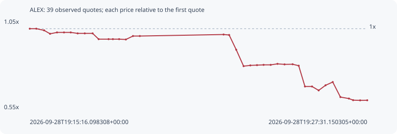

# ALEX

**solana** / `adGwrsB99iep9k5opFJcmjGEgSAERMATkAa8z6bSe4z`

[All tokens](README.md) · [Market window](../README.md)

## Native assessments

This contract is in the quote cohort; it has no native model assessment in this window.

## Series 8f23fc09ecadfe6b3fd8

Pool: `not supplied`

[Complete series](../series/solana/8f23fc09ecadfe6b3fd8.json)

Every dot is a captured quote. Lines connect observations; the curve ends at the last available quote.

| Peak | Final | Return | Maximum drawdown |
| ---: | ---: | ---: | ---: |
| 1.0000x | 0.5955x | -40.45% | 40.49% |

### Complete quote timeline

| Time (UTC) | Price (USD) | Multiple | Evidence |
| --- | ---: | ---: | --- |
| 2026-09-28T19:15:16.098308+00:00 | 1.73759e-05 | 1.0000x | `capture:ab2becb9-3f94-4a57-b9e8-472ad0998012:rank:95` |
| 2026-09-28T19:15:30.340579+00:00 | 1.73759e-05 | 1.0000x | `capture:564db5fc-5586-41d3-88fb-a9a955708f1d:rank:94` |
| 2026-09-28T19:15:47.323285+00:00 | 1.72133e-05 | 0.9906x | `capture:65003429-a569-4442-8d4f-b2c93db69061:rank:90` |
| 2026-09-28T19:16:00.259696+00:00 | 1.68764e-05 | 0.9713x | `capture:4236f8d5-90c4-4c9b-a73e-d6443ae3bf32:rank:84` |
| 2026-09-28T19:16:15.455827+00:00 | 1.70101e-05 | 0.9789x | `capture:acc657c6-9a43-46bf-986e-7b907c831cba:rank:84` |
| 2026-09-28T19:16:30.624202+00:00 | 1.70101e-05 | 0.9789x | `capture:0d391072-ec81-4bb7-9be0-0d6bbb801c70:rank:80` |
| 2026-09-28T19:16:45.311485+00:00 | 1.70101e-05 | 0.9789x | `capture:72cccbac-c3fe-4991-8f62-08c53849b146:rank:82` |
| 2026-09-28T19:17:00.368914+00:00 | 1.69164e-05 | 0.9736x | `capture:1232cf18-7088-40a1-9f55-ad9ae22b44f5:rank:82` |
| 2026-09-28T19:17:15.914647+00:00 | 1.69164e-05 | 0.9736x | `capture:9792e199-c0c2-4272-ac95-24501e4a3f79:rank:84` |
| 2026-09-28T19:17:32.965607+00:00 | 1.69164e-05 | 0.9736x | `capture:0f04cfe5-88a0-4a83-ae8d-85c5cb3cdc89:rank:83` |
| 2026-09-28T19:17:46.087880+00:00 | 1.63509e-05 | 0.9410x | `capture:ee91a1c6-bc99-4c7a-9cdc-bd6cb5478a9b:rank:82` |
| 2026-09-28T19:18:07.749963+00:00 | 1.63509e-05 | 0.9410x | `capture:b0fb1b47-4973-472f-9619-8480bc7d294e:rank:86` |
| 2026-09-28T19:18:17.126008+00:00 | 1.63509e-05 | 0.9410x | `capture:5ed98f51-d1e1-422a-81df-4186a8b0a0a2:rank:84` |
| 2026-09-28T19:18:30.722167+00:00 | 1.63509e-05 | 0.9410x | `capture:9f88d118-9108-4dff-bbfc-246eaed5ce38:rank:87` |
| 2026-09-28T19:18:45.386687+00:00 | 1.6317e-05 | 0.9391x | `capture:f533100a-ce62-4457-9107-42e7601ea5d7:rank:98` |
| 2026-09-28T19:19:00.883835+00:00 | 1.66555e-05 | 0.9585x | `capture:a2495d99-5671-4c7e-b87c-48f48d90f2f2:rank:95` |
| 2026-09-28T19:19:15.826416+00:00 | 1.66555e-05 | 0.9585x | `capture:ba1dc6a3-b8b7-461a-8110-8490f03539a5:rank:98` |
| 2026-09-28T19:22:18.240717+00:00 | 1.6804e-05 | 0.9671x | `capture:546b2c55-1845-4da7-bc9c-4439cd0ccdba:rank:96` |
| 2026-09-28T19:22:30.371968+00:00 | 1.67586e-05 | 0.9645x | `capture:507d17cb-af67-4a81-a2b2-d5ddfbc40021:rank:97` |
| 2026-09-28T19:22:45.783808+00:00 | 1.5312e-05 | 0.8812x | `capture:9558d322-c429-480b-885f-82f4481c8506:rank:96` |
| 2026-09-28T19:23:01.833252+00:00 | 1.36985e-05 | 0.7884x | `capture:c5462412-2da1-4432-8949-8fcd1492c57f:rank:89` |
| 2026-09-28T19:23:16.460099+00:00 | 1.3772e-05 | 0.7926x | `capture:2d456a2a-6755-4e1d-9a80-b6e3b2d44ec1:rank:88` |
| 2026-09-28T19:23:31.092727+00:00 | 1.37988e-05 | 0.7941x | `capture:0e687519-8b01-4d7e-b48c-e2ec34135d17:rank:81` |
| 2026-09-28T19:23:45.375171+00:00 | 1.38241e-05 | 0.7956x | `capture:1b404fa0-870b-4e7c-bafd-c3ef241c5093:rank:75` |
| 2026-09-28T19:24:00.852400+00:00 | 1.38241e-05 | 0.7956x | `capture:5205c587-4734-452c-b758-46c4814dded1:rank:73` |
| 2026-09-28T19:24:15.655418+00:00 | 1.39225e-05 | 0.8013x | `capture:5b9df0f6-51c0-4dbb-9de7-7df7a46bfee0:rank:75` |
| 2026-09-28T19:24:31.056437+00:00 | 1.38714e-05 | 0.7983x | `capture:971b5dda-397d-4fe7-b49e-94713bb088df:rank:71` |
| 2026-09-28T19:24:48.687179+00:00 | 1.3885e-05 | 0.7991x | `capture:feb72cbd-a170-4ba3-8a11-eb1df1686719:rank:67` |
| 2026-09-28T19:25:01.877958+00:00 | 1.37409e-05 | 0.7908x | `capture:fd6d01ae-d246-439e-ac58-27ae75880eb9:rank:65` |
| 2026-09-28T19:25:15.488701+00:00 | 1.17004e-05 | 0.6734x | `capture:b8fee87c-9981-475c-930b-99c255910a9f:rank:64` |
| 2026-09-28T19:25:30.900173+00:00 | 1.17004e-05 | 0.6734x | `capture:7f757769-25c3-429a-81d0-c6b2ee45ee15:rank:66` |
| 2026-09-28T19:25:45.342895+00:00 | 1.13165e-05 | 0.6513x | `capture:0ca3656d-ce8c-444b-8f77-acf34c08a1f4:rank:67` |
| 2026-09-28T19:26:00.340634+00:00 | 1.18176e-05 | 0.6801x | `capture:5b3728c5-aff9-43f3-bbb5-25b251825caa:rank:63` |
| 2026-09-28T19:26:16.031602+00:00 | 1.21373e-05 | 0.6985x | `capture:bb8d4bfc-85e1-4d55-a2ff-e47193bcce5f:rank:60` |
| 2026-09-28T19:26:32.771713+00:00 | 1.06612e-05 | 0.6136x | `capture:2fed7296-b3d1-4ba6-8398-799ee55f1f2b:rank:58` |
| 2026-09-28T19:26:51.267717+00:00 | 1.05149e-05 | 0.6051x | `capture:4cc162c2-aa4a-403b-a901-4bb5058380d6:rank:61` |
| 2026-09-28T19:27:00.453239+00:00 | 1.03581e-05 | 0.5961x | `capture:4273fbb8-5342-4e37-8d61-ced6b88e542d:rank:64` |
| 2026-09-28T19:27:15.715818+00:00 | 1.03404e-05 | 0.5951x | `capture:d04c9116-4617-4b61-8b98-5489321cd1cc:rank:64` |
| 2026-09-28T19:27:31.150305+00:00 | 1.0347e-05 | 0.5955x | `capture:7cad37e8-83d3-4438-8055-245db6707e2e:rank:65` |

### Exit-policy timeline

Calculated from captured quotes under the window policy. Native assessments are linked separately above.

| Time (UTC) | Action | Price (USD) | Evidence |
| --- | --- | ---: | --- |
| 2026-09-28T19:15:16.098308+00:00 | BUY | 1.73759e-05 | `capture:ab2becb9-3f94-4a57-b9e8-472ad0998012:rank:95` |
| 2026-09-28T19:15:30.340579+00:00 | HOLD | 1.73759e-05 | `capture:564db5fc-5586-41d3-88fb-a9a955708f1d:rank:94` |
| 2026-09-28T19:15:47.323285+00:00 | HOLD | 1.72133e-05 | `capture:65003429-a569-4442-8d4f-b2c93db69061:rank:90` |
| 2026-09-28T19:16:00.259696+00:00 | HOLD | 1.68764e-05 | `capture:4236f8d5-90c4-4c9b-a73e-d6443ae3bf32:rank:84` |
| 2026-09-28T19:16:15.455827+00:00 | HOLD | 1.70101e-05 | `capture:acc657c6-9a43-46bf-986e-7b907c831cba:rank:84` |
| 2026-09-28T19:16:30.624202+00:00 | HOLD | 1.70101e-05 | `capture:0d391072-ec81-4bb7-9be0-0d6bbb801c70:rank:80` |
| 2026-09-28T19:16:45.311485+00:00 | HOLD | 1.70101e-05 | `capture:72cccbac-c3fe-4991-8f62-08c53849b146:rank:82` |
| 2026-09-28T19:17:00.368914+00:00 | HOLD | 1.69164e-05 | `capture:1232cf18-7088-40a1-9f55-ad9ae22b44f5:rank:82` |
| 2026-09-28T19:17:15.914647+00:00 | HOLD | 1.69164e-05 | `capture:9792e199-c0c2-4272-ac95-24501e4a3f79:rank:84` |
| 2026-09-28T19:17:32.965607+00:00 | HOLD | 1.69164e-05 | `capture:0f04cfe5-88a0-4a83-ae8d-85c5cb3cdc89:rank:83` |
| 2026-09-28T19:17:46.087880+00:00 | HOLD | 1.63509e-05 | `capture:ee91a1c6-bc99-4c7a-9cdc-bd6cb5478a9b:rank:82` |
| 2026-09-28T19:18:07.749963+00:00 | HOLD | 1.63509e-05 | `capture:b0fb1b47-4973-472f-9619-8480bc7d294e:rank:86` |
| 2026-09-28T19:18:17.126008+00:00 | HOLD | 1.63509e-05 | `capture:5ed98f51-d1e1-422a-81df-4186a8b0a0a2:rank:84` |
| 2026-09-28T19:18:30.722167+00:00 | HOLD | 1.63509e-05 | `capture:9f88d118-9108-4dff-bbfc-246eaed5ce38:rank:87` |
| 2026-09-28T19:18:45.386687+00:00 | HOLD | 1.6317e-05 | `capture:f533100a-ce62-4457-9107-42e7601ea5d7:rank:98` |
| 2026-09-28T19:19:00.883835+00:00 | HOLD | 1.66555e-05 | `capture:a2495d99-5671-4c7e-b87c-48f48d90f2f2:rank:95` |
| 2026-09-28T19:19:15.826416+00:00 | HOLD | 1.66555e-05 | `capture:ba1dc6a3-b8b7-461a-8110-8490f03539a5:rank:98` |
| 2026-09-28T19:22:18.240717+00:00 | HOLD | 1.6804e-05 | `capture:546b2c55-1845-4da7-bc9c-4439cd0ccdba:rank:96` |
| 2026-09-28T19:22:30.371968+00:00 | HOLD | 1.67586e-05 | `capture:507d17cb-af67-4a81-a2b2-d5ddfbc40021:rank:97` |
| 2026-09-28T19:22:45.783808+00:00 | SL | 1.5312e-05 | `capture:9558d322-c429-480b-885f-82f4481c8506:rank:96` |
