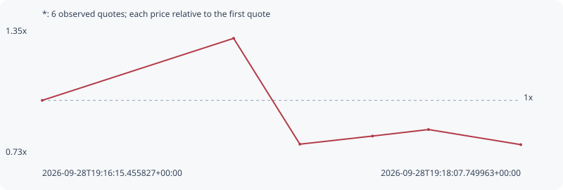

# *

**solana** / `4GvrfcGuypXP5QFsPmZUTSHL4H6F6kL9XbuFeZjDSTNK`

[All tokens](README.md) · [Market window](../README.md)

## Native assessments

This contract is in the quote cohort; it has no native model assessment in this window.

## Series 808cec980f4418f745d9

Pool: `not supplied`

[Complete series](../series/solana/808cec980f4418f745d9.json)

Every dot is a captured quote. Lines connect observations; the curve ends at the last available quote.

| Peak | Final | Return | Maximum drawdown |
| ---: | ---: | ---: | ---: |
| 1.3049x | 0.7824x | -21.76% | 40.04% |

### Complete quote timeline

| Time (UTC) | Price (USD) | Multiple | Evidence |
| --- | ---: | ---: | --- |
| 2026-09-28T19:16:15.455827+00:00 | 6.0527e-06 | 1.0000x | `capture:acc657c6-9a43-46bf-986e-7b907c831cba:rank:77` |
| 2026-09-28T19:17:00.368914+00:00 | 7.898e-06 | 1.3049x | `capture:1232cf18-7088-40a1-9f55-ad9ae22b44f5:rank:50` |
| 2026-09-28T19:17:15.914647+00:00 | 4.74956e-06 | 0.7847x | `capture:9792e199-c0c2-4272-ac95-24501e4a3f79:rank:44` |
| 2026-09-28T19:17:32.965607+00:00 | 4.99115e-06 | 0.8246x | `capture:0f04cfe5-88a0-4a83-ae8d-85c5cb3cdc89:rank:39` |
| 2026-09-28T19:17:46.087880+00:00 | 5.18486e-06 | 0.8566x | `capture:ee91a1c6-bc99-4c7a-9cdc-bd6cb5478a9b:rank:39` |
| 2026-09-28T19:18:07.749963+00:00 | 4.73566e-06 | 0.7824x | `capture:b0fb1b47-4973-472f-9619-8480bc7d294e:rank:41` |

### Exit-policy timeline

Calculated from captured quotes under the window policy. Native assessments are linked separately above.

| Time (UTC) | Action | Price (USD) | Evidence |
| --- | --- | ---: | --- |
| 2026-09-28T19:16:15.455827+00:00 | BUY | 6.0527e-06 | `capture:acc657c6-9a43-46bf-986e-7b907c831cba:rank:77` |
| 2026-09-28T19:17:00.368914+00:00 | PROFIT | 7.898e-06 | `capture:1232cf18-7088-40a1-9f55-ad9ae22b44f5:rank:50` |
| 2026-09-28T19:17:15.914647+00:00 | SL | 4.74956e-06 | `capture:9792e199-c0c2-4272-ac95-24501e4a3f79:rank:44` |
