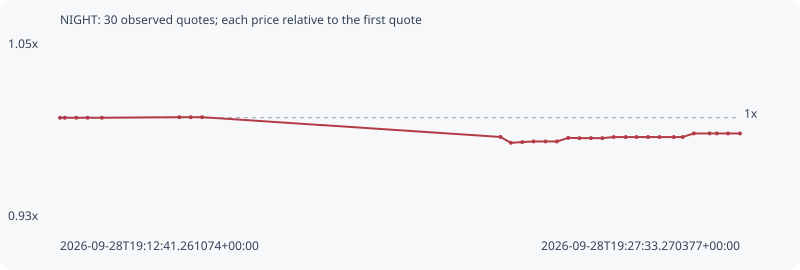

# NIGHT

**bsc** / `0xfe930c2d63aed9b82fc4dbc801920dd2c1a3224f`

[All tokens](README.md) · [Market window](../README.md)

## Native assessments

This contract is in the quote cohort; it has no native model assessment in this window.

## Series 13076f5b046d0ca24c57

Pool: `not supplied`

[Complete series](../series/bsc/13076f5b046d0ca24c57.json)

Every dot is a captured quote. Lines connect observations; the curve ends at the last available quote.

| Peak | Final | Return | Maximum drawdown |
| ---: | ---: | ---: | ---: |
| 1.0003x | 0.9898x | -1.02% | 1.66% |

### Complete quote timeline

| Time (UTC) | Price (USD) | Multiple | Evidence |
| --- | ---: | ---: | --- |
| 2026-09-28T19:12:41.261074+00:00 | 0.0279394 | 1.0000x | `capture:795a88f0-804c-4f14-a3e8-ce8d9318f6df:rank:75` |
| 2026-09-28T19:12:47.639745+00:00 | 0.0279394 | 1.0000x | `capture:c2d8bd1a-9ed6-4d75-91ae-006bea65a635:rank:93` |
| 2026-09-28T19:13:02.549284+00:00 | 0.0279394 | 1.0000x | `capture:0aa38b41-b2e7-48f5-a3ba-8fd4a983fff8:rank:97` |
| 2026-09-28T19:13:17.511052+00:00 | 0.0279394 | 1.0000x | `capture:87e92f15-0601-4987-bd47-ae2e9f91de16:rank:99` |
| 2026-09-28T19:13:36.268178+00:00 | 0.0279394 | 1.0000x | `capture:577859f6-aadc-4653-b269-a860dbe8c41c:rank:99` |
| 2026-09-28T19:15:17.739331+00:00 | 0.027949 | 1.0003x | `capture:08cc1e53-32bc-48e9-9abe-0b7caf40b440:rank:97` |
| 2026-09-28T19:15:32.749915+00:00 | 0.027949 | 1.0003x | `capture:81e75e19-4c52-4e91-ba7d-af89c6539b19:rank:99` |
| 2026-09-28T19:15:47.591170+00:00 | 0.027949 | 1.0003x | `capture:98b3c66b-c70a-4987-9342-10165ae058ec:rank:98` |
| 2026-09-28T19:22:19.090071+00:00 | 0.0275916 | 0.9876x | `capture:30ef0b61-e0e1-4eba-95c6-de3dc48fe868:rank:37` |
| 2026-09-28T19:22:32.671189+00:00 | 0.0274856 | 0.9838x | `capture:5d031323-644d-4272-bacc-8a363d4b77cb:rank:37` |
| 2026-09-28T19:22:47.674643+00:00 | 0.0274985 | 0.9842x | `capture:c8838291-6f5a-42d9-9013-9d9421deb79e:rank:35` |
| 2026-09-28T19:23:02.516005+00:00 | 0.0275102 | 0.9846x | `capture:f8b60e63-80ce-442a-9ca7-659f2b5ca21d:rank:35` |
| 2026-09-28T19:23:18.123882+00:00 | 0.0275102 | 0.9846x | `capture:f689df34-2acf-42e7-a37b-1a7d50808302:rank:35` |
| 2026-09-28T19:23:33.140484+00:00 | 0.0275102 | 0.9846x | `capture:ef2304f7-c374-4b90-a3e4-d8976f05c226:rank:36` |
| 2026-09-28T19:23:47.927661+00:00 | 0.027575 | 0.9870x | `capture:51aa913c-158f-4059-8727-ff1ace24834c:rank:31` |
| 2026-09-28T19:24:02.684719+00:00 | 0.0275702 | 0.9868x | `capture:77fa5264-b080-4409-8d15-3f5504293a7d:rank:19` |
| 2026-09-28T19:24:17.754261+00:00 | 0.0275702 | 0.9868x | `capture:9e642626-a894-4304-aad8-bfad3e85b1e6:rank:19` |
| 2026-09-28T19:24:32.694463+00:00 | 0.0275702 | 0.9868x | `capture:2934d705-4adf-40dc-b5ef-2f9f3edbbe61:rank:19` |
| 2026-09-28T19:24:47.591753+00:00 | 0.0275898 | 0.9875x | `capture:1cb45dcb-fe83-4fcc-8cfd-c5de8d369858:rank:14` |
| 2026-09-28T19:25:03.394485+00:00 | 0.0275898 | 0.9875x | `capture:f1b0620f-7caf-483d-8db4-440b4d786962:rank:13` |
| 2026-09-28T19:25:17.566680+00:00 | 0.0275898 | 0.9875x | `capture:89c3d45d-a145-4312-88dc-a4340e727616:rank:14` |
| 2026-09-28T19:25:32.640282+00:00 | 0.0275898 | 0.9875x | `capture:a41f01eb-b1b7-4ed5-a604-19b71e522502:rank:14` |
| 2026-09-28T19:25:47.745538+00:00 | 0.0275898 | 0.9875x | `capture:b20e5ea5-a03d-4b94-91ce-404a72f5de9b:rank:14` |
| 2026-09-28T19:26:06.431923+00:00 | 0.0275898 | 0.9875x | `capture:a3278748-b5f3-45be-a966-ab473520d9c2:rank:15` |
| 2026-09-28T19:26:17.917162+00:00 | 0.0275898 | 0.9875x | `capture:3b80c987-c82b-4a3e-8f0b-d3017a78edcb:rank:16` |
| 2026-09-28T19:26:32.687411+00:00 | 0.0276552 | 0.9898x | `capture:d1fef60a-e7ad-4594-a8e8-74ee96c47ae4:rank:15` |
| 2026-09-28T19:26:53.320509+00:00 | 0.0276552 | 0.9898x | `capture:5f09420c-1544-46ff-a2e4-39235f8f73a9:rank:16` |
| 2026-09-28T19:27:02.865937+00:00 | 0.0276552 | 0.9898x | `capture:bd21661a-974d-4bab-9276-4e2f7e7d279a:rank:15` |
| 2026-09-28T19:27:17.494949+00:00 | 0.0276552 | 0.9898x | `capture:c5d9da1a-7d95-4d7f-8cef-ffb660ac56d0:rank:16` |
| 2026-09-28T19:27:33.270377+00:00 | 0.0276552 | 0.9898x | `capture:1cb6d037-a95b-477e-be82-4cc75b729c8b:rank:18` |

### Exit-policy timeline

Calculated from captured quotes under the window policy. Native assessments are linked separately above.

| Time (UTC) | Action | Price (USD) | Evidence |
| --- | --- | ---: | --- |
| 2026-09-28T19:12:41.261074+00:00 | BUY | 0.0279394 | `capture:795a88f0-804c-4f14-a3e8-ce8d9318f6df:rank:75` |
| 2026-09-28T19:12:47.639745+00:00 | HOLD | 0.0279394 | `capture:c2d8bd1a-9ed6-4d75-91ae-006bea65a635:rank:93` |
| 2026-09-28T19:13:02.549284+00:00 | HOLD | 0.0279394 | `capture:0aa38b41-b2e7-48f5-a3ba-8fd4a983fff8:rank:97` |
| 2026-09-28T19:13:17.511052+00:00 | HOLD | 0.0279394 | `capture:87e92f15-0601-4987-bd47-ae2e9f91de16:rank:99` |
| 2026-09-28T19:13:36.268178+00:00 | HOLD | 0.0279394 | `capture:577859f6-aadc-4653-b269-a860dbe8c41c:rank:99` |
| 2026-09-28T19:15:17.739331+00:00 | HOLD | 0.027949 | `capture:08cc1e53-32bc-48e9-9abe-0b7caf40b440:rank:97` |
| 2026-09-28T19:15:32.749915+00:00 | HOLD | 0.027949 | `capture:81e75e19-4c52-4e91-ba7d-af89c6539b19:rank:99` |
| 2026-09-28T19:15:47.591170+00:00 | HOLD | 0.027949 | `capture:98b3c66b-c70a-4987-9342-10165ae058ec:rank:98` |
| 2026-09-28T19:22:19.090071+00:00 | HOLD | 0.0275916 | `capture:30ef0b61-e0e1-4eba-95c6-de3dc48fe868:rank:37` |
| 2026-09-28T19:22:32.671189+00:00 | HOLD | 0.0274856 | `capture:5d031323-644d-4272-bacc-8a363d4b77cb:rank:37` |
| 2026-09-28T19:22:47.674643+00:00 | HOLD | 0.0274985 | `capture:c8838291-6f5a-42d9-9013-9d9421deb79e:rank:35` |
| 2026-09-28T19:23:02.516005+00:00 | HOLD | 0.0275102 | `capture:f8b60e63-80ce-442a-9ca7-659f2b5ca21d:rank:35` |
| 2026-09-28T19:23:18.123882+00:00 | HOLD | 0.0275102 | `capture:f689df34-2acf-42e7-a37b-1a7d50808302:rank:35` |
| 2026-09-28T19:23:33.140484+00:00 | HOLD | 0.0275102 | `capture:ef2304f7-c374-4b90-a3e4-d8976f05c226:rank:36` |
| 2026-09-28T19:23:47.927661+00:00 | HOLD | 0.027575 | `capture:51aa913c-158f-4059-8727-ff1ace24834c:rank:31` |
| 2026-09-28T19:24:02.684719+00:00 | HOLD | 0.0275702 | `capture:77fa5264-b080-4409-8d15-3f5504293a7d:rank:19` |
| 2026-09-28T19:24:17.754261+00:00 | HOLD | 0.0275702 | `capture:9e642626-a894-4304-aad8-bfad3e85b1e6:rank:19` |
| 2026-09-28T19:24:32.694463+00:00 | HOLD | 0.0275702 | `capture:2934d705-4adf-40dc-b5ef-2f9f3edbbe61:rank:19` |
| 2026-09-28T19:24:47.591753+00:00 | HOLD | 0.0275898 | `capture:1cb45dcb-fe83-4fcc-8cfd-c5de8d369858:rank:14` |
| 2026-09-28T19:25:03.394485+00:00 | HOLD | 0.0275898 | `capture:f1b0620f-7caf-483d-8db4-440b4d786962:rank:13` |
| 2026-09-28T19:25:17.566680+00:00 | HOLD | 0.0275898 | `capture:89c3d45d-a145-4312-88dc-a4340e727616:rank:14` |
| 2026-09-28T19:25:32.640282+00:00 | HOLD | 0.0275898 | `capture:a41f01eb-b1b7-4ed5-a604-19b71e522502:rank:14` |
| 2026-09-28T19:25:47.745538+00:00 | HOLD | 0.0275898 | `capture:b20e5ea5-a03d-4b94-91ce-404a72f5de9b:rank:14` |
| 2026-09-28T19:26:06.431923+00:00 | HOLD | 0.0275898 | `capture:a3278748-b5f3-45be-a966-ab473520d9c2:rank:15` |
| 2026-09-28T19:26:17.917162+00:00 | HOLD | 0.0275898 | `capture:3b80c987-c82b-4a3e-8f0b-d3017a78edcb:rank:16` |
| 2026-09-28T19:26:32.687411+00:00 | HOLD | 0.0276552 | `capture:d1fef60a-e7ad-4594-a8e8-74ee96c47ae4:rank:15` |
| 2026-09-28T19:26:53.320509+00:00 | HOLD | 0.0276552 | `capture:5f09420c-1544-46ff-a2e4-39235f8f73a9:rank:16` |
| 2026-09-28T19:27:02.865937+00:00 | HOLD | 0.0276552 | `capture:bd21661a-974d-4bab-9276-4e2f7e7d279a:rank:15` |
| 2026-09-28T19:27:17.494949+00:00 | HOLD | 0.0276552 | `capture:c5d9da1a-7d95-4d7f-8cef-ffb660ac56d0:rank:16` |
| 2026-09-28T19:27:33.270377+00:00 | HOLD | 0.0276552 | `capture:1cb6d037-a95b-477e-be82-4cc75b729c8b:rank:18` |
