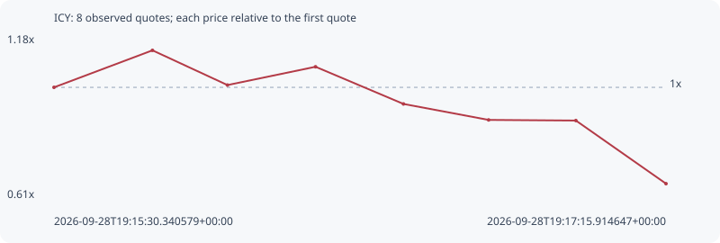

# ICY

**solana** / `6veQHmimWDy9dZgi2dkAMCngrLDQFKcA9vMtKpbqpump`

[All tokens](README.md) · [Market window](../README.md)

## Native assessments

This contract is in the quote cohort; it has no native model assessment in this window.

## Series 0a6c6c116ef9f5dcde24

Pool: `not supplied`

[Complete series](../series/solana/0a6c6c116ef9f5dcde24.json)

Every dot is a captured quote. Lines connect observations; the curve ends at the last available quote.

| Peak | Final | Return | Maximum drawdown |
| ---: | ---: | ---: | ---: |
| 1.1291x | 0.6640x | -33.60% | 41.19% |

### Complete quote timeline

| Time (UTC) | Price (USD) | Multiple | Evidence |
| --- | ---: | ---: | --- |
| 2026-09-28T19:15:30.340579+00:00 | 6.00522e-06 | 1.0000x | `capture:564db5fc-5586-41d3-88fb-a9a955708f1d:rank:92` |
| 2026-09-28T19:15:47.323285+00:00 | 6.78049e-06 | 1.1291x | `capture:65003429-a569-4442-8d4f-b2c93db69061:rank:68` |
| 2026-09-28T19:16:00.259696+00:00 | 6.05316e-06 | 1.0080x | `capture:4236f8d5-90c4-4c9b-a73e-d6443ae3bf32:rank:63` |
| 2026-09-28T19:16:15.455827+00:00 | 6.43615e-06 | 1.0718x | `capture:acc657c6-9a43-46bf-986e-7b907c831cba:rank:62` |
| 2026-09-28T19:16:30.624202+00:00 | 5.65754e-06 | 0.9421x | `capture:0d391072-ec81-4bb7-9be0-0d6bbb801c70:rank:60` |
| 2026-09-28T19:16:45.311485+00:00 | 5.32306e-06 | 0.8864x | `capture:72cccbac-c3fe-4991-8f62-08c53849b146:rank:58` |
| 2026-09-28T19:17:00.368914+00:00 | 5.30971e-06 | 0.8842x | `capture:1232cf18-7088-40a1-9f55-ad9ae22b44f5:rank:59` |
| 2026-09-28T19:17:15.914647+00:00 | 3.98774e-06 | 0.6640x | `capture:9792e199-c0c2-4272-ac95-24501e4a3f79:rank:57` |

### Exit-policy timeline

Calculated from captured quotes under the window policy. Native assessments are linked separately above.

| Time (UTC) | Action | Price (USD) | Evidence |
| --- | --- | ---: | --- |
| 2026-09-28T19:15:30.340579+00:00 | BUY | 6.00522e-06 | `capture:564db5fc-5586-41d3-88fb-a9a955708f1d:rank:92` |
| 2026-09-28T19:15:47.323285+00:00 | HOLD | 6.78049e-06 | `capture:65003429-a569-4442-8d4f-b2c93db69061:rank:68` |
| 2026-09-28T19:16:00.259696+00:00 | HOLD | 6.05316e-06 | `capture:4236f8d5-90c4-4c9b-a73e-d6443ae3bf32:rank:63` |
| 2026-09-28T19:16:15.455827+00:00 | HOLD | 6.43615e-06 | `capture:acc657c6-9a43-46bf-986e-7b907c831cba:rank:62` |
| 2026-09-28T19:16:30.624202+00:00 | HOLD | 5.65754e-06 | `capture:0d391072-ec81-4bb7-9be0-0d6bbb801c70:rank:60` |
| 2026-09-28T19:16:45.311485+00:00 | SL | 5.32306e-06 | `capture:72cccbac-c3fe-4991-8f62-08c53849b146:rank:58` |
