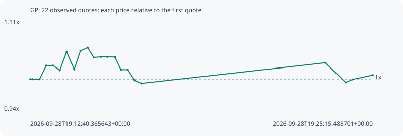

# GP

**solana** / `HTmQz7My6MehV7bjhJ6jde8nDND1yvsz68d24LP7YgUQ`

[All tokens](README.md) · [Market window](../README.md)

## Native assessments

This contract is in the quote cohort; it has no native model assessment in this window.

## Series 56d43200de51b291934b

Pool: `not supplied`

[Complete series](../series/solana/56d43200de51b291934b.json)

Every dot is a captured quote. Lines connect observations; the curve ends at the last available quote.

| Peak | Final | Return | Maximum drawdown |
| ---: | ---: | ---: | ---: |
| 1.0575x | 1.0075x | +0.75% | 6.15% |

### Complete quote timeline

| Time (UTC) | Price (USD) | Multiple | Evidence |
| --- | ---: | ---: | --- |
| 2026-09-28T19:12:40.365643+00:00 | 0.00693364 | 1.0000x | `capture:3af1faa1-2074-484e-893e-ed2c676e1576:rank:88` |
| 2026-09-28T19:12:45.490977+00:00 | 0.00693364 | 1.0000x | `capture:ac0279d6-7dd1-44b6-bf3e-910bf7b8eddf:rank:88` |
| 2026-09-28T19:13:00.884337+00:00 | 0.00693364 | 1.0000x | `capture:5867894f-39b4-4bcd-bd87-86394c63aab4:rank:87` |
| 2026-09-28T19:13:15.565374+00:00 | 0.00710568 | 1.0248x | `capture:ca31b3d4-ad60-4333-98b3-6d940a196f86:rank:88` |
| 2026-09-28T19:13:30.833894+00:00 | 0.00710568 | 1.0248x | `capture:2beb38a4-bfac-4502-bbc3-8c8c0f943007:rank:91` |
| 2026-09-28T19:13:45.640151+00:00 | 0.00704597 | 1.0162x | `capture:4d31b656-3ffe-4768-bef6-377adf019420:rank:89` |
| 2026-09-28T19:14:00.595194+00:00 | 0.00727891 | 1.0498x | `capture:2c78112b-48e7-4f74-8c2e-1cb8642a79dc:rank:92` |
| 2026-09-28T19:14:17.246316+00:00 | 0.00705815 | 1.0180x | `capture:7a923cde-d765-4388-a15c-4f47fde0a3b5:rank:93` |
| 2026-09-28T19:14:30.874732+00:00 | 0.00729011 | 1.0514x | `capture:fa585070-b1ae-4f9d-afbd-aa986f487793:rank:91` |
| 2026-09-28T19:14:46.892387+00:00 | 0.00733228 | 1.0575x | `capture:7d9e3e65-8bda-4696-b6d1-7a86825bd98c:rank:93` |
| 2026-09-28T19:15:00.432009+00:00 | 0.00720827 | 1.0396x | `capture:797f9a41-958a-44ba-ac57-3b9cacf5d06b:rank:97` |
| 2026-09-28T19:15:16.098308+00:00 | 0.00721509 | 1.0406x | `capture:ab2becb9-3f94-4a57-b9e8-472ad0998012:rank:99` |
| 2026-09-28T19:15:30.340579+00:00 | 0.00721509 | 1.0406x | `capture:564db5fc-5586-41d3-88fb-a9a955708f1d:rank:98` |
| 2026-09-28T19:15:47.323285+00:00 | 0.00721328 | 1.0403x | `capture:65003429-a569-4442-8d4f-b2c93db69061:rank:96` |
| 2026-09-28T19:16:00.259696+00:00 | 0.00705344 | 1.0173x | `capture:4236f8d5-90c4-4c9b-a73e-d6443ae3bf32:rank:94` |
| 2026-09-28T19:16:15.455827+00:00 | 0.00705344 | 1.0173x | `capture:acc657c6-9a43-46bf-986e-7b907c831cba:rank:96` |
| 2026-09-28T19:16:30.624202+00:00 | 0.00691829 | 0.9978x | `capture:0d391072-ec81-4bb7-9be0-0d6bbb801c70:rank:94` |
| 2026-09-28T19:16:45.311485+00:00 | 0.00688135 | 0.9925x | `capture:72cccbac-c3fe-4991-8f62-08c53849b146:rank:92` |
| 2026-09-28T19:23:31.092727+00:00 | 0.00714094 | 1.0299x | `capture:0e687519-8b01-4d7e-b48c-e2ec34135d17:rank:98` |
| 2026-09-28T19:24:15.655418+00:00 | 0.0068932 | 0.9942x | `capture:5b9df0f6-51c0-4dbb-9de7-7df7a46bfee0:rank:99` |
| 2026-09-28T19:24:31.056437+00:00 | 0.00693145 | 0.9997x | `capture:971b5dda-397d-4fe7-b49e-94713bb088df:rank:99` |
| 2026-09-28T19:25:15.488701+00:00 | 0.00698573 | 1.0075x | `capture:b8fee87c-9981-475c-930b-99c255910a9f:rank:99` |

### Exit-policy timeline

Calculated from captured quotes under the window policy. Native assessments are linked separately above.

| Time (UTC) | Action | Price (USD) | Evidence |
| --- | --- | ---: | --- |
| 2026-09-28T19:12:40.365643+00:00 | BUY | 0.00693364 | `capture:3af1faa1-2074-484e-893e-ed2c676e1576:rank:88` |
| 2026-09-28T19:12:45.490977+00:00 | HOLD | 0.00693364 | `capture:ac0279d6-7dd1-44b6-bf3e-910bf7b8eddf:rank:88` |
| 2026-09-28T19:13:00.884337+00:00 | HOLD | 0.00693364 | `capture:5867894f-39b4-4bcd-bd87-86394c63aab4:rank:87` |
| 2026-09-28T19:13:15.565374+00:00 | HOLD | 0.00710568 | `capture:ca31b3d4-ad60-4333-98b3-6d940a196f86:rank:88` |
| 2026-09-28T19:13:30.833894+00:00 | HOLD | 0.00710568 | `capture:2beb38a4-bfac-4502-bbc3-8c8c0f943007:rank:91` |
| 2026-09-28T19:13:45.640151+00:00 | HOLD | 0.00704597 | `capture:4d31b656-3ffe-4768-bef6-377adf019420:rank:89` |
| 2026-09-28T19:14:00.595194+00:00 | HOLD | 0.00727891 | `capture:2c78112b-48e7-4f74-8c2e-1cb8642a79dc:rank:92` |
| 2026-09-28T19:14:17.246316+00:00 | HOLD | 0.00705815 | `capture:7a923cde-d765-4388-a15c-4f47fde0a3b5:rank:93` |
| 2026-09-28T19:14:30.874732+00:00 | HOLD | 0.00729011 | `capture:fa585070-b1ae-4f9d-afbd-aa986f487793:rank:91` |
| 2026-09-28T19:14:46.892387+00:00 | HOLD | 0.00733228 | `capture:7d9e3e65-8bda-4696-b6d1-7a86825bd98c:rank:93` |
| 2026-09-28T19:15:00.432009+00:00 | HOLD | 0.00720827 | `capture:797f9a41-958a-44ba-ac57-3b9cacf5d06b:rank:97` |
| 2026-09-28T19:15:16.098308+00:00 | HOLD | 0.00721509 | `capture:ab2becb9-3f94-4a57-b9e8-472ad0998012:rank:99` |
| 2026-09-28T19:15:30.340579+00:00 | HOLD | 0.00721509 | `capture:564db5fc-5586-41d3-88fb-a9a955708f1d:rank:98` |
| 2026-09-28T19:15:47.323285+00:00 | HOLD | 0.00721328 | `capture:65003429-a569-4442-8d4f-b2c93db69061:rank:96` |
| 2026-09-28T19:16:00.259696+00:00 | HOLD | 0.00705344 | `capture:4236f8d5-90c4-4c9b-a73e-d6443ae3bf32:rank:94` |
| 2026-09-28T19:16:15.455827+00:00 | HOLD | 0.00705344 | `capture:acc657c6-9a43-46bf-986e-7b907c831cba:rank:96` |
| 2026-09-28T19:16:30.624202+00:00 | HOLD | 0.00691829 | `capture:0d391072-ec81-4bb7-9be0-0d6bbb801c70:rank:94` |
| 2026-09-28T19:16:45.311485+00:00 | HOLD | 0.00688135 | `capture:72cccbac-c3fe-4991-8f62-08c53849b146:rank:92` |
| 2026-09-28T19:23:31.092727+00:00 | HOLD | 0.00714094 | `capture:0e687519-8b01-4d7e-b48c-e2ec34135d17:rank:98` |
| 2026-09-28T19:24:15.655418+00:00 | HOLD | 0.0068932 | `capture:5b9df0f6-51c0-4dbb-9de7-7df7a46bfee0:rank:99` |
| 2026-09-28T19:24:31.056437+00:00 | HOLD | 0.00693145 | `capture:971b5dda-397d-4fe7-b49e-94713bb088df:rank:99` |
| 2026-09-28T19:25:15.488701+00:00 | HOLD | 0.00698573 | `capture:b8fee87c-9981-475c-930b-99c255910a9f:rank:99` |
