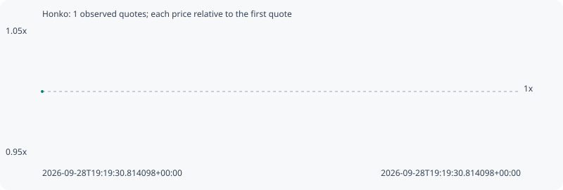

# Honko

**solana** / `G3fgAabbgArMinMgE5iGumkmGbsrAzC2bhngbAPTpump`

[All tokens](README.md) · [Market window](../README.md)

## Native assessments

This contract is in the quote cohort; it has no native model assessment in this window.

## Series 19275291a397490c168f

Pool: `not supplied`

[Complete series](../series/solana/19275291a397490c168f.json)

Every dot is a captured quote. Lines connect observations; the curve ends at the last available quote.

Fewer than two quotes: return and drawdown are not calculated.

### Complete quote timeline

| Time (UTC) | Price (USD) | Multiple | Evidence |
| --- | ---: | ---: | --- |
| 2026-09-28T19:19:30.814098+00:00 | 5.29885e-06 | 1.0000x | `capture:b25d90dc-c8db-4388-8a2b-d06541e5320f:rank:88` |

### Exit-policy timeline

Calculated from captured quotes under the window policy. Native assessments are linked separately above.

| Time (UTC) | Action | Price (USD) | Evidence |
| --- | --- | ---: | --- |
