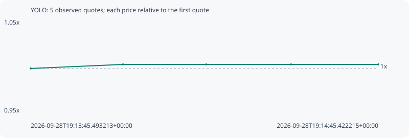

# YOLO

**robinhood** / `0x62c71cd34a52c30d894419cbcc55db2afa8032ea`

[All tokens](README.md) · [Market window](../README.md)

## Native assessments

This contract is in the quote cohort; it has no native model assessment in this window.

## Series d367caca0ff52a96735f

Pool: `not supplied`

[Complete series](../series/robinhood/d367caca0ff52a96735f.json)

Every dot is a captured quote. Lines connect observations; the curve ends at the last available quote.

| Peak | Final | Return | Maximum drawdown |
| ---: | ---: | ---: | ---: |
| 1.0046x | 1.0046x | +0.46% | 0.00% |

### Complete quote timeline

| Time (UTC) | Price (USD) | Multiple | Evidence |
| --- | ---: | ---: | --- |
| 2026-09-28T19:13:45.493213+00:00 | 0.00296831 | 1.0000x | `capture:52264519-193b-4508-b560-e9ee4e3e0963:rank:94` |
| 2026-09-28T19:14:01.407289+00:00 | 0.00298187 | 1.0046x | `capture:0a62cce6-2c27-4761-80c1-feb9130a0c83:rank:85` |
| 2026-09-28T19:14:15.755233+00:00 | 0.00298187 | 1.0046x | `capture:09651124-e158-421c-bcdc-cb2310b48412:rank:84` |
| 2026-09-28T19:14:30.367936+00:00 | 0.00298187 | 1.0046x | `capture:7a0b9f45-7248-4af6-b349-4bf6d5ef81be:rank:88` |
| 2026-09-28T19:14:45.422215+00:00 | 0.00298187 | 1.0046x | `capture:bf6e34c4-c499-472e-8e2b-ebbb151300e2:rank:88` |

### Exit-policy timeline

Calculated from captured quotes under the window policy. Native assessments are linked separately above.

| Time (UTC) | Action | Price (USD) | Evidence |
| --- | --- | ---: | --- |
| 2026-09-28T19:13:45.493213+00:00 | BUY | 0.00296831 | `capture:52264519-193b-4508-b560-e9ee4e3e0963:rank:94` |
| 2026-09-28T19:14:01.407289+00:00 | HOLD | 0.00298187 | `capture:0a62cce6-2c27-4761-80c1-feb9130a0c83:rank:85` |
| 2026-09-28T19:14:15.755233+00:00 | HOLD | 0.00298187 | `capture:09651124-e158-421c-bcdc-cb2310b48412:rank:84` |
| 2026-09-28T19:14:30.367936+00:00 | HOLD | 0.00298187 | `capture:7a0b9f45-7248-4af6-b349-4bf6d5ef81be:rank:88` |
| 2026-09-28T19:14:45.422215+00:00 | HOLD | 0.00298187 | `capture:bf6e34c4-c499-472e-8e2b-ebbb151300e2:rank:88` |
