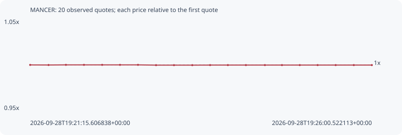

# MANCER

**robinhood** / `0xc72f232a6869e6cf34dc06129affd07f8a2a246a`

[All tokens](README.md) · [Market window](../README.md)

## Native assessments

This contract is in the quote cohort; it has no native model assessment in this window.

## Series 5f16d8666a9e16fdeff2

Pool: `not supplied`

[Complete series](../series/robinhood/5f16d8666a9e16fdeff2.json)

Every dot is a captured quote. Lines connect observations; the curve ends at the last available quote.

| Peak | Final | Return | Maximum drawdown |
| ---: | ---: | ---: | ---: |
| 1.0000x | 0.9998x | -0.02% | 0.03% |

### Complete quote timeline

| Time (UTC) | Price (USD) | Multiple | Evidence |
| --- | ---: | ---: | --- |
| 2026-09-28T19:21:15.606838+00:00 | 0.00184639 | 1.0000x | `capture:c2a8ab31-038e-42f4-8e33-852fee1b9a24:rank:87` |
| 2026-09-28T19:21:30.959683+00:00 | 0.0018462 | 0.9999x | `capture:300e0f35-12d4-46a9-a17e-17adbe8e1059:rank:71` |
| 2026-09-28T19:21:45.420062+00:00 | 0.00184648 | 1.0000x | `capture:ec22b61b-732a-44d2-be85-c577051928eb:rank:64` |
| 2026-09-28T19:22:00.489634+00:00 | 0.00184648 | 1.0000x | `capture:d6c64542-18c5-48a0-a6c9-f0e2a9c54b41:rank:62` |
| 2026-09-28T19:22:15.632268+00:00 | 0.00184648 | 1.0000x | `capture:13e6d33e-e854-4b87-b3da-49aedec6950e:rank:65` |
| 2026-09-28T19:22:30.535979+00:00 | 0.00184648 | 1.0000x | `capture:091fb4d2-10fc-4d5f-9c22-af9f55e90e4a:rank:66` |
| 2026-09-28T19:22:45.520851+00:00 | 0.00184648 | 1.0000x | `capture:128617a9-4055-4a8d-8b04-c8876bad9c70:rank:68` |
| 2026-09-28T19:23:00.594785+00:00 | 0.0018459 | 0.9997x | `capture:b6c633f1-3960-4db3-a2ca-34618f913368:rank:63` |
| 2026-09-28T19:23:15.534636+00:00 | 0.0018459 | 0.9997x | `capture:d5a0d1a4-a366-4985-80da-e34160e2f58c:rank:61` |
| 2026-09-28T19:23:30.815940+00:00 | 0.0018459 | 0.9997x | `capture:c6f23ed9-c47c-4f73-bf08-86a494a11aa2:rank:58` |
| 2026-09-28T19:23:45.643860+00:00 | 0.00184603 | 0.9998x | `capture:0b8bbeb9-cbaa-4cb2-a853-2bb146bd23e5:rank:56` |
| 2026-09-28T19:24:00.467430+00:00 | 0.00184603 | 0.9998x | `capture:4a231962-827e-445d-ab7d-bb974bfc841b:rank:61` |
| 2026-09-28T19:24:15.505143+00:00 | 0.00184603 | 0.9998x | `capture:b7273a78-8f87-4dcc-877e-f47f549e0fe8:rank:61` |
| 2026-09-28T19:24:31.344409+00:00 | 0.00184603 | 0.9998x | `capture:85f4db1c-c852-45c3-99aa-4320f3839031:rank:63` |
| 2026-09-28T19:24:45.576445+00:00 | 0.00184603 | 0.9998x | `capture:da07dfaa-56d9-4a51-99df-1ad071803eb0:rank:78` |
| 2026-09-28T19:25:00.412700+00:00 | 0.00184603 | 0.9998x | `capture:1dec2f8f-4694-4c32-8be8-eeec3980c853:rank:74` |
| 2026-09-28T19:25:15.316372+00:00 | 0.00184603 | 0.9998x | `capture:52eaf5a3-351e-4c29-b00b-a167107703e3:rank:83` |
| 2026-09-28T19:25:30.354898+00:00 | 0.00184603 | 0.9998x | `capture:d70b1f6a-3ec3-4ec2-8c88-db476beae4f9:rank:82` |
| 2026-09-28T19:25:45.483791+00:00 | 0.00184603 | 0.9998x | `capture:ebb21e05-3dc6-4a8f-a800-fa79ba147200:rank:82` |
| 2026-09-28T19:26:00.522113+00:00 | 0.00184603 | 0.9998x | `capture:a33301e4-8f37-4fb5-af69-629635c54fe6:rank:91` |

### Exit-policy timeline

Calculated from captured quotes under the window policy. Native assessments are linked separately above.

| Time (UTC) | Action | Price (USD) | Evidence |
| --- | --- | ---: | --- |
| 2026-09-28T19:21:15.606838+00:00 | BUY | 0.00184639 | `capture:c2a8ab31-038e-42f4-8e33-852fee1b9a24:rank:87` |
| 2026-09-28T19:21:30.959683+00:00 | HOLD | 0.0018462 | `capture:300e0f35-12d4-46a9-a17e-17adbe8e1059:rank:71` |
| 2026-09-28T19:21:45.420062+00:00 | HOLD | 0.00184648 | `capture:ec22b61b-732a-44d2-be85-c577051928eb:rank:64` |
| 2026-09-28T19:22:00.489634+00:00 | HOLD | 0.00184648 | `capture:d6c64542-18c5-48a0-a6c9-f0e2a9c54b41:rank:62` |
| 2026-09-28T19:22:15.632268+00:00 | HOLD | 0.00184648 | `capture:13e6d33e-e854-4b87-b3da-49aedec6950e:rank:65` |
| 2026-09-28T19:22:30.535979+00:00 | HOLD | 0.00184648 | `capture:091fb4d2-10fc-4d5f-9c22-af9f55e90e4a:rank:66` |
| 2026-09-28T19:22:45.520851+00:00 | HOLD | 0.00184648 | `capture:128617a9-4055-4a8d-8b04-c8876bad9c70:rank:68` |
| 2026-09-28T19:23:00.594785+00:00 | HOLD | 0.0018459 | `capture:b6c633f1-3960-4db3-a2ca-34618f913368:rank:63` |
| 2026-09-28T19:23:15.534636+00:00 | HOLD | 0.0018459 | `capture:d5a0d1a4-a366-4985-80da-e34160e2f58c:rank:61` |
| 2026-09-28T19:23:30.815940+00:00 | HOLD | 0.0018459 | `capture:c6f23ed9-c47c-4f73-bf08-86a494a11aa2:rank:58` |
| 2026-09-28T19:23:45.643860+00:00 | HOLD | 0.00184603 | `capture:0b8bbeb9-cbaa-4cb2-a853-2bb146bd23e5:rank:56` |
| 2026-09-28T19:24:00.467430+00:00 | HOLD | 0.00184603 | `capture:4a231962-827e-445d-ab7d-bb974bfc841b:rank:61` |
| 2026-09-28T19:24:15.505143+00:00 | HOLD | 0.00184603 | `capture:b7273a78-8f87-4dcc-877e-f47f549e0fe8:rank:61` |
| 2026-09-28T19:24:31.344409+00:00 | HOLD | 0.00184603 | `capture:85f4db1c-c852-45c3-99aa-4320f3839031:rank:63` |
| 2026-09-28T19:24:45.576445+00:00 | HOLD | 0.00184603 | `capture:da07dfaa-56d9-4a51-99df-1ad071803eb0:rank:78` |
| 2026-09-28T19:25:00.412700+00:00 | HOLD | 0.00184603 | `capture:1dec2f8f-4694-4c32-8be8-eeec3980c853:rank:74` |
| 2026-09-28T19:25:15.316372+00:00 | HOLD | 0.00184603 | `capture:52eaf5a3-351e-4c29-b00b-a167107703e3:rank:83` |
| 2026-09-28T19:25:30.354898+00:00 | HOLD | 0.00184603 | `capture:d70b1f6a-3ec3-4ec2-8c88-db476beae4f9:rank:82` |
| 2026-09-28T19:25:45.483791+00:00 | HOLD | 0.00184603 | `capture:ebb21e05-3dc6-4a8f-a800-fa79ba147200:rank:82` |
| 2026-09-28T19:26:00.522113+00:00 | HOLD | 0.00184603 | `capture:a33301e4-8f37-4fb5-af69-629635c54fe6:rank:91` |
