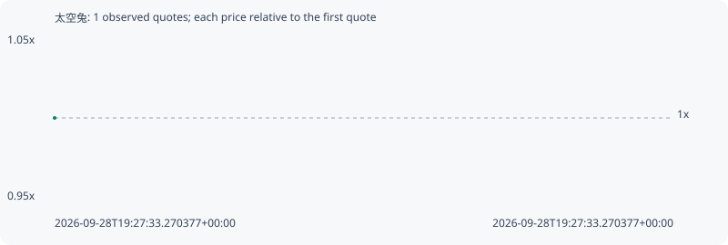

# 太空兔

**bsc** / `0x38860d2ee327244229242c02e600a6154cec7777`

[All tokens](README.md) · [Market window](../README.md)

## Native assessments

This contract is in the quote cohort; it has no native model assessment in this window.

## Series 0aabc033c5a601e96ce1

Pool: `not supplied`

[Complete series](../series/bsc/0aabc033c5a601e96ce1.json)

Every dot is a captured quote. Lines connect observations; the curve ends at the last available quote.

Fewer than two quotes: return and drawdown are not calculated.

### Complete quote timeline

| Time (UTC) | Price (USD) | Multiple | Evidence |
| --- | ---: | ---: | --- |
| 2026-09-28T19:27:33.270377+00:00 | 1.41177e-05 | 1.0000x | `capture:1cb6d037-a95b-477e-be82-4cc75b729c8b:rank:80` |

### Exit-policy timeline

Calculated from captured quotes under the window policy. Native assessments are linked separately above.

| Time (UTC) | Action | Price (USD) | Evidence |
| --- | --- | ---: | --- |
