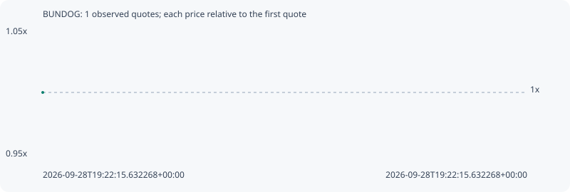

# BUNDOG

**robinhood** / `0x67e1cdab841957688cd355ff90c0d8139ea32fe6`

[All tokens](README.md) · [Market window](../README.md)

## Native assessments

This contract is in the quote cohort; it has no native model assessment in this window.

## Series 2cd86b693e8fc7de6622

Pool: `not supplied`

[Complete series](../series/robinhood/2cd86b693e8fc7de6622.json)

Every dot is a captured quote. Lines connect observations; the curve ends at the last available quote.

Fewer than two quotes: return and drawdown are not calculated.

### Complete quote timeline

| Time (UTC) | Price (USD) | Multiple | Evidence |
| --- | ---: | ---: | --- |
| 2026-09-28T19:22:15.632268+00:00 | 6.1672e-06 | 1.0000x | `capture:13e6d33e-e854-4b87-b3da-49aedec6950e:rank:99` |

### Exit-policy timeline

Calculated from captured quotes under the window policy. Native assessments are linked separately above.

| Time (UTC) | Action | Price (USD) | Evidence |
| --- | --- | ---: | --- |
