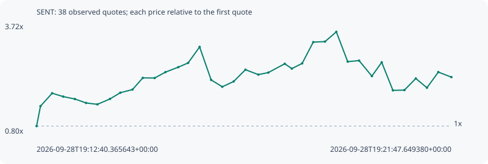

# SENT

**solana** / `9N7o7AazXwY4HBG2BSsmNmEQirDDd2isbbMJDBzYpump`

[All tokens](README.md) · [Market window](../README.md)

## Native assessments

This contract is in the quote cohort; it has no native model assessment in this window.

## Series 5f2fa9ec68e97ce82189

Pool: `not supplied`

[Complete series](../series/solana/5f2fa9ec68e97ce82189.json)

Every dot is a captured quote. Lines connect observations; the curve ends at the last available quote.

| Peak | Final | Return | Maximum drawdown |
| ---: | ---: | ---: | ---: |
| 3.5195x | 2.3087x | +130.87% | 44.44% |

### Complete quote timeline

| Time (UTC) | Price (USD) | Multiple | Evidence |
| --- | ---: | ---: | --- |
| 2026-09-28T19:12:40.365643+00:00 | 1.70259e-05 | 1.0000x | `capture:3af1faa1-2074-484e-893e-ed2c676e1576:rank:34` |
| 2026-09-28T19:12:45.490977+00:00 | 2.61e-05 | 1.5330x | `capture:ac0279d6-7dd1-44b6-bf3e-910bf7b8eddf:rank:27` |
| 2026-09-28T19:13:00.884337+00:00 | 3.19737e-05 | 1.8779x | `capture:5867894f-39b4-4bcd-bd87-86394c63aab4:rank:19` |
| 2026-09-28T19:13:15.565374+00:00 | 3.04408e-05 | 1.7879x | `capture:ca31b3d4-ad60-4333-98b3-6d940a196f86:rank:15` |
| 2026-09-28T19:13:30.833894+00:00 | 2.93555e-05 | 1.7242x | `capture:2beb38a4-bfac-4502-bbc3-8c8c0f943007:rank:14` |
| 2026-09-28T19:13:45.640151+00:00 | 2.75583e-05 | 1.6186x | `capture:4d31b656-3ffe-4768-bef6-377adf019420:rank:14` |
| 2026-09-28T19:14:00.595194+00:00 | 2.69229e-05 | 1.5813x | `capture:2c78112b-48e7-4f74-8c2e-1cb8642a79dc:rank:14` |
| 2026-09-28T19:14:17.246316+00:00 | 2.94106e-05 | 1.7274x | `capture:7a923cde-d765-4388-a15c-4f47fde0a3b5:rank:14` |
| 2026-09-28T19:14:30.874732+00:00 | 3.22326e-05 | 1.8932x | `capture:fa585070-b1ae-4f9d-afbd-aa986f487793:rank:13` |
| 2026-09-28T19:14:46.892387+00:00 | 3.36488e-05 | 1.9763x | `capture:7d9e3e65-8bda-4696-b6d1-7a86825bd98c:rank:12` |
| 2026-09-28T19:15:00.432009+00:00 | 3.89612e-05 | 2.2883x | `capture:797f9a41-958a-44ba-ac57-3b9cacf5d06b:rank:11` |
| 2026-09-28T19:15:16.098308+00:00 | 3.89012e-05 | 2.2848x | `capture:ab2becb9-3f94-4a57-b9e8-472ad0998012:rank:11` |
| 2026-09-28T19:15:30.340579+00:00 | 4.15806e-05 | 2.4422x | `capture:564db5fc-5586-41d3-88fb-a9a955708f1d:rank:10` |
| 2026-09-28T19:15:47.323285+00:00 | 4.38454e-05 | 2.5752x | `capture:65003429-a569-4442-8d4f-b2c93db69061:rank:10` |
| 2026-09-28T19:16:00.259696+00:00 | 4.57715e-05 | 2.6883x | `capture:4236f8d5-90c4-4c9b-a73e-d6443ae3bf32:rank:10` |
| 2026-09-28T19:16:15.455827+00:00 | 5.30536e-05 | 3.1161x | `capture:acc657c6-9a43-46bf-986e-7b907c831cba:rank:7` |
| 2026-09-28T19:16:30.624202+00:00 | 3.80612e-05 | 2.2355x | `capture:0d391072-ec81-4bb7-9be0-0d6bbb801c70:rank:7` |
| 2026-09-28T19:16:45.311485+00:00 | 3.49114e-05 | 2.0505x | `capture:72cccbac-c3fe-4991-8f62-08c53849b146:rank:6` |
| 2026-09-28T19:17:00.368914+00:00 | 3.73318e-05 | 2.1926x | `capture:1232cf18-7088-40a1-9f55-ad9ae22b44f5:rank:5` |
| 2026-09-28T19:17:15.914647+00:00 | 4.26834e-05 | 2.5070x | `capture:9792e199-c0c2-4272-ac95-24501e4a3f79:rank:5` |
| 2026-09-28T19:17:32.965607+00:00 | 4.04521e-05 | 2.3759x | `capture:0f04cfe5-88a0-4a83-ae8d-85c5cb3cdc89:rank:5` |
| 2026-09-28T19:17:46.087880+00:00 | 4.13765e-05 | 2.4302x | `capture:ee91a1c6-bc99-4c7a-9cdc-bd6cb5478a9b:rank:5` |
| 2026-09-28T19:18:07.749963+00:00 | 4.53899e-05 | 2.6659x | `capture:b0fb1b47-4973-472f-9619-8480bc7d294e:rank:5` |
| 2026-09-28T19:18:17.126008+00:00 | 4.3185e-05 | 2.5364x | `capture:5ed98f51-d1e1-422a-81df-4186a8b0a0a2:rank:5` |
| 2026-09-28T19:18:30.722167+00:00 | 4.55596e-05 | 2.6759x | `capture:9f88d118-9108-4dff-bbfc-246eaed5ce38:rank:5` |
| 2026-09-28T19:18:45.386687+00:00 | 5.52434e-05 | 3.2447x | `capture:f533100a-ce62-4457-9107-42e7601ea5d7:rank:5` |
| 2026-09-28T19:19:00.883835+00:00 | 5.5486e-05 | 3.2589x | `capture:a2495d99-5671-4c7e-b87c-48f48d90f2f2:rank:4` |
| 2026-09-28T19:19:15.826416+00:00 | 5.9922e-05 | 3.5195x | `capture:ba1dc6a3-b8b7-461a-8110-8490f03539a5:rank:3` |
| 2026-09-28T19:19:30.814098+00:00 | 4.63506e-05 | 2.7224x | `capture:b25d90dc-c8db-4388-8a2b-d06541e5320f:rank:3` |
| 2026-09-28T19:19:45.817199+00:00 | 4.68317e-05 | 2.7506x | `capture:722d1b7b-ef4f-4ac5-883c-0557bae2b60b:rank:4` |
| 2026-09-28T19:20:02.715590+00:00 | 3.97663e-05 | 2.3356x | `capture:60ff17d8-3b18-4f61-9bc7-006afd324cf2:rank:5` |
| 2026-09-28T19:20:15.699547+00:00 | 4.60529e-05 | 2.7049x | `capture:10a94828-637f-4580-a9f7-2fbd34d8589a:rank:5` |
| 2026-09-28T19:20:30.480194+00:00 | 3.32908e-05 | 1.9553x | `capture:54722132-db1d-4a2b-8c1c-2b0e71d01430:rank:5` |
| 2026-09-28T19:20:45.683165+00:00 | 3.3412e-05 | 1.9624x | `capture:17963a37-fd65-46b6-8e1c-350082721f8c:rank:5` |
| 2026-09-28T19:21:00.690136+00:00 | 3.86926e-05 | 2.2726x | `capture:f2ff842d-38e9-4cbe-a281-98c17d5a5672:rank:5` |
| 2026-09-28T19:21:15.372716+00:00 | 3.44682e-05 | 2.0245x | `capture:a923b968-a768-495e-ae33-6de2042c551f:rank:4` |
| 2026-09-28T19:21:30.402460+00:00 | 4.16096e-05 | 2.4439x | `capture:d926629b-2050-4e50-a602-1638c6205870:rank:4` |
| 2026-09-28T19:21:47.649380+00:00 | 3.93077e-05 | 2.3087x | `capture:0799ec6d-0e89-46b5-ae88-5695bf6c5fc3:rank:5` |

### Exit-policy timeline

Calculated from captured quotes under the window policy. Native assessments are linked separately above.

| Time (UTC) | Action | Price (USD) | Evidence |
| --- | --- | ---: | --- |
| 2026-09-28T19:12:40.365643+00:00 | BUY | 1.70259e-05 | `capture:3af1faa1-2074-484e-893e-ed2c676e1576:rank:34` |
| 2026-09-28T19:12:45.490977+00:00 | TP | 2.61e-05 | `capture:ac0279d6-7dd1-44b6-bf3e-910bf7b8eddf:rank:27` |
